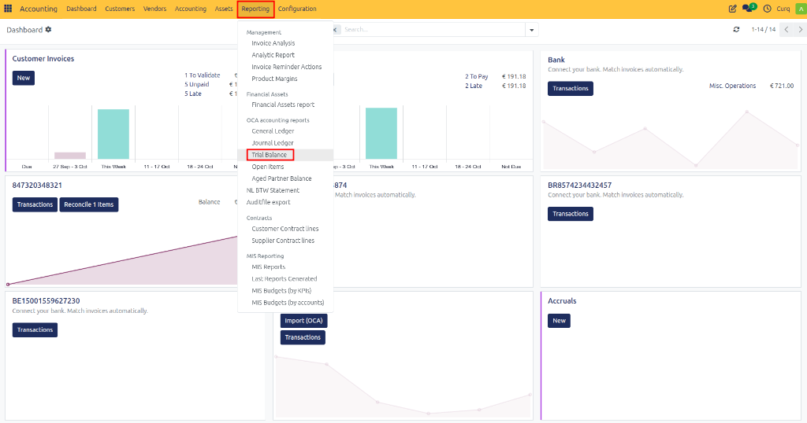
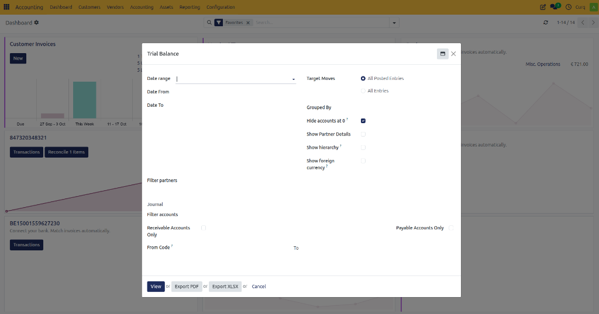
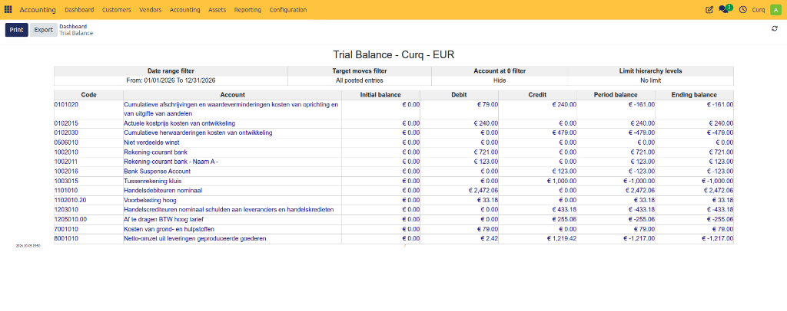

# Trial Balance

## Overview
The Trial Balance is a financial report that displays the balances of all ledger accounts for a selected period. It helps verify that total debits equal total credits and provides an overview of the company's financial position before preparing financial statements.

The report is commonly used by accountants to:
- Verify accounting accuracy.
- Review account balances.
- Identify posting errors.
- Prepare financial statements.
- Analyze receivables and payables.

Navigate to:
**Accounting → Reporting → Trial Balance**

---

## Trial Balance Filters

Before generating the report, you can configure several filters to display the required data.

### Date Range

| Field | Description |
| :--- | :--- |
| **Date Range** | Select a predefined reporting period such as This Month, Last Quarter, or Fiscal Year. |
| **Date From** | Start date of the reporting period. |
| **Date To** | End date of the reporting period. |

> **Example**
> - **Date From:** 01/01/2026
> - **Date To:** 31/12/2026
> 
> Displays all account balances for the year 2026.

### Target Moves

Determines which accounting entries are included.

| Option | Description |
| :--- | :--- |
| **All Posted Entries** | Includes only validated (posted) journal entries. |
| **All Entries** | Includes both draft and posted journal entries. |

> **Recommendation:** Use **All Posted Entries** for official financial reporting.

### Grouped By

| Field | Description |
| :--- | :--- |
| **Grouped By** | Groups report results by a selected category, such as account type or partner. |

### Display Options

| Field | Description |
| :--- | :--- |
| **Hide Accounts at 0** | Hides accounts with zero balances. |
| **Show Partner Details** | Displays balances broken down by customer or supplier. |
| **Show Hierarchy** | Displays accounts according to the chart of accounts hierarchy. |
| **Show Foreign Currency** | Shows balances in the original foreign currency. |

### Partner Filters

| Field | Description |
| :--- | :--- |
| **Filter Partners** | Restricts the report to selected customers or suppliers. |

> **Example:** Select a specific customer to view only balances related to that customer.

### Journal Filter

| Field | Description |
| :--- | :--- |
| **Journal** | Includes transactions from selected journals only. |

> **Example:** Select the Bank journal to analyze only bank-related transactions.

### Account Filters

| Field | Description |
| :--- | :--- |
| **Filter Accounts** | Restricts the report to selected accounts. |
| **Receivable Accounts Only** | Displays only customer receivable accounts. |
| **Payable Accounts Only** | Displays only supplier payable accounts. |
| **From Code** | Starting account code for filtering. |
| **To** | Ending account code for filtering. |

> **Example**
> - **From Code:** 1000
> - **To:** 1999
> 
> Displays only accounts within that code range.

---

## Available Actions

After configuring the filters, the following actions are available:

| Action | Description |
| :--- | :--- |
| **View** | Generates the Trial Balance report on screen. |
| **Export PDF** | Downloads the report as a PDF document. |
| **Export XLSX** | Downloads the report as an Excel spreadsheet. |
| **Cancel** | Closes the report wizard without generating a report. |

---

## Viewing the Report

Once generated, the Trial Balance report provides a comprehensive overview of all ledger account balances for the selected period.

