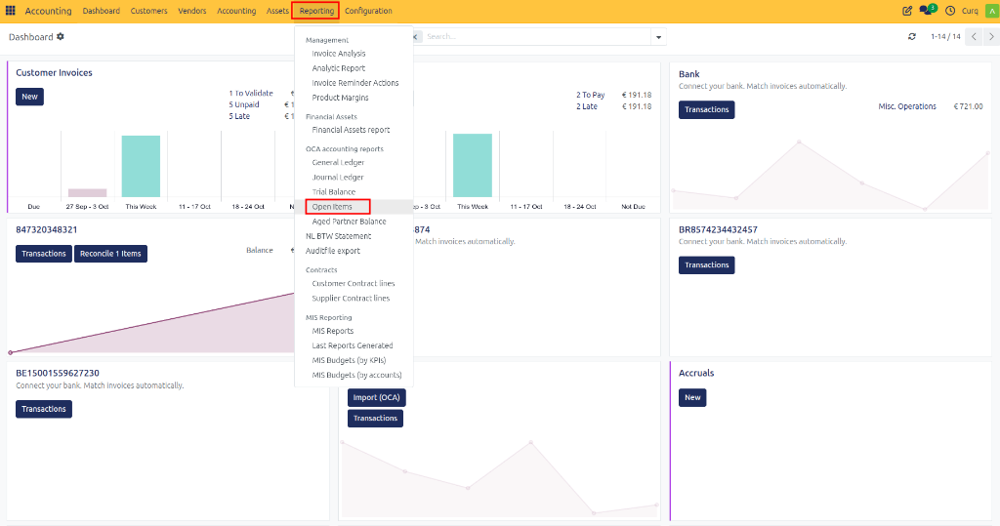
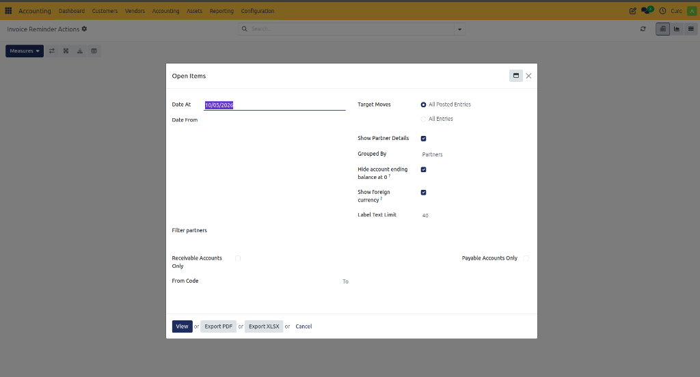
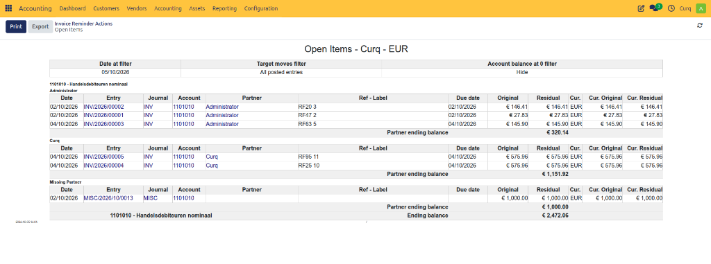

# Open Items Report

## Overview
The Open Items report shows all unpaid customer invoices, unpaid vendor bills, and other accounting entries that still have an outstanding balance.

This report helps you:
- Monitor outstanding customer payments.
- Track unpaid supplier invoices.
- Identify overdue balances.
- Review receivable and payable accounts.
- Support collection and payment follow-up activities.

Open Items only displays entries that are not fully reconciled. Once an invoice or bill is completely paid and reconciled, it is removed from the report.

Navigate to:
**Accounting → Reporting → Open Items**

---

## Report Fields

Before generating the report, you can configure several filters to display the required data.

| Field | Description |
| :--- | :--- |
| **Date At** | Shows open items as of the selected date. |
| **Date From** | Displays only entries created from the selected date onwards. |
| **Target Moves** | Choose whether to include only posted entries or all entries. |
| **All Posted Entries** | Shows only validated accounting entries. |
| **All Entries** | Includes both draft and posted entries. |
| **Show Partner Details** | Displays open items grouped by customer or vendor. |
| **Grouped By** | Defines how records are grouped in the report (for example by Partner). |
| **Hide Account Ending Balance at 0** | Hides accounts that have no outstanding balance. |
| **Show Foreign Currency** | Displays amounts in the original transaction currency. |
| **Label Text Limit** | Limits the number of characters shown for entry descriptions. |

---

## Partner Filters

| Field | Description |
| :--- | :--- |
| **Filter Partners** | Select specific customers or vendors to include in the report. |
| **Receivable Accounts Only** | Show only customer receivable accounts. |
| **Payable Accounts Only** | Show only supplier payable accounts. |

---

## Account Filters

| Field | Description |
| :--- | :--- |
| **From Code** | Start of the account code range to include. |
| **To** | End of the account code range to include. |

---

## Available Actions

| Action | Description |
| :--- | :--- |
| **View** | Displays the report directly on screen. |
| **Export PDF** | Downloads the report as a PDF document. |
| **Export XLSX** | Downloads the report as an Excel file for further analysis. |
| **Cancel** | Closes the report wizard without generating the report. |

---

## Viewing the Report

Once generated, the Open Items report provides a clear list of all outstanding balances grouped by your chosen criteria.

