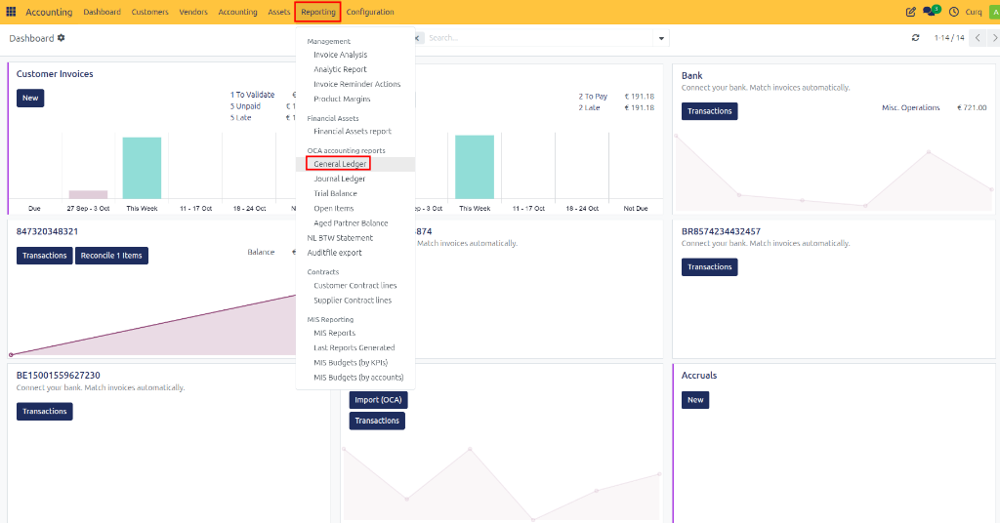
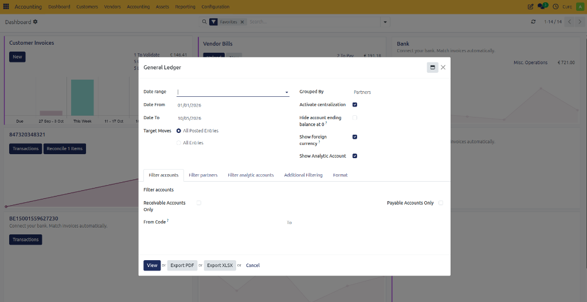
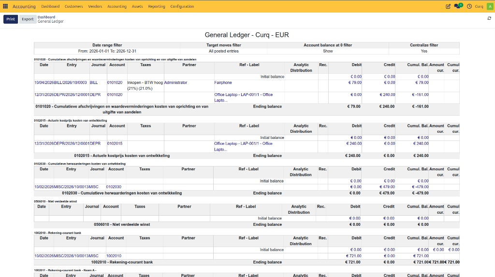

# Accounting Reports

CURQ uses the standard accounting reports maintained by the Odoo Community Association (OCA). These reports provide valuable insights into financial transactions and help monitor the financial health of your organization.

---

## General Ledger

The General Ledger report provides a complete overview of all journal entries grouped by ledger account. It allows you to analyze transactions, review balances, and investigate accounting activity across a selected period.

**Navigate to:**
`Accounting → Reporting → General Ledger`

### Available Filter Options

The General Ledger report includes several filters to help you generate the desired overview:

- **Date Range**
  Select the financial year or reporting period you want to analyze.
- **Grouped By**
  Choose how the report should be grouped:
  - Customer/Supplier
  - Tax Group
  - No Grouping
  For a complete overview of ledger balances and transactions, it is recommended to leave the report ungrouped.
- **Date From – Date To**
  Define a custom reporting period by selecting a start and end date.
- **Target Moves**
  Choose whether to display:
  - Only posted journal entries
  - Posted and draft journal entries

### Additional Filtering Options

The report can be further refined using additional filters.
For example, you can display only:
- Customers (Accounts Receivable)
- Suppliers (Accounts Payable)
- Specific ledger accounts
- Specific journals
- Particular transaction types

To apply advanced filtering:
1. Open the **Additional Filters** tab.
2. Use the **Domain** option to define one or more filter conditions.
3. Apply the filters to generate a more targeted report.

This flexibility allows you to create highly specific accounting reports based on your business requirements.

---

## Reviewing the General Ledger

After generating the report, you can drill down into the underlying transactions by clicking the blue highlighted values. This provides direct access to the journal entries that make up the reported balances.

---

## Exporting and Printing the General Ledger

Once the desired filters have been applied, the report can be exported or printed for further analysis, auditing, or sharing.

Available export formats:
- Excel (.xlsx)
- PDF

Use the **Print** or **Export** options at the top of the report to download the General Ledger in your preferred format.
