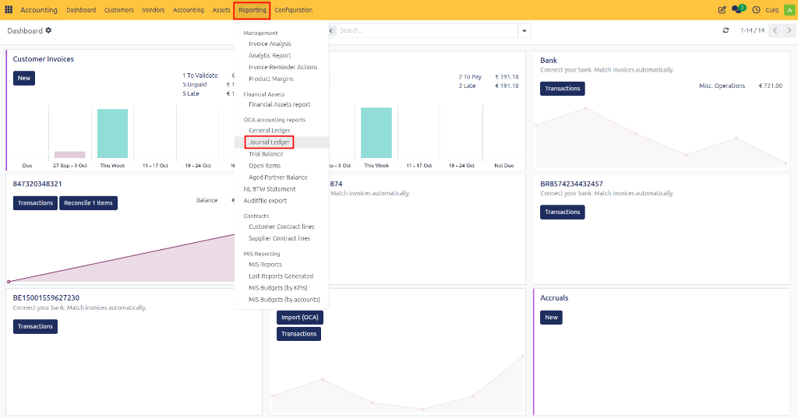
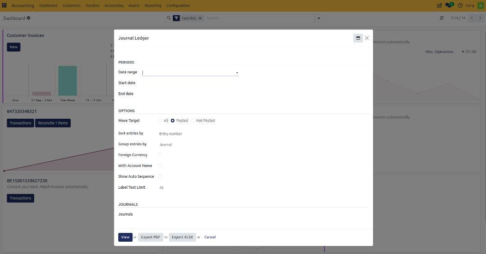
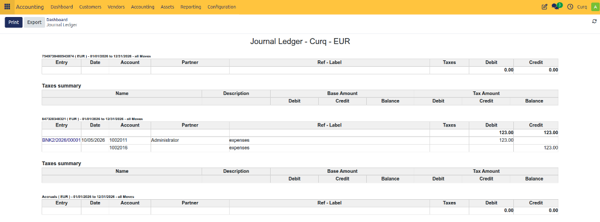

# Journal Ledger

## Overview
The Journal Ledger report provides a detailed list of all accounting entries recorded in selected journals during a specific period.

It helps accountants and finance teams:
- Review accounting transactions.
- Audit journal activity.
- Verify posted entries.
- Analyze debits and credits.
- Export accounting records for reporting or compliance purposes.

Each journal entry is displayed with its transaction details, amounts, dates, and related accounts.

Navigate to:
**Accounting → Reporting → Journal Ledger**

---

## Report Fields

Before generating the report, you can configure several filters to display the required data.

### Periods

| Field | Description |
| :--- | :--- |
| **Date Range** | Select a predefined reporting period such as This Month, This Quarter, or This Year. |
| **Start Date** | Beginning date of the reporting period. |
| **End Date** | Ending date of the reporting period. |

### Options

| Field | Description |
| :--- | :--- |
| **Move Target** | Determines which journal entries are included in the report. |
| **All** | Includes both draft and posted entries. |
| **Posted** | Includes only validated journal entries. |
| **Not Posted** | Includes only draft journal entries. |
| **Sort Entries By** | Defines how entries are ordered in the report. |
| **Group Entries By** | Groups entries by journal or another selected option. |
| **Foreign Currency** | Displays original foreign currency amounts. |
| **With Account Name** | Shows account names together with account codes. |
| **Show Auto Sequence** | Displays automatically generated entry numbers. |
| **Label Text Limit** | Limits the number of characters displayed for entry descriptions. |

---

## Journal Filters

| Field | Description |
| :--- | :--- |
| **Journals** | Select one or more journals to include in the report. |

**Common journals include:**
- Customer Invoices
- Vendor Bills
- Bank
- Cash
- Miscellaneous Operations
- Sales
- Purchases

---

## Available Actions

| Action | Description |
| :--- | :--- |
| **View** | Displays the Journal Ledger report on screen. |
| **Export PDF** | Downloads the report as a PDF document. |
| **Export XLSX** | Downloads the report as an Excel spreadsheet. |
| **Cancel** | Closes the report wizard without generating a report. |

---

## Viewing the Report

Once generated, the Journal Ledger report displays a detailed breakdown of all journal activity based on the selected filters.

