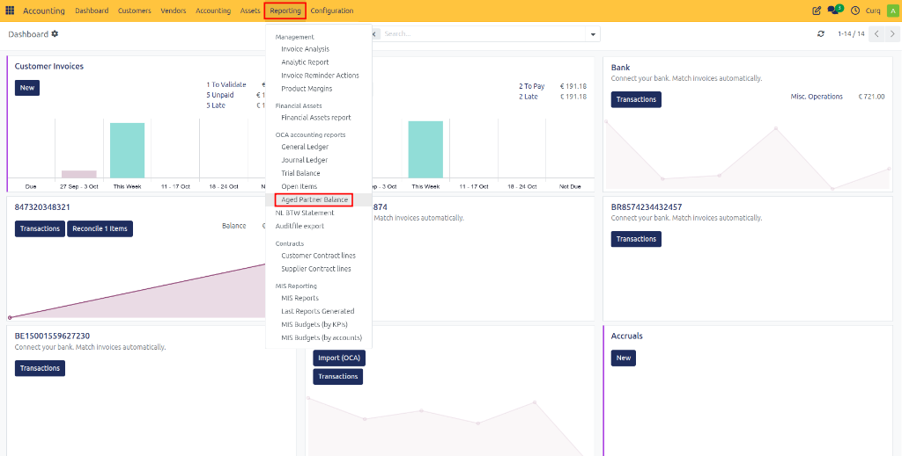
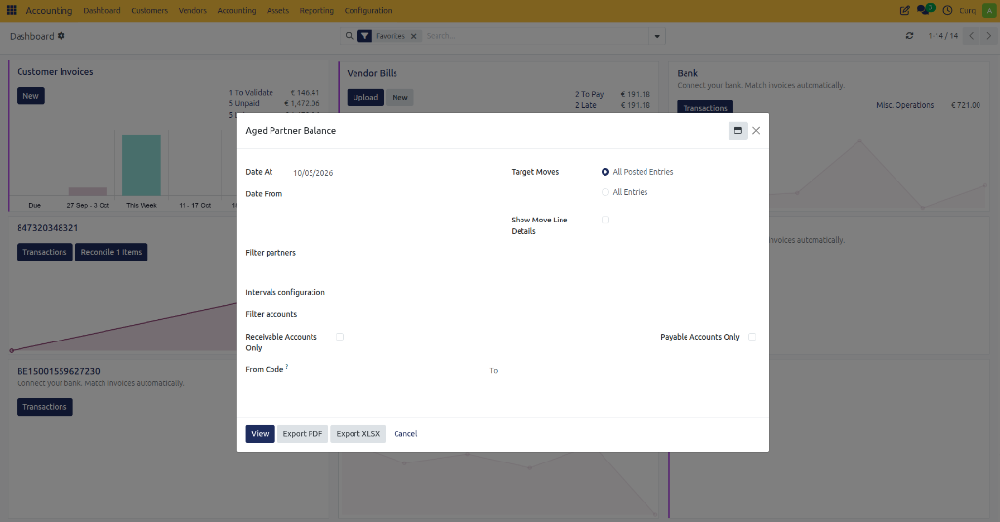
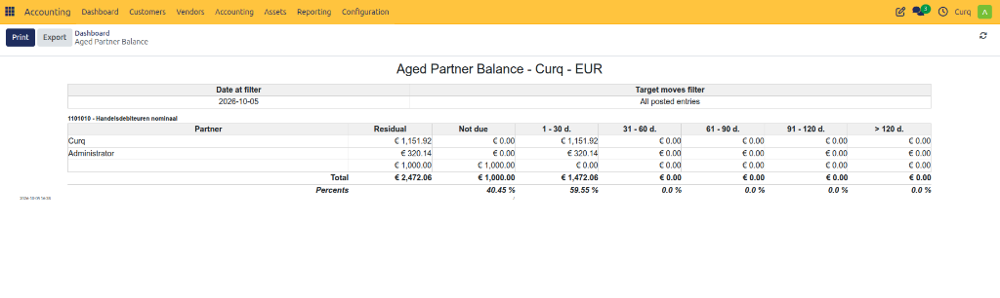

# Aged Partner Balance

## Overview
The Aged Partner Balance report helps track outstanding customer and supplier balances based on how long they have been overdue.

It categorizes unpaid amounts into aging periods (for example: Current, 30 Days, 60 Days, 90 Days, and Older) so you can quickly identify overdue invoices and bills.

This report is commonly used for:
- Monitoring overdue customer invoices.
- Following up on outstanding payments.
- Reviewing supplier balances.
- Managing cash flow.
- Credit control and collections.

Navigate to:
**Accounting → Reporting → Aged Partner Balance**

---

## Report Fields

Before generating the report, you can configure several filters to display the required data.

### Reporting Period

| Field | Description |
| :--- | :--- |
| **Date At** | Generates the aging report as of the selected date. Outstanding balances are calculated up to this date. |
| **Date From** | Includes transactions from the specified start date onward. |

### Entry Filters

| Field | Description |
| :--- | :--- |
| **Target Moves** | Determines which accounting entries are included in the report. |
| **All Posted Entries** | Includes only validated accounting entries. |
| **All Entries** | Includes both draft and posted entries. |
| **Show Move Line Details** | Displays individual journal item details for each outstanding balance. |

### Partner Filters

| Field | Description |
| :--- | :--- |
| **Filter Partners** | Select specific customers or suppliers to include in the report. |

### Aging Configuration

| Field | Description |
| :--- | :--- |
| **Intervals Configuration** | Defines how aging periods are grouped, such as Current, 30 Days, 60 Days, 90 Days, and older balances. |

### Account Filters

| Field | Description |
| :--- | :--- |
| **Receivable Accounts Only** | Displays only customer receivable balances. |
| **Payable Accounts Only** | Displays only supplier payable balances. |
| **From Code** | Starting account code to include in the report. |
| **To** | Ending account code to include in the report. |

---

## Available Actions

| Action | Description |
| :--- | :--- |
| **View** | Displays the Aged Partner Balance report on screen. |
| **Export PDF** | Downloads the report as a PDF document. |
| **Export XLSX** | Downloads the report as an Excel spreadsheet. |
| **Cancel** | Closes the wizard without generating the report. |

---

## Viewing the Report

Once generated, the Aged Partner Balance report visually separates outstanding receivables and payables into aged intervals.

