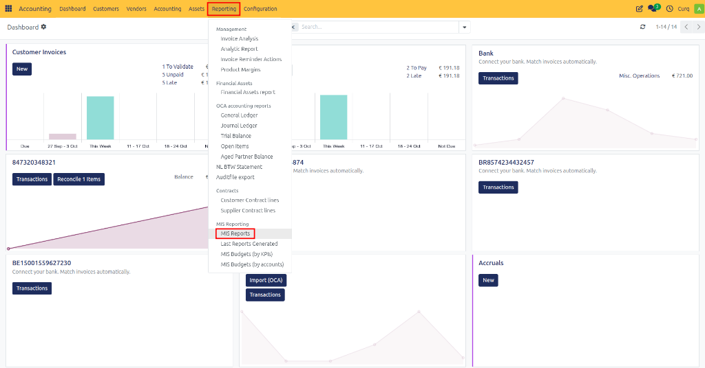
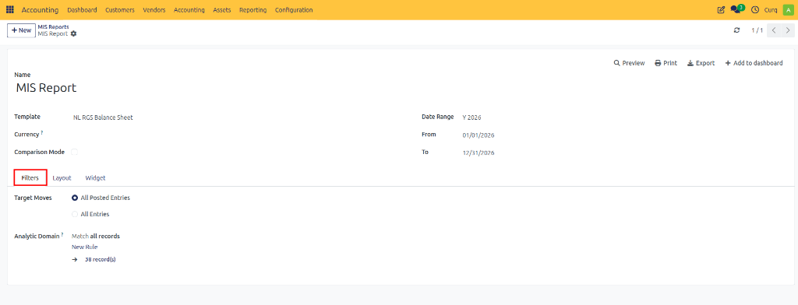
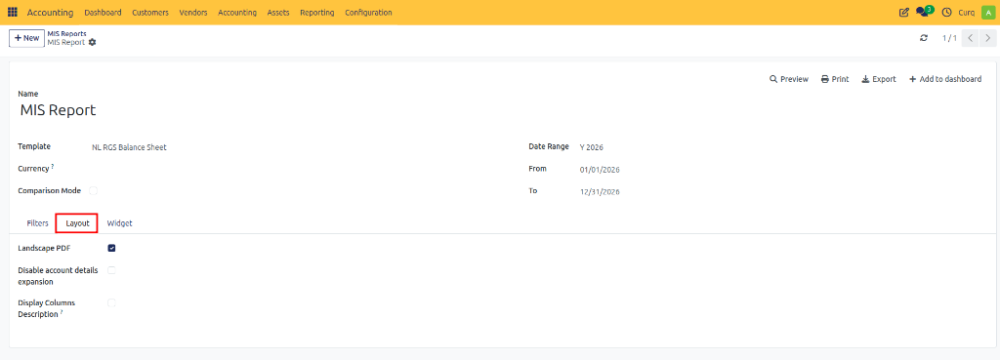
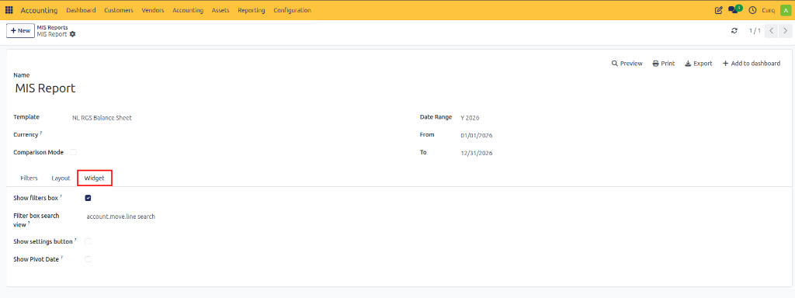
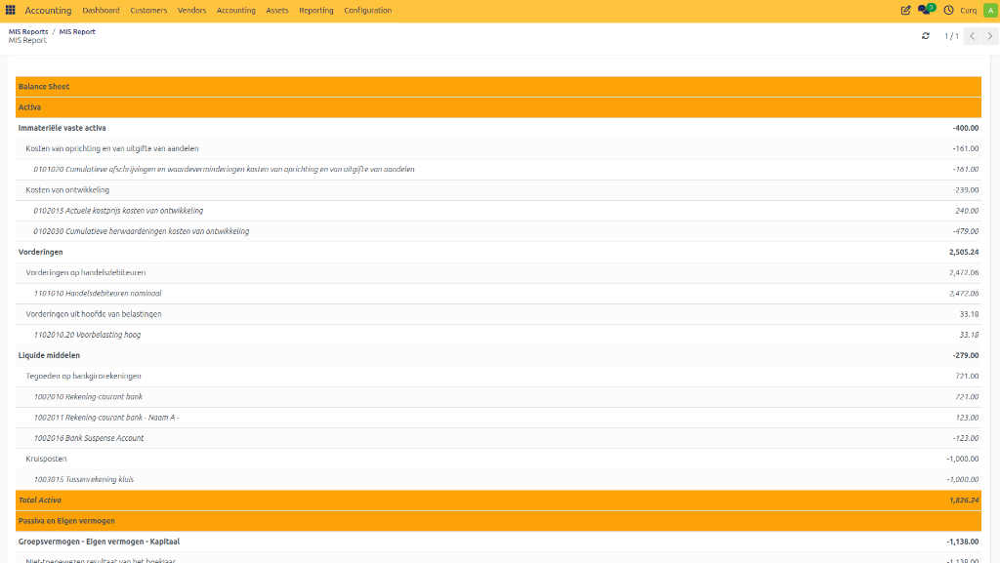

# MIS Reports

## Overview
MIS (Management Information System) Reports allow organizations to create customized financial reports and dashboards based on accounting data. These reports can be tailored to specific business requirements and used for management analysis, financial monitoring, and decision-making.

Users can define report templates, apply filters, customize layouts, and configure dashboard widgets for quick access to key financial information.

Navigate to:
**Accounting → Reporting → MIS Reports**

---

## Main Information Fields

| Field | Description |
| :--- | :--- |
| **Name** | The name of the MIS report. This name is displayed in the report list and dashboards. |
| **Template** | Select an existing MIS report template that defines the report structure, calculations, and displayed indicators. |
| **Currency** | Defines the currency used to display report amounts. |
| **Date Range** | Specifies the reporting period to analyze. |
| **From** | Start date of the reporting period. |
| **To** | End date of the reporting period. |
| **Comparison Mode** | Enables comparison of report values against another period (e.g., previous month, previous year, budget). |

---

## Filters Tab
The Filters tab controls which accounting data is included in the report.

| Field | Description |
| :--- | :--- |
| **Target Moves** | Determines which accounting entries are included in calculations. |
| **All Posted Entries** | Includes only validated (posted) accounting entries. Recommended for official reporting. |
| **All Entries** | Includes both draft and posted entries. Useful for forecasting and internal analysis. |
| **Analytic Domain** | Allows filtering data using analytic accounts, cost centers, projects, departments, or custom analytic dimensions. |

> **Example**
> You may create a Profit & Loss report that only includes transactions from:
> - Marketing Department
> - IT Department
> - Specific Project
> - Cost Center
> 
> using the Analytic Domain filter.

---

## Layout Tab
The Layout tab controls how the report is displayed and printed.

| Field | Description |
| :--- | :--- |
| **Landscape PDF** | Generates PDF reports in landscape orientation. Useful for reports with many columns. |
| **Disable Account Details Expansion** | Prevents users from expanding report lines to view detailed account transactions. Creates a cleaner summary report. |
| **Display Columns Description** | Shows descriptive text for report columns to improve readability and understanding. |

### Layout Features

**Landscape PDF**
When enabled:
- Report is printed horizontally.
- More columns fit on a page.
- Ideal for management reports with multiple periods.

**Disable Account Details Expansion**
When enabled:
- Users see only summary totals.
- Drill-down into account details is disabled.
- Suitable for executive-level reports.

**Display Columns Description**
When enabled:
- Additional descriptions are shown for report columns.
- Makes reports easier to understand for non-accounting users.

---

## Widget Tab
The Widget tab controls dashboard behavior and user interaction.

| Field | Description |
| :--- | :--- |
| **Show Filters Box** | Displays the filter panel on the dashboard widget, allowing users to change report criteria. |
| **Filter Box Search View** | Defines the search/filter interface available to users. |
| **Show Settings Button** | Displays a settings icon on the widget for additional configuration options. |
| **Show Pivot Date** | Displays the reporting date or pivot date used in calculations. |

### Widget Features

**Show Filters Box**
When enabled:
- Users can modify report filters directly from the dashboard.
- Reports become interactive.
- Useful for management dashboards.

**Filter Box Search View**
Defines which search view is available when users interact with report filters.
Examples:
- Search by journal
- Search by account
- Search by department
- Search by analytic account

**Show Settings Button**
When enabled:
- A settings icon appears on the dashboard widget.
- Users can access report configuration options quickly.

**Show Pivot Date**
When enabled:
- The reporting reference date is displayed.
- Useful for period comparisons and financial analysis.

---

## Available Actions

| Action | Description |
| :--- | :--- |
| **Preview** | Generates a live preview of the report without printing. |
| **Print** | Generates a printable PDF report. |
| **Export** | Exports the report to supported formats such as Excel. |
| **Add to Dashboard** | Adds the report as a dashboard widget for quick access. |

---

## Viewing the Report

Once generated, the MIS report displays the customized financial information based on your configurations.

