# Channels and Direct Messages

Create public and private discussion channels, start direct chats with colleagues, share documents, and hold voice or video calls in CURQ 18.

---

### 1. Overview of Channels and Direct Messages

CURQ provides real-time team communication directly inside the business platform through **Discuss**:

* **Channels**: Group chat rooms organized by topic, department, or project *(such as `#general`, `#sales`, or `#warehouse`)*. Channels keep team discussions focused in public or private spaces.
* **Direct Messages**: Private conversations between two or more specific colleagues. Direct messages are only visible to the people invited to that chat.

Using built-in chat keeps company communications in one place, so employees do not need to switch between external messaging apps.

---

### 2. Access the Discuss Workspace

You can open the chat workspace in two ways:

1. Click the main app menu icon at the top left of the dashboard and select **Discuss** *(or **Chat**)*.
2. Click the chat bubble icon in the top right menu bar from anywhere inside CURQ to open the quick chat dropdown or expand it into the full workspace.

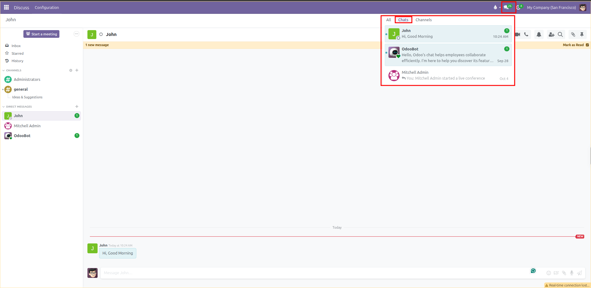

The left sidebar displays:
* **Inbox**: Messages where colleagues mention you or documents you follow.
* **Starred**: Saved messages you marked for later follow-up.
* **History**: Past notifications you have already read.
* **Channels**: All public and private group rooms you belong to.
* **Direct Messages**: One-on-one and private team conversations.

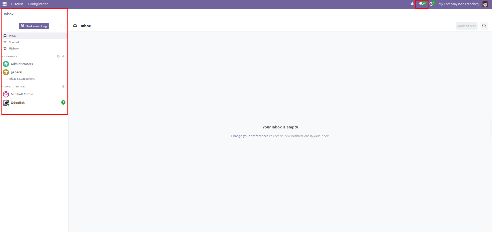

---

### 3. Create and Join Channels

#### Create a New Channel

1. In the left sidebar, click the **+** (plus) icon next to **Channels**.
2. Type a channel name *(for example, `operations` or `customer-support`)*. Channel names automatically format with a `#` prefix.
3. If the channel does not exist, click **Create: #channel-name**.

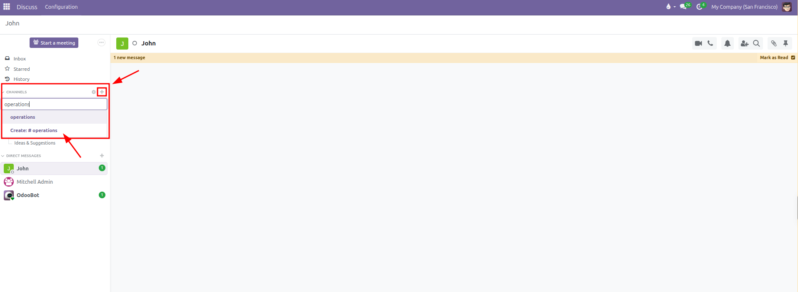

The newly created channel opens in the main window and appears in your sidebar:

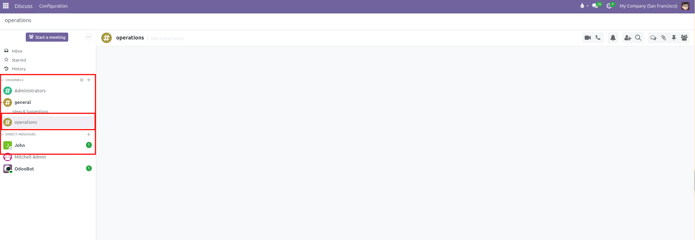

4. To set the channel description or restrict membership:
   * Click the gear icon next to the channel name in the sidebar.
   * Enter a short description outlining the purpose of the group.
   * Under the **Privacy** tab, choose whether the channel is open to everyone or restricted to invited users.

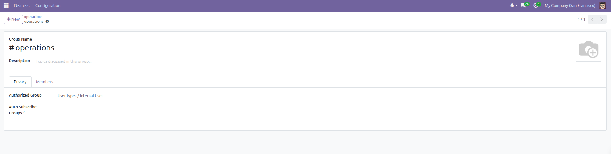

   * Under the **Members** tab, view existing members or add new colleagues to the channel.

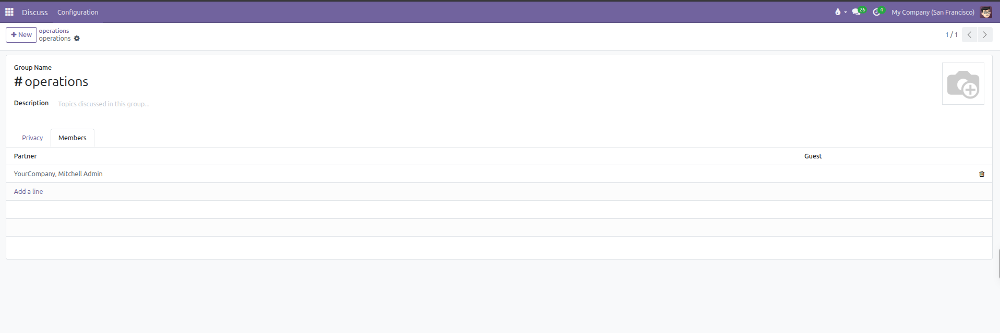

   * Click **Save** (cloud icon).

#### Join an Existing Channel

1. Click the **+** (plus) icon next to **Channels**.
2. Start typing the name of an existing channel *(such as `operations`)*.
3. Select the channel from the search results to join immediately.

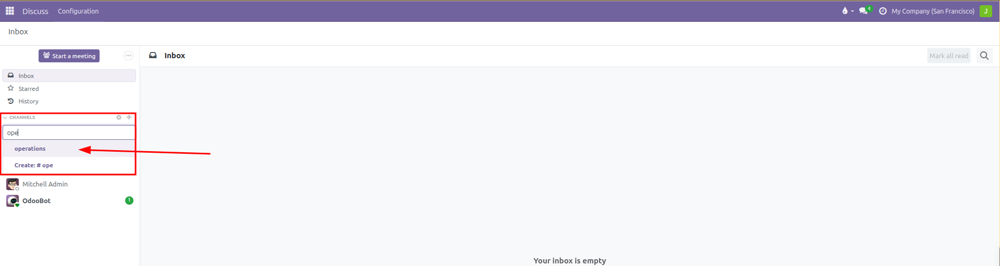

---

### 4. Start a Direct Message

To message a colleague privately:

1. In the left sidebar, click the **+** (plus) icon next to **Direct Messages**.

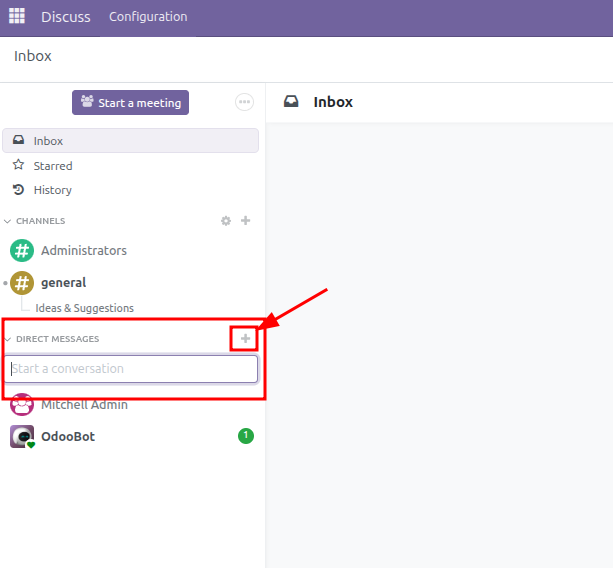

2. Type the name of the colleague you want to contact.
3. Select their name from the dropdown list to open a private conversation.

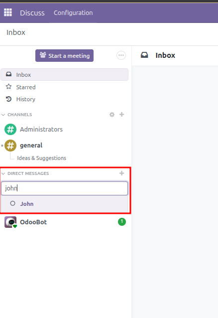

4. Check their availability through the status indicator next to their avatar:
   * **Green filled circle**: Online and active.
   * **Orange filled circle**: Away or idle *(automatically set after 30 minutes of inactivity)*.
   * **Hollow circle (`○`)**: Offline *(user closed their browser or logged out)*.
   * **Green heart (`♥`)**: Automated bot *(such as OdooBot)*.

*(User availability updates automatically based on system activity. There is no manual toggle to change your status).*

To include multiple people in a private group chat, type several names into the search box before confirming, or click the Add Person icon in an existing direct conversation to open the invite popover and click **Create Group Chat**.

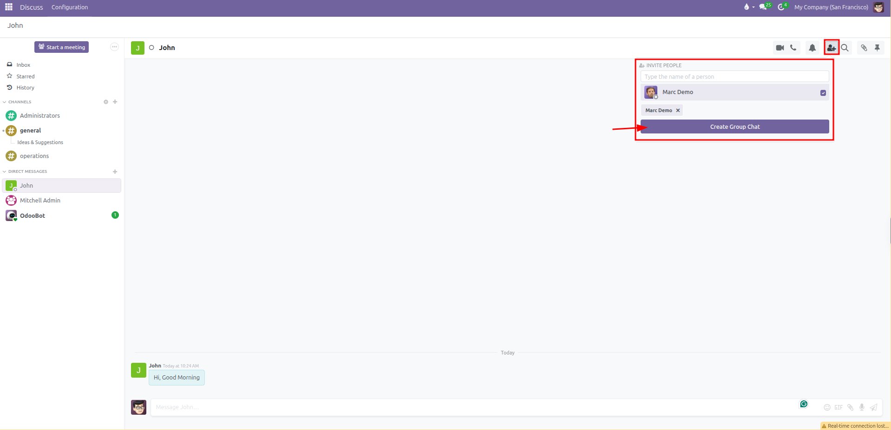

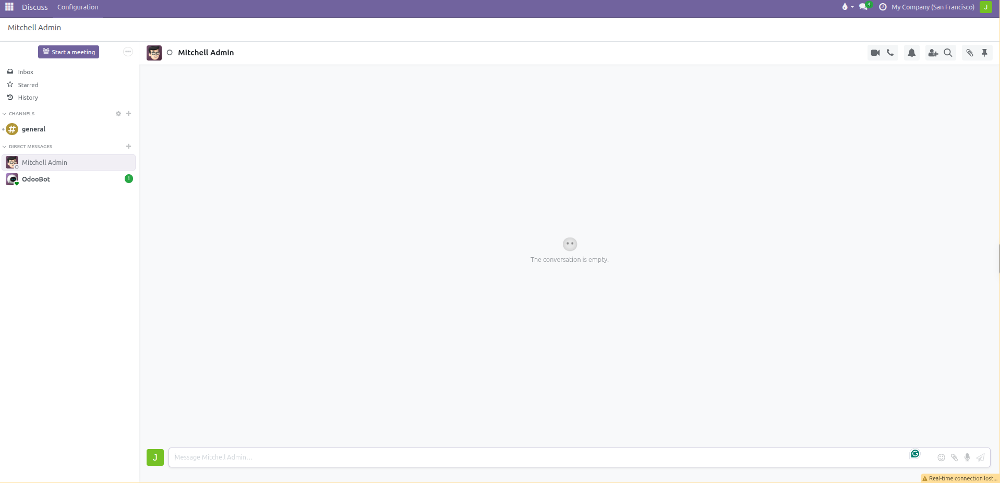

#### Incoming Messages and Unread Badges

When a colleague messages you while you are in another app:

1. A green unread counter appears next to their name in the sidebar.

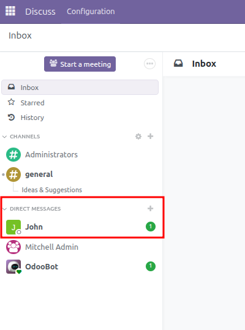

2. Click their name to open the conversation.
3. CURQ displays a yellow notification banner showing the new message count and a red separator line marking where new messages begin.
4. Click **Mark as Read** in the top yellow banner to clear the unread notification.

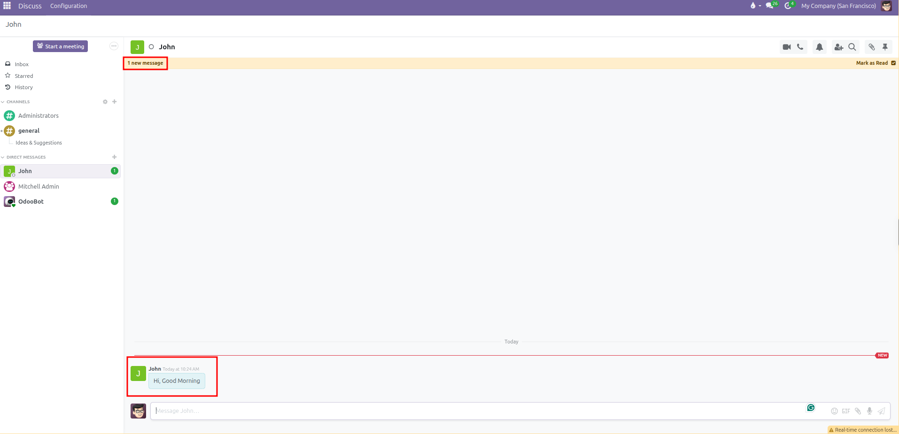

---

### 5. Send Messages, Mentions, and Reactions

Inside any conversation window:

1. Type your message into the text box at the bottom.
2. Use special characters to connect records and notify colleagues:
   * **Mention a Coworker (`@`)**: Type `@` followed by a user name to open the user suggestion list. Tagging a coworker sends an immediate notification directly to their Inbox.

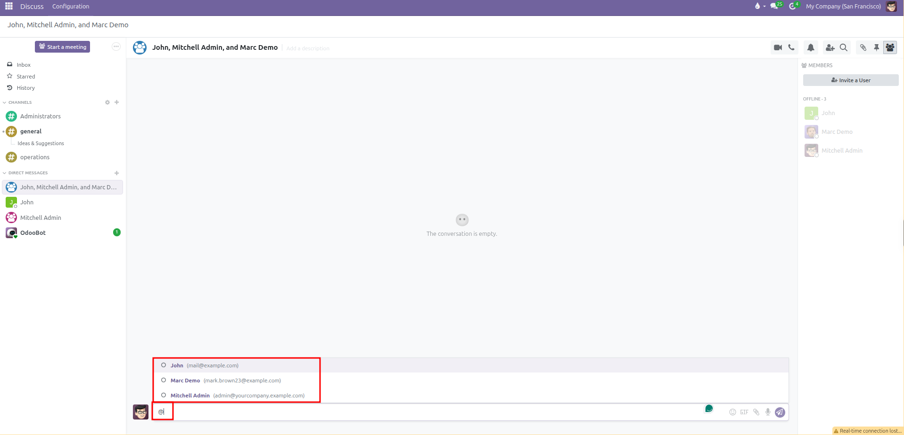

   * **Link a Channel (`#`)**: Type `#` followed by a channel name to show available channels and topic threads. Linking a channel creates a clickable shortcut directly to that room.

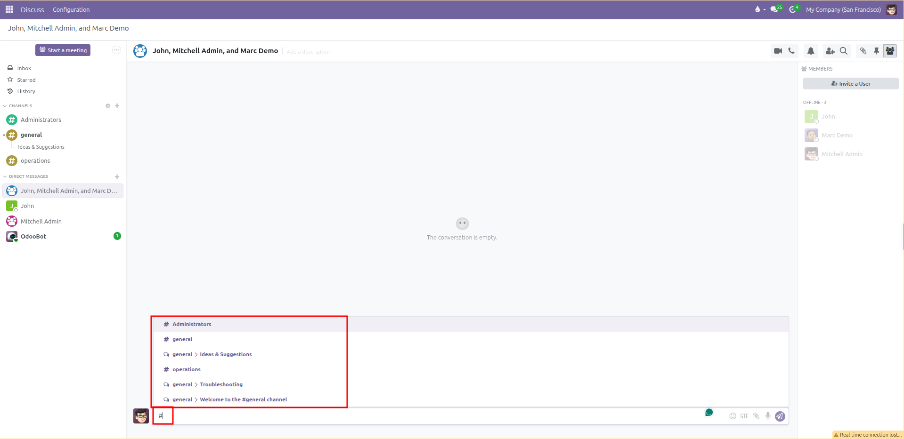

3. To attach files or documents, click the paperclip icon *(or drag and drop files into the window)*. You can share PDF invoices, contracts, spreadsheets, and images.
4. Press **Enter** to send the message.

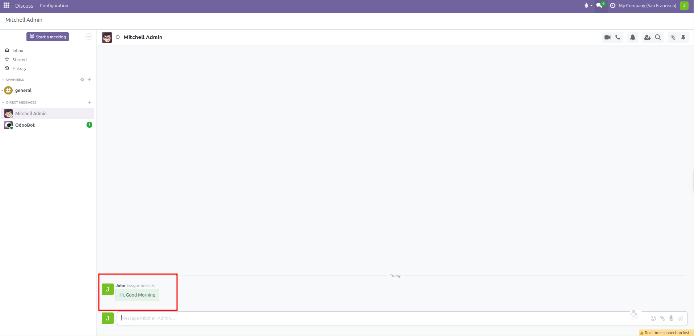

5. Hover over any message to access quick actions:
   * **Add Emoji Reaction**: Click the smiley face icon to open the emoji picker or search for specific icons *(such as thumbs up, fire, or celebratory emojis)*.
   * **Quote Message**: Click the curved arrow icon to quote the text in your next response.
   * **Star Message**: Click the star icon to save important messages into your personal **Starred** folder for quick access later.
   * **More Actions Menu**: Click the three vertical dots to view additional options: **Pin**, **Mark as Unread**, **Edit**, **Delete**, or **Copy Link**.

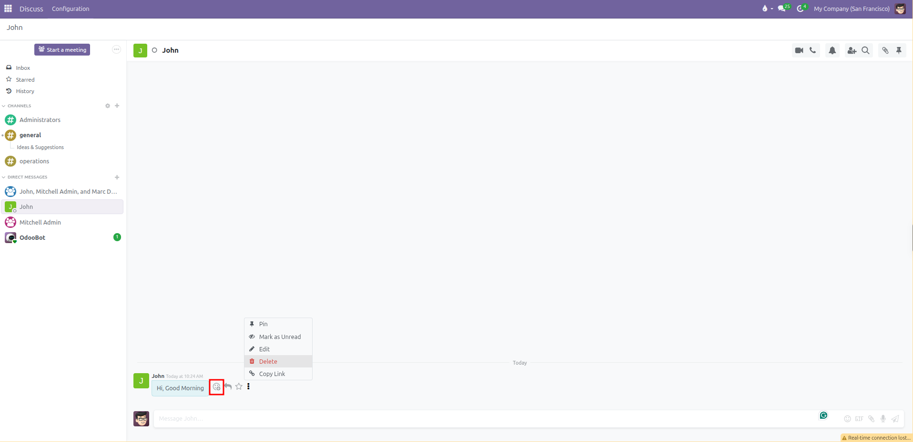

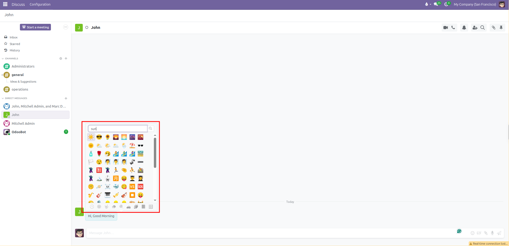

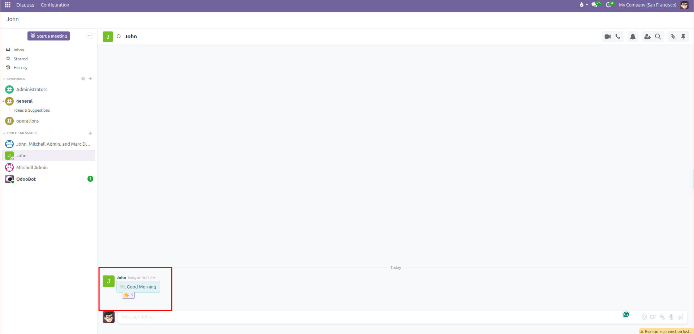

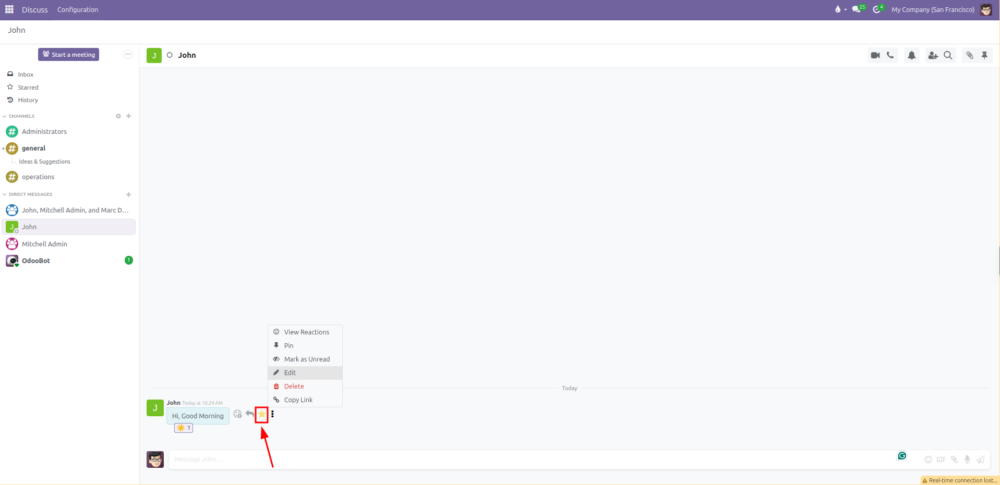

---

### 6. Voice Calls, Video Calls, and Screen Sharing

CURQ lets you start real-time calls directly inside any channel or direct chat without third-party meeting software:

1. Open the channel or direct conversation where you want to meet.
2. In the top right corner of the chat pane, click:
   * The **Phone** icon to start an audio voice call.
   * The **Camera** icon to start a video call.

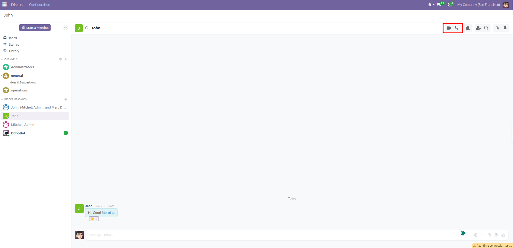

3. When connecting for the first time, your web browser requests permission to access your audio or video equipment. Click **Allow** to connect your microphone.

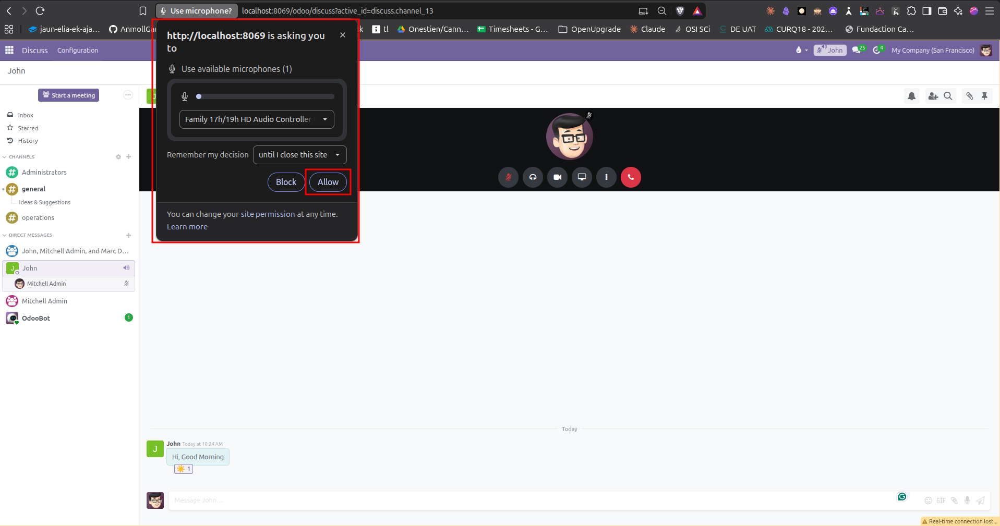

4. Once the call is active, use the toolbar controls at the bottom:
   * **Microphone**: Mute or unmute your voice.
   * **Deafen** *(headset icon)*: Silence incoming audio from other callers.
   * **Camera**: Turn your webcam video on or off.
   * **Screen Share** *(monitor icon)*: Share your screen, a specific browser tab, or an application window with participants.
   * **Settings** *(three dots)*: Adjust audio input devices and noise suppression.
   * **Hang Up** *(red phone icon)*: Leave the call when finished.

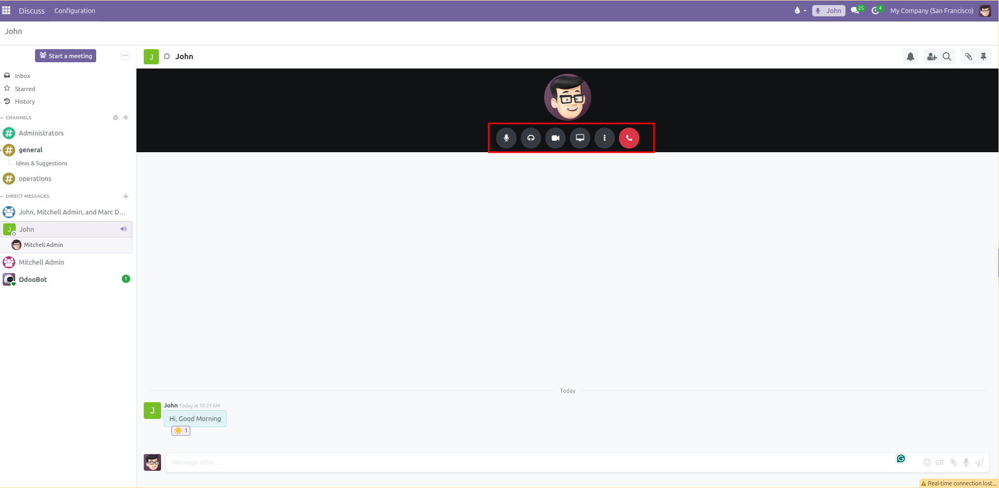

#### Instant Calls with the "Start a meeting" Button

To launch an immediate video conference without creating a permanent channel first:

1. Click the purple **Start a meeting** button at the top of the left sidebar *(or press keyboard shortcut `m`)*. This button is also available inside the top navigation bar chat dropdown.

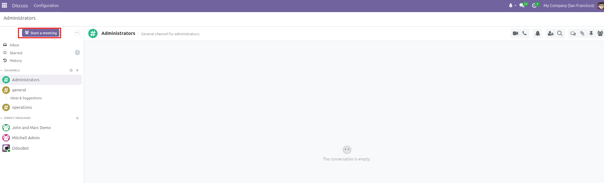

2. CURQ automatically creates an instant meeting room, activates full-screen video, and opens the **Invite People** popover.
3. Select teammates from the list to add them to the call, or copy the direct meeting link displayed at the bottom of the popover to share with participants.

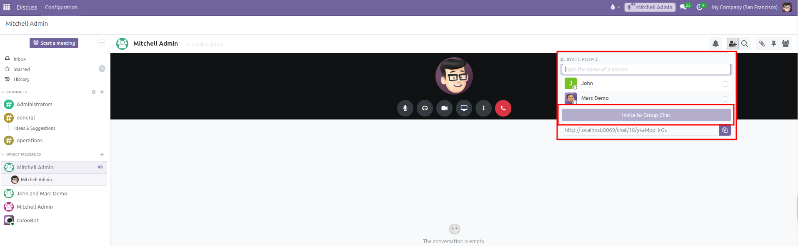

4. Once the discussion concludes and callers hang up, the temporary room closes, preventing unnecessary clutter in your permanent channels list.

---

### 7. Header Toolbar Tools: Notifications, Search, Attachments, Pinned Messages, and Members

Every channel and direct message window features a set of administrative and productivity tools in the top right header:

#### 1. Notification Settings (Bell Icon)
Click the bell icon in the top header to control how alerts arrive for the current conversation:
* **Mute Conversation**: Silence popups and notification sounds for a designated period. Choose between **For 15 minutes**, **For 1 hour**, **For 3 hours**, **For 8 hours**, **For 24 hours**, or permanently until unmuted. When muted, the bell icon changes into a red slashed bell. Click **Unmute Conversation** to restore alerts at any point.
* **Channel Notification Preferences** *(Channels only)*: Select how CURQ alerts you to new posts:
  * **Use Default**: Follows your global user preference *(Handle in Odoo or Handle by Emails)*.
  * **All Messages**: Generates a notification for every post in the room.
  * **Mentions Only**: Alerts you only when someone tags you with `@` or alerts the entire group.
  * **Nothing**: Completely silences all activity in this room without muting your other conversations.

#### 2. Search Messages (Magnifying Glass Icon)
Click the magnifying glass icon to open the in-thread search drawer on the right side:
* Enter keywords, coworker names, or phrases into the search bar.
* CURQ displays matching messages chronologically with author names and posting times.
* Click any search result to scroll straight to that message inside the conversation history.

#### 3. Attachments Drawer and External Upload Security (Paperclip Icon)
Click the paperclip icon in the header toolbar to view all shared documents and media:
* Displays all files, PDF invoices, spreadsheets, and pictures shared in the conversation, organized chronologically by date sections.
* Allows team members to preview, download, or delete uploaded files without searching through hundreds of text lines.
* **External User Upload Security Switch**:
  * For channels that include external portal visitors or clients, the top of the attachments drawer contains a security toggle switch.
  * **File upload is disabled for external users**: When switched off, guest participants can read and write chat messages, but cannot upload files. This protects company storage and prevents unverified external uploads.
  * **File upload is enabled for external users**: When switched on, external guests can attach project files, receipts, or photos directly to the thread.

#### 4. Pinned Messages (Push Pin Icon)
Click the push pin icon in the header toolbar to open the pinned messages drawer:
* Pin critical announcements, guidelines, shared spreadsheets, or meeting agendas so team members can access them quickly.
* To pin a message: Hover over any message in the feed, click the three vertical dots menu, and select **Pin**.
* To consult or unpin: Open the pinned messages drawer, click a pinned item to view it in context, or unpin it when the announcement is no longer needed.

#### 5. Members and Invitations (People Icon)
Click the people icon in the top header to open the members sidebar:
* Lists all participants currently enrolled in the channel or conversation.
* Displays live presence indicators next to each coworker *(Green filled circle for active, Orange filled circle for away, and Hollow circle for offline)*.
* Click **Invite a User** *(or the Add Person icon)* to invite additional colleagues. When inviting a teammate to a direct chat, CURQ provides an option to **Create Group Chat**, preserving previous conversation history while adding the new member.
