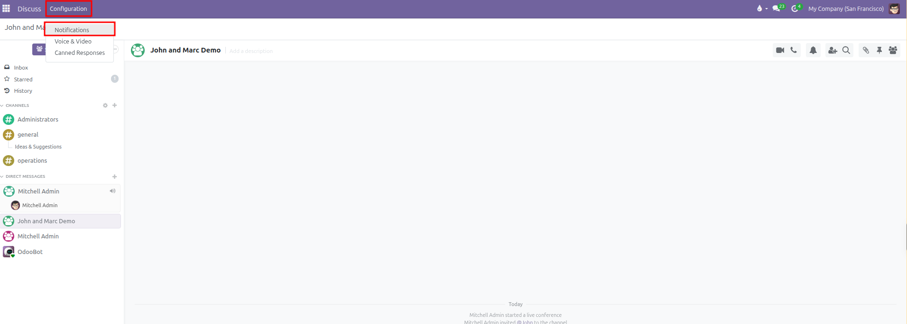
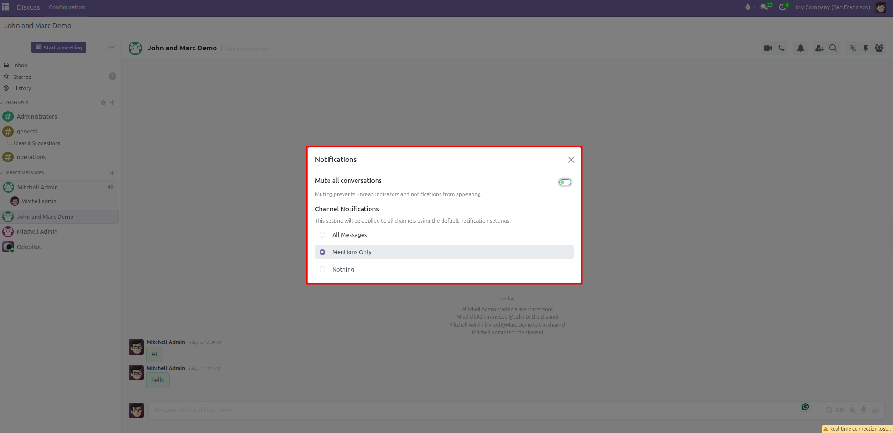
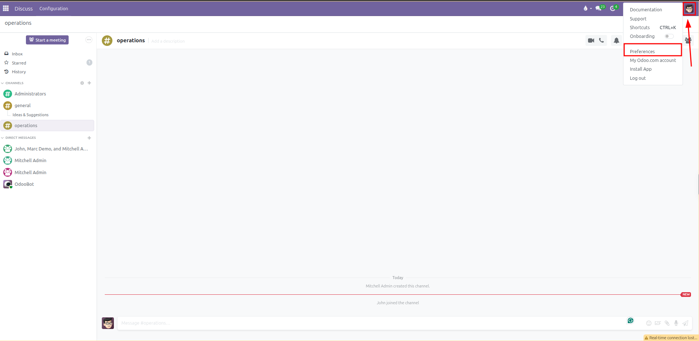
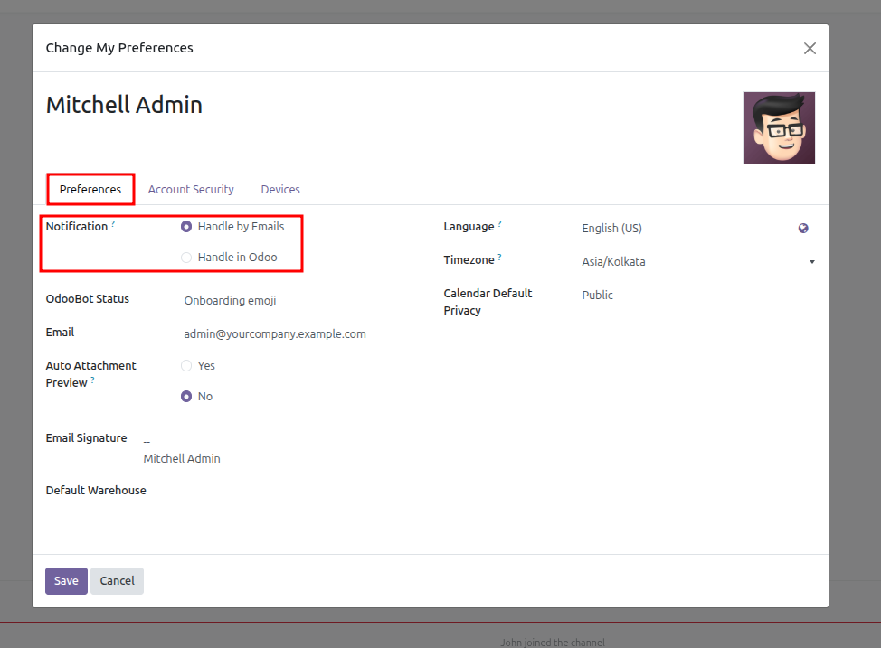

# Notification Settings and Preferences

Configure global chat alert rules, set conversation mute durations, and manage personal notification delivery in CURQ 18.

---

### 1. Overview of Notification Configuration

CURQ allows every employee to customize how and when they receive alerts from team channels, direct messages, and followed business records. Managing these settings prevents notification overload while ensuring critical operational updates are never missed.

Users can set two levels of notification control:

1. **Global Default Settings**: Apply across all channels and direct messages from the central **Configuration** menu.
2. **Channel-Specific Overrides**: Tailor alert sensitivity for individual channels using the header toolbar bell icon.

---

### 2. Configure Global Channel Notification Defaults

To set the default alert behavior for all channels you join:

1. Open the **Discuss** app from the main application menu.
2. In the top navigation bar, click **Configuration** and select **Notifications**.

3. The **Notifications** dialog opens in the center of the screen:

4. Under **Channel Notifications**, select one of the three default rules:
   * **All Messages**: Triggers an alert for every single post sent to any channel. Recommended only for small teams or critical monitoring channels.
   * **Mentions Only** *(Default)*: Triggers an alert only when a coworker tags you directly with `@name` or alerts the entire channel. This is the recommended baseline setting for daily business operations.
   * **Nothing**: Completely silences default channel posts. You will only see new messages when you manually click into the channel.

Changes apply immediately to all channels set to use default notifications.

---

### 3. Temporarily Mute All Conversations (Do-Not-Disturb)

When attending meetings, hosting calls, or focusing on high-priority tasks, you can pause incoming chat pings across all conversations at once:

1. Open **Discuss > Configuration > Notifications**.
2. Click the switch toggle next to **Mute all conversations** to turn it on *(green)*.
3. Select your desired timeframe from the **Mute duration** dropdown:
   * **For 15 minutes**
   * **For 1 hour**
   * **For 3 hours**
   * **For 8 hours**
   * **For 24 hours**
   * **Until I turn it back on** *(permanent mute until manually disabled)*

#### What Happens While Muted:
* Desktop popups and alert chimes are suppressed.
* Unread counters on channels and direct chats are hidden to prevent distraction.
* A warning banner appears inside the conversation pane indicating that conversations are currently silenced.
* Once the designated timer expires, CURQ automatically turns off the mute switch and resumes normal alert delivery.

To restore notifications before the timer expires, return to **Configuration > Notifications** and switch **Mute all conversations** off, or click **Unmute Conversation** from the notification banner.

---

### 4. Set Channel-Specific Notification Overrides

If a specific project room requires closer monitoring than your global baseline, you can customize its rules independently:

1. Click on the channel in the left sidebar *(for example, `#operations`)*.
2. In the top right header toolbar, click the **Bell** icon.
3. Select an override:
   * **Use Default**: Follows the baseline rule configured under **Configuration > Notifications**.
   * **All Messages**: Overrides global settings to notify you of every post in this specific room.
   * **Mentions Only**: Alerts you only when directly tagged in this room.
   * **Nothing**: Mutes this specific channel without silencing your other discussions.
4. To mute only this single conversation without affecting company-wide chats, select **Mute Conversation** and choose an individual duration *(such as 1 hour or 8 hours)*.

---

### 5. Choose Between In-App Inbox and External Email Delivery

In addition to chat alerts, CURQ delivers notifications for business documents you follow *(such as Sales Orders, Purchase Orders, and Tasks)*. You can choose whether these arrive inside CURQ or in your personal email inbox:

1. Click your user avatar at the top right of the screen.
2. Select **Preferences** *(or **My Profile**)*.

3. Locate the **Notification** field under the **Preferences** tab:
   * **Handle in Odoo**: All notifications route to your CURQ **Inbox** folder. This centralizes company communication inside the business platform and keeps your external email clean.
   * **Handle by Emails**: Notifications forward directly to your registered work email address as separate emails.

4. Click **Save** to confirm your preference.
