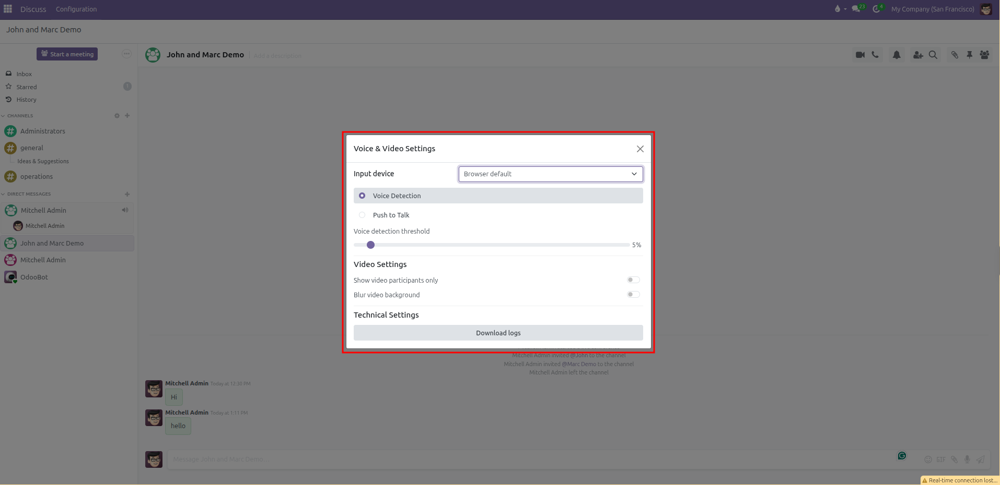

# Voice and Video Call Configuration

Configure audio input devices, voice detection sensitivity, push-to-talk hotkeys, background blur, and camera display rules for real-time calls in CURQ 18.

---

### 1. Overview of Voice and Video Settings

CURQ includes built-in WebRTC audio and video calling directly inside Discuss. To ensure clear communication during team conferences and client meetings, users can adjust their hardware inputs, audio activation modes, camera feeds, and privacy filters.

These settings are managed centrally from the Discuss configuration menu and apply automatically to all calls you start or join.

---

### 2. Access Voice and Video Settings

To configure your calling equipment:

1. Open the **Discuss** app from the main application menu.
2. In the top navigation bar, click **Configuration** and select **Voice & Video**.
3. The **Voice & Video Settings** dialog opens in the center of the screen:

---

### 3. Configure Audio Input and Microphone Settings

#### Select Audio Input Device
* Under **Input device**, click the dropdown menu to choose your preferred microphone hardware *(such as your built-in computer microphone, a USB headset, or an external desktop mic)*.
* If set to **Browser default**, CURQ follows whatever default audio input device is selected in your operating system or web browser.

#### Choose Audio Activation Mode

CURQ offers two distinct methods for transmitting your voice during a call:

1. **Voice Detection**:
   * The microphone transmits sound automatically whenever your voice volume exceeds a set threshold.
   * **Voice detection threshold**: Use the slider to set sensitivity *(default is 5%)*.
     * **Lower percentage** *(closer to 0%)*: Makes the microphone more sensitive, capturing softer voices.
     * **Higher percentage**: Filters out quiet ambient noise, keystrokes, and office background sounds so your microphone only activates when you speak clearly.

2. **Push to Talk**:
   * The microphone remains completely muted until you press and hold a designated shortcut key on your keyboard. This prevents accidental background noise in busy environments.
   * **Push-to-talk key**: Click the keyboard icon and press your desired key or combination *(such as `Space` or `Ctrl + Space`)* to register the shortcut.
   * **Delay after releasing push-to-talk**: Adjust the slider between `0 ms` and `2000 ms` *(default is 200 ms)*. This brief delay keeps the audio feed open for a fraction of a second after releasing the key so your final syllables are not cut off.

---

### 4. Configure Video Feed and Privacy Settings

Under **Video Settings**, adjust how camera feeds display during team meetings:

#### Show Video Participants Only
* Click the toggle switch to enable **Show video participants only**.
* When enabled, CURQ hides callers who have their cameras turned off and displays only participants broadcasting live video feeds. This maximizes screen space for presentations and face-to-face discussions.

#### Blur Video Background
* Click the toggle switch to enable **Blur video background**.
* CURQ uses real-time browser canvas filtering to isolate your silhouette and blur your physical background, keeping home offices or busy workspaces private.
* When enabled, adjust the dual sliders to refine the visual effect:
  * **Background blur intensity**: Controls how heavily the background behind you is blurred *(from 0% to 100%)*.
  * **Edge blur intensity**: Adjusts the sharpness of the boundary between your silhouette and the blurred background.

---

### 5. Technical Diagnostics and Connection Logs

If you encounter audio stuttering, dropped video feeds, or network issues during a conference:

1. Open **Discuss > Configuration > Voice & Video**.
2. Under **Technical Settings**, click the **Download logs** button.
3. CURQ generates and downloads a structured diagnostic file named `RtcLogs_YYYY-MM-DD_HH-mm.json`.
4. Provide this log file to your system administrator or technical team to inspect WebRTC connection events, network latency, and media packet drops.
