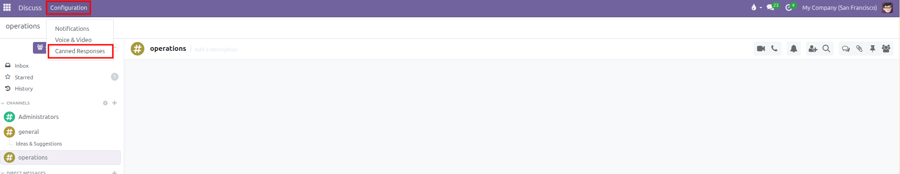
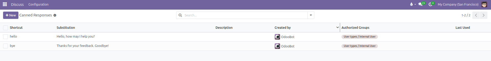
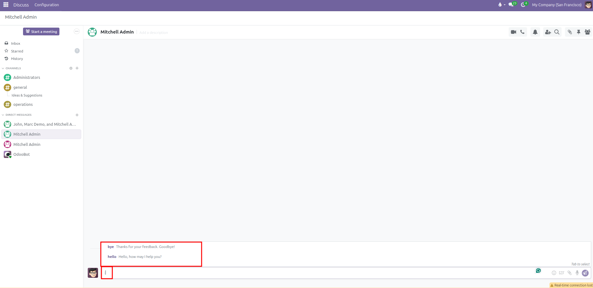

# Canned Responses Setup

Create pre-written message templates, assign shortcut triggers, and share standard responses across teams in CURQ 18.

---

### 1. Overview of Canned Responses

Canned responses allow employees to insert standardized message templates into any chat conversation or document chatter simply by typing a colon followed by a shortcut *(such as `:hello` or `:pricing`)*. 

Using canned responses speeds up customer communication, ensures brand consistency across customer service and sales teams, and removes the need to type identical messages multiple times.

---

### 2. Access Canned Responses Configuration

To manage existing templates or create new ones:

1. Open the **Discuss** app from the main application menu.
2. In the top navigation bar, click **Configuration** and select **Canned Responses**.

3. The system displays the list of active canned responses. The default search filter displays **My canned responses**, showing templates you created. You can clear this filter or select **Shared canned responses** to view team-wide templates.

---

### 3. Create a New Canned Response

To add a reusable template:

1. From the **Canned Responses** list view, click **New** *(or click the top row of the editable table)*.
2. Fill in the template details:
   * **Shortcut**: Enter the keyword that will trigger the template. You do not need to type the colon here *(for example, enter `quote-followup` to trigger with `:quote-followup`)*.
   * **Substitution**: Type the complete text that will automatically fill into the message box when the shortcut is selected.
   * **Description**: Enter a brief summary explaining the purpose of this template *(for example, `Standard follow-up for pending quotation approvals`)*.
   * **Authorized Groups**:
     * **Leave Blank**: Keeps the template personal to your user account. Other coworkers will not see or use it.
     * **Select Groups**: Add specific user groups *(such as `Sales / User` or `Inventory / User`)* to share the template with all members of that department.
3. Click the cloud icon *(or click outside the row)* to **Save**.

---

### 4. Insert Canned Responses in Messages

Canned responses function in every composer across CURQ, including public channels, private direct chats, and record chatter feeds on Sales Orders, Invoices, and Helpdesk tickets:

1. Click inside any message box.
2. Type a colon (`:`) followed by the first few letters of the shortcut *(such as `:hello`)*.
3. A popup suggestions list appears displaying all matching canned responses along with their preview text.

4. Select the desired template using your mouse, press **Tab**, or press **Enter**.
5. CURQ immediately swaps the shortcut with the full substitution text.
6. You can edit the text, insert names, or adjust details before clicking **Send**.

---

### 5. Personal Versus Shared Responses and Permissions

CURQ manages template access using strict security rules:

* **Personal Templates**: Created without selecting any Authorized Groups. Only the author can view, use, edit, or delete them.
* **Shared Department Templates**: Created with one or more Authorized Groups selected. Any colleague belonging to those groups can view and use the shortcut in their messages.