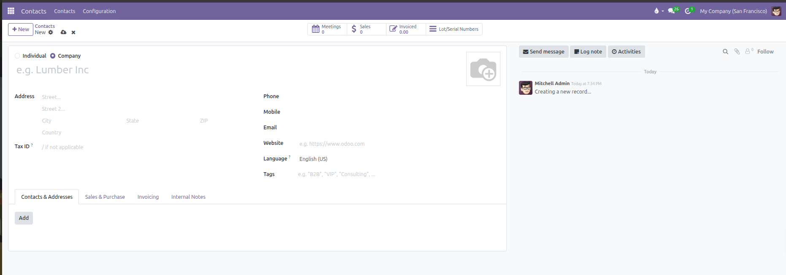
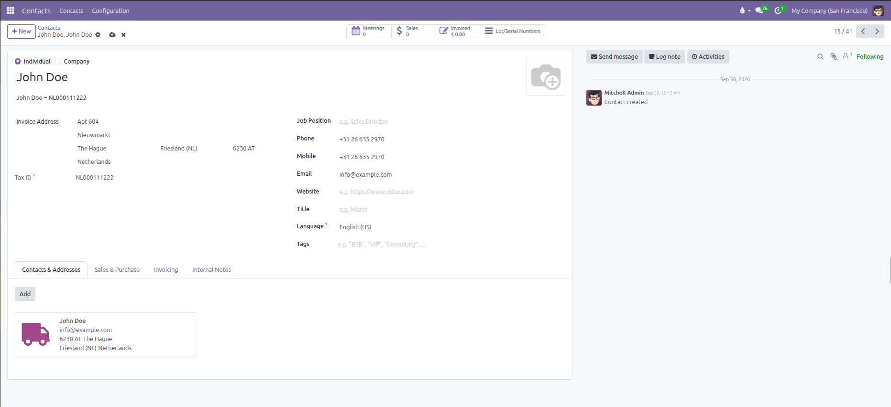
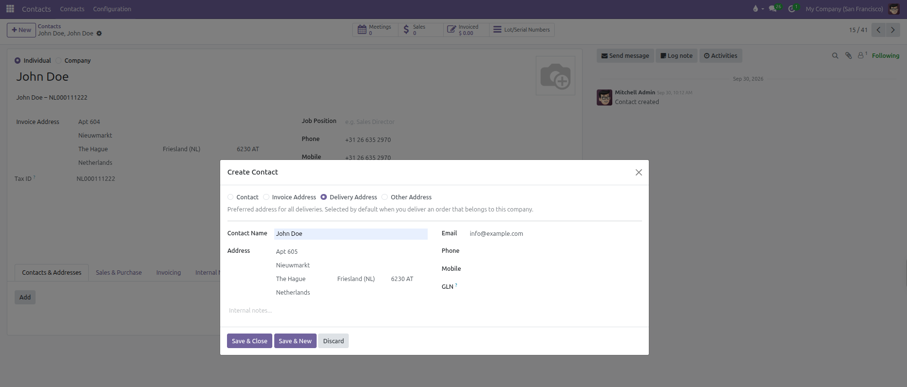
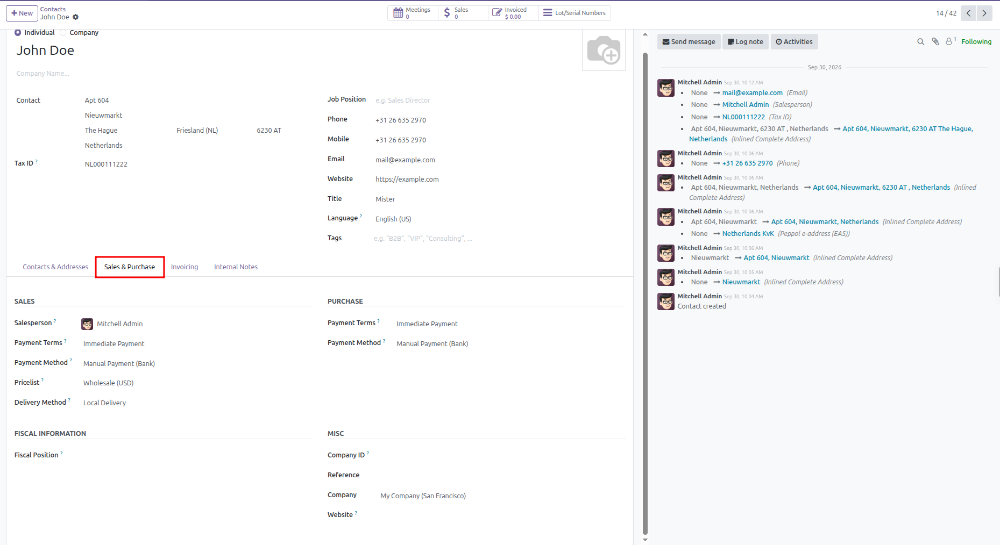
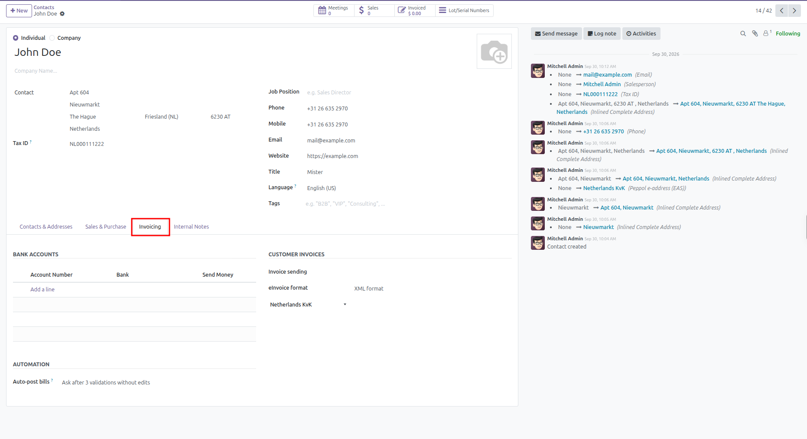
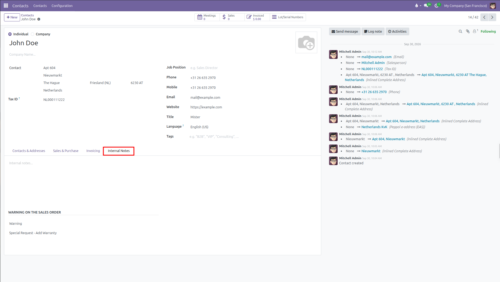

# Creating a Contact

Follow these steps to add and manage contacts in CURQ 18:

### 1. Open Contacts
1. Open the **Contacts** app from the main dashboard.
2. Click **New** at the top left to create a blank contact record.

   

### 2. Choose the Contact Type
* **Individual**: Select this option for a person, employee, or private customer. The **Company Name** field appears below their name, but it is completely optional:
  * **Leave it empty** if the person is a private customer, contractor, or independent contact.
  * **Select or type a company** if the person works for a business. Doing this links them to that organization and automatically pulls the company address.
* **Company**: Select this option for an organization, corporation, or business entity. Sub-contacts and branch addresses can be attached directly under this company record.

### 3. Enter Basic Contact Information
1. Type the contact or company name in the **Name** field.
2. Fill in communication and address details:
   * **Address**: Enter street, city, state, postal code, and country.
   * **Tax ID**: Enter the business tax number or VAT registration code.
   * **Job Position**: Specify the person role or title inside their organization.
   * **Phone** and **Mobile**: Enter contact telephone numbers.
   * **Email**: Enter the primary email address used to send quotes and invoices.
   * **Website**: Enter the company website address.
   * **Title**: Select a formal salutation (such as Mister, Madam, or Doctor). This field is visible when creating an individual contact.
   * **Language**: Choose the preferred language for this contact. CURQ uses this language when sending automated emails, quotations, and invoices if multiple languages are installed.
   * **Tags**: Select or create labels to group and filter your contacts quickly.
   * **Avatar or Logo**: Click the camera icon at the top right to upload a contact photo or company logo.

### 4. Add Addresses and Sub-Contacts
Under the **Contacts & Addresses** tab, click **Add** to attach related people or locations:

| Address Type         | Purpose                                                               |
| ----------------------| -----------------------------------------------------------------------|
| **Contact**          | Adds an employee or contact person working at this company.           |
| **Invoice Address**  | The billing destination where invoices and payment notices are sent.  |
| **Delivery Address** | The physical shipping destination where warehouse orders are shipped. |
| **Other Address**    | A secondary office, warehouse branch, or alternate site.              |

Enter the contact name, email, phone, street address, and optional GLN (Global Location Number) or internal notes, then click **Save & Close**.

### 5. Sales and Purchase (Optional)
Open the **Sales & Purchase** tab to define commercial, shipping, billing, and organizational rules:

#### Sales
* **Salesperson**: Select the internal team member who manages this customer.
* **Payment Terms**: Choose the payment schedule applied to customer orders and invoices, such as Immediate Payment, 15 Days, or 30 Days.
* **Payment Method**: Select the preferred incoming payment method when the customer pays bills (such as Manual or Credit Card).
* **Pricelist**: Set the default currency and special price rules for this customer, such as Default (USD). If the contact is an individual linked to a parent company, this is inherited from that company.
* **Delivery Method**: Select the default shipping method used on sales orders, such as Local Delivery or Standard Delivery.

#### Purchase
* **Payment Terms**: Choose the payment deadline agreed upon when purchasing goods from this supplier.
* **Payment Method**: Select the outgoing payment method your company uses to pay this vendor bills (such as Manual, Bank Transfer, or Checks).

#### Fiscal Information
* **Fiscal Position**: Select tax mapping rules that automatically adjust tax rates for domestic, regional, or international trade.

#### Misc
* **Reference**: An internal reference code or customer ID used by your team.
* **Company ID**: The official corporate registration number or chamber of commerce ID for a company.
* **Company**: In a multi-company setup, choose which branch or legal entity owns this contact.
* **Website**: If running multiple websites, restrict this contact account to a specific website store.
* **Industry**: Select the business sector the company operates in, such as Construction, Manufacturing, or Retail (visible on company records).

### 6. Invoicing (Optional)
Open the **Invoicing** tab to configure banking records, electronic billing standards, and bill validation rules.
*(Note: If the contact is an individual linked to a parent company, accounting settings are managed on the parent company record).*

#### Bank Accounts
Click **Add a line** to register bank accounts for this partner:
* **Account Number**: Enter the bank account number or IBAN.
* **Bank**: Select or create the banking institution.
* **Send Money**: Check this box if your company sends payouts or refunds to this account for supplier bills or credit notes.

#### Customer Invoices
* **Invoice sending**: Choose the default channel used when confirming and sending customer invoices:
  * **Download**: Prepares the invoice for manual download and printing.
  * **by Email**: Automatically queues the invoice to be emailed to the customer.
* **eInvoice format**: Select the electronic data interchange standard used when generating digital invoice files:
  * **France (FacturX)**
  * **EU Standard (Peppol Bis 3.0)**
  * **Germany (ZUGFeRD)**
  * **Germany (XRechnung)**
  * **Netherlands (NLCIUS)**
  * **Australia (BIS Billing 3.0 A-NZ)**
  * **Singapore (BIS Billing 3.0 SG)**
* **Peppol ID**: Select the national registry identifier scheme (such as Belgian Company Registry, France SIRET, Netherlands KvK, Germany Leitweg-ID, or USA EIN) and enter the endpoint number for cross-border electronic invoicing via Peppol.

#### Automation
* **Auto-post bills**: Controls how incoming vendor bills from this partner are validated:
  * **Always**: Automatically validates and posts bills as soon as they are registered.
  * **Ask after 3 validations without edits**: Prompts to turn on auto-posting once three consecutive bills have been approved without changes.
  * **Never**: Requires manual confirmation for every bill received from this supplier.

### 7. Add Internal Notes and Warnings (Optional)
Open the **Internal Notes** tab to record private memos and order alerts:

* **Internal Notes**: Free-text box to write historical background, customer preferences, or special operational reminders. These notes are visible only to internal staff and never appear on printed customer documents.
* **Warning on the Sales Order**: Set an operational alert when this customer is selected on quotations or sales orders:
  * **No Message**: Standard behavior without any popup prompts.
  * **Warning**: Displays a popup alert message to the salesperson, but allows them to proceed with the order.
  * **Blocking Message**: Displays a popup error message and completely blocks the salesperson from creating or confirming orders for this customer (ideal for bad debtors or suspended accounts).
* **Message**: Enter the warning or blocking text that appears in the popup dialog.

### 8. Save the Contact
CURQ 18 automatically saves changes as you type. You can also click the cloud icon at the top of the form to confirm saving manually. The contact is now ready for use across sales, purchasing, and invoicing.

---
