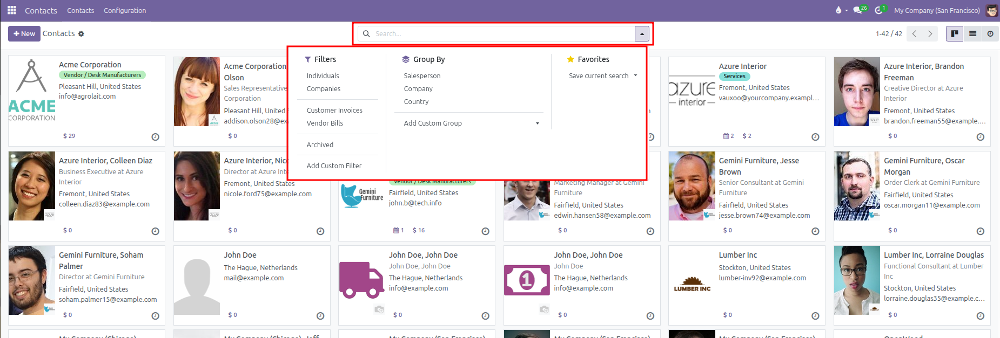
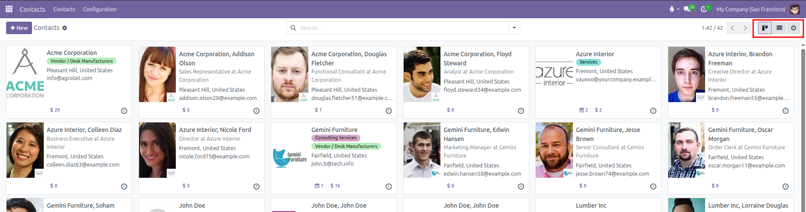
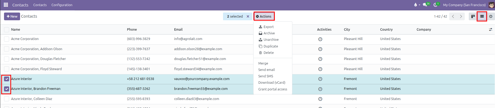
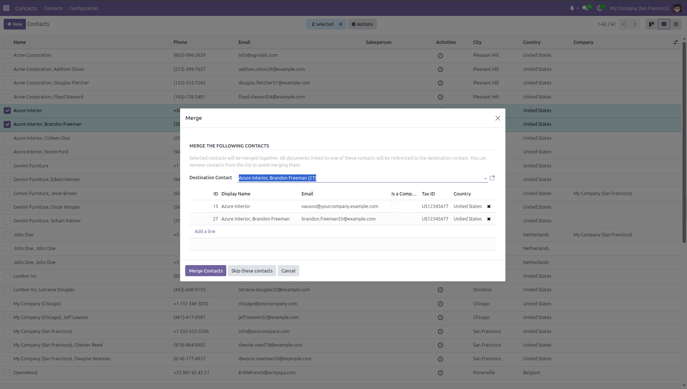

# Search, Filter, and Group Contacts

Follow these steps to find, filter, and organize contacts in CURQ 18:

---

### 1. Search for Contacts

To find a specific contact quickly:
1. Open the **Contacts** app from the main dashboard.
2. Click into the search bar at the top center of the screen.
3. Type your search term. CURQ allows searching by:
   * **Name**: The personal name or business name.
   * **Company**: The parent organization.
   * **Email**: Contact email address.
   * **Phone / Mobile**: Direct phone or mobile numbers.
   * **Tag**: Labels assigned to contacts (such as B2B or VIP).
   * **Salesperson**: The internal team member managing the relationship.

---

### 2. Apply Preset and Custom Filters

Narrow down your contact directory using standard built-in filters:
1. Click the search bar to reveal the filter dropdown menu.
2. Under the **Filters** section, select one or more options:
   * **Individuals**: Displays only individual people and employees.
   * **Companies**: Displays only business entities and organizations.
   * **Customer Invoices**: Displays contacts with customer sales and billing history.
   * **Vendor Bills**: Displays suppliers and vendors with purchase bills.
   * **Archived**: Displays deactivated contacts that are hidden from everyday views.
3. Click **Add Custom Filter** to filter by specific fields, such as City, State, or Country.

---

### 3. Group Contacts by Organization or Country

Organize large contact lists into structured groups:
1. Click the search bar to open the dropdown menu.
2. Under the **Group By** section, select a grouping rule:
   * **Salesperson**: Groups contacts under the internal team member assigned to manage them.
   * **Company**: Groups employees and sub-contacts under their parent organization.
   * **Country**: Groups partners geographically by their country.
3. Click **Add Custom Group** to cluster records by any other field, such as Contact Tags or Cities.
4. Under **Favorites**, click **Save current search** to save your active filters and grouping rules for one-click access later.

---

### 4. Switch Between Directory Views

CURQ provides three visual layouts to browse and interact with contacts:

* **Kanban Card View**: Displays visual cards with contact photos, company names, emails, phone numbers, and quick counters for meetings and sales orders.
* **List View**: Displays contacts in a spreadsheet table. This layout makes it easy to compare phone numbers, cities, and countries, or select multiple contacts at once for bulk actions.
* **Activity View**: Displays a schedule board showing upcoming tasks, phone calls, meetings, and to-do deadlines across all contacts.

To switch views, click the **Kanban**, **List**, or **Activity** icons at the top right of the screen.

---

### 5. Perform Bulk Actions in List View

When working in the **List** view:
1. Select the checkbox on one or more contact rows (or check the box in the table header to select all).
2. Click the **Actions** dropdown menu (gear icon) at the top of the list to perform bulk operations:
   * **Export**: Download selected contacts into a spreadsheet file (XLSX or CSV).
   * **Archive**: Deactivate records without deleting their transaction history.
   * **Unarchive**: Restore previously archived contacts to active status.
   * **Duplicate**: Make an identical copy of a contact record.
   * **Delete**: Remove contacts (blocked if records are tied to posted transactions).
   * **Merge**: Combine duplicate records into a single consolidated master contact.
   * **Send email**: Send an email message to all selected contacts.
   * **Send SMS**: Send text messages to contact mobile numbers.
   * **Download (vCard)**: Export contact cards formatted for phones or address books.
   * **Grant portal access**: Invite customers to access their orders and bills online.

---

### 6. Merge Duplicate Contacts

When duplicate contact records are created by mistake, merge them into a single clean profile:
1. Select two or more duplicate contacts in the **List** view.
2. Click the **Actions** menu and select **Merge**.
3. In the **Merge** popup window:
   * **Destination Contact**: Choose which contact profile remains as the final master record. All sales orders, invoices, deliveries, and past notes redirect to this destination profile.
   * **Contacts Table**: Review the list of contacts being combined. Click the remove icon (x) on any row to exclude it, or click **Add a line** to include another contact.
4. Click **Merge Contacts** to finish the consolidation.

