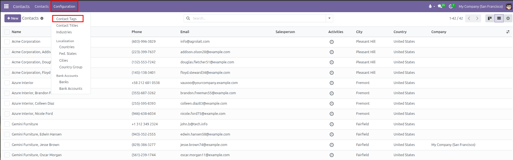
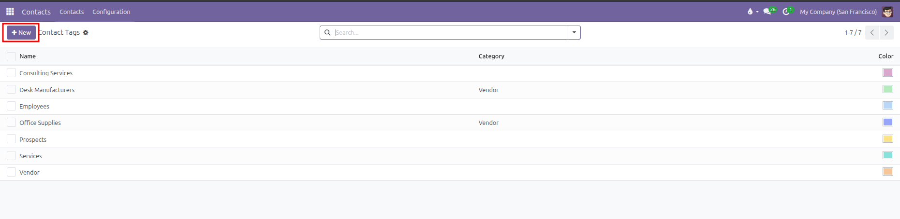
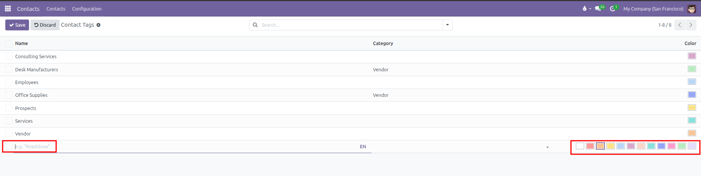
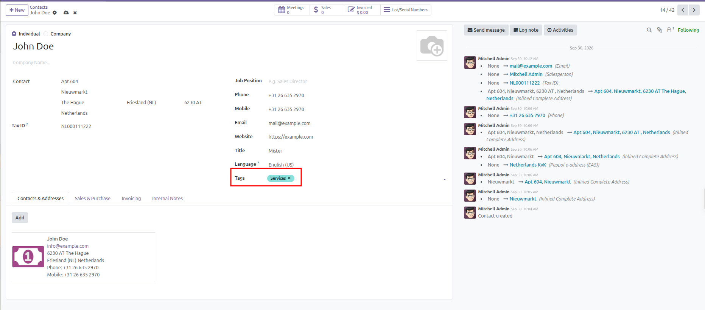

# Contact Tags Setup

Configure and organize color-coded tags to categorize and segment contacts in CURQ 18.

---

### 1. Overview of Contact Tags

Contact tags allow you to label and group people and companies based on business needs. You can assign labels such as `VIP`, `Vendor`, `Consulting Services`, or `Desk Manufacturers`.

Benefits of using contact tags:
* **Visual Badges**: Color-coded badges show key details at a glance on contact cards and contact forms.
* **Easy Filtering**: Filter your contact directory by tag in the search bar.
* **Tag Categories**: Build parent and child relationships (such as `Vendor / Desk Manufacturers`) to organize tags cleanly.

---

### 2. Access the Contact Tags Menu

To view and manage contact tags:
1. Open the **Contacts** app from the main dashboard.
2. In the top navigation bar, click **Configuration**.
3. Select **Contact Tags**.

CURQ displays the table of existing tags with their parent category and color indicator:

---

### 3. Create or Edit a Contact Tag

You can add a new tag directly in the table or open the full form view:

1. Click **New** at the top left of the list, or click into an empty row at the bottom of the table.
2. Fill in the tag fields:

| Field | Description | Practical Effect |
| :--- | :--- | :--- |
| **Tag Name** | Name of the label (for example, `VIP` or `Consulting Services`). | Displays on the contact record and search dropdowns. |
| **Category** | Optional parent tag (for example, choose `Vendor` to make this a sub-tag). | Creates a nested label like `Vendor / Desk Manufacturers`. |
| **Color** | Color swatch selected from the color picker palette. | Sets the badge background color on contact cards and forms. |

3. Click into the inline text box (with placeholder `e.g. "Roadshow"`) and select a color swatch from the 12 available palette options on the right:

4. Click outside the line or click **Save** at the top left to store your new tag.

*(To deactivate a tag without deleting it, open the tag form and turn off the **Active** toggle switch).*

---

### 4. Assign Tags to a Contact

To apply tags to a person or business:
1. Open the **Contacts** app.
2. Click any contact card to open the contact form.
3. Locate the **Tags** field on the right side of the form under **Language**.
4. Click into the field and select one or more tags from the dropdown list.
5. Click **Save** (cloud icon) or navigate away to keep the changes.

*(You can also create a new tag on the fly by typing a new name into the Tags field and clicking Create).*

---

### 5. Search and Group Contacts by Tag

After assigning tags, you can organize your directory using them:
1. In the **Contacts** main directory, click the search bar.
2. Type a tag name (such as `Vendor` or `Services`).
3. Click the matching tag suggestion in the dropdown list.
4. CURQ narrows the view to show only contacts with that tag.
