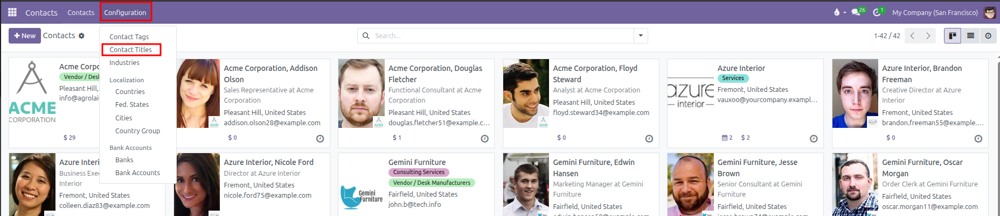
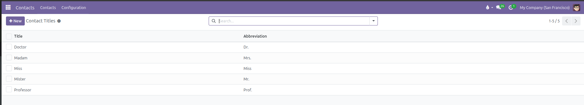
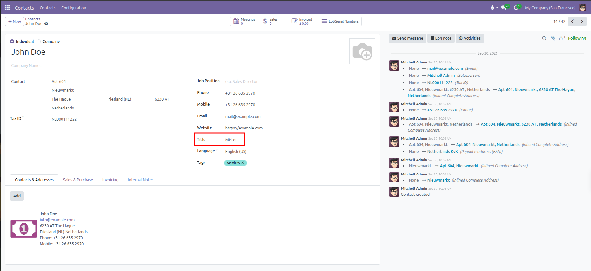

# Contact Titles Setup

Configure salutations and professional titles for individual contacts in CURQ 18.

---

### 1. Overview of Contact Titles

Contact titles provide standard salutations and academic designations for people in your directory. They help maintain professional communication across customer emails, quotes, and delivery notes.

Standard titles included in CURQ:
* **Mister** (Abbreviation: `Mr.`)
* **Madam** (Abbreviation: `Mrs.`)
* **Miss** (Abbreviation: `Miss`)
* **Doctor** (Abbreviation: `Dr.`)
* **Professor** (Abbreviation: `Prof.`)

*(Titles are reserved exclusively for individual contacts and are automatically hidden when editing company records).*

---

### 2. Access the Contact Titles Menu

To manage the list of titles:
1. Open the **Contacts** app from the main dashboard.
2. In the top navigation bar, click **Configuration**.
3. Select **Contact Titles**.

CURQ displays the table of existing titles with their full name and abbreviation:

---

### 3. Create or Edit a Contact Title

You can add custom titles (such as `Eng.`, `Rev.`, or `Captain`) directly in the table:

1. Click **New** at the top left of the list, or click into an empty row at the bottom of the table.
2. Configure the title properties:

| Field | Description | Practical Effect |
| :--- | :--- | :--- |
| **Title** | Full title name (such as `Doctor` or `Engineer`). | Appears in administrative views and configuration menus. |
| **Abbreviation** | Short code or salutation (such as `Dr.` or `Eng.`). | Displays when selecting titles on contact forms and email greetings. |

3. Click outside the row or click **Save** at the top left to store your changes.

*(To delete an unused title, select its row checkbox and click **Actions** > **Delete**).*

---

### 4. Assign a Title to an Individual Contact

To set a title on a contact profile:
1. Open the **Contacts** app.
2. Select an individual contact (or click **+ New** and choose **Individual**).
3. On the right side of the form, locate the **Title** field (under **Website** and above **Language**).
4. Click the dropdown and select the appropriate title.
5. Click **Save** (cloud icon) to apply the title.

---

### 5. Practical Impact Across CURQ

Setting contact titles produces consistent benefits throughout your system:
* **Professional Communications**: Email templates automatically address customers with their correct formal salutation.
* **Printed Documents**: Delivery slips, quotes, and invoices include respectful personal designations.
* **Clean Data**: Standardizing titles avoids duplicate abbreviations like `Mr` versus `Mr.`.
