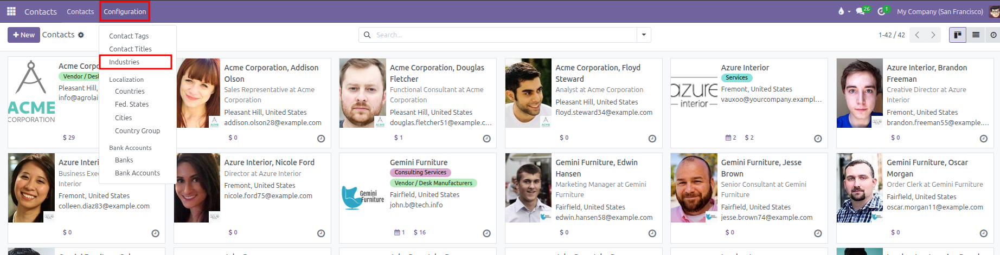
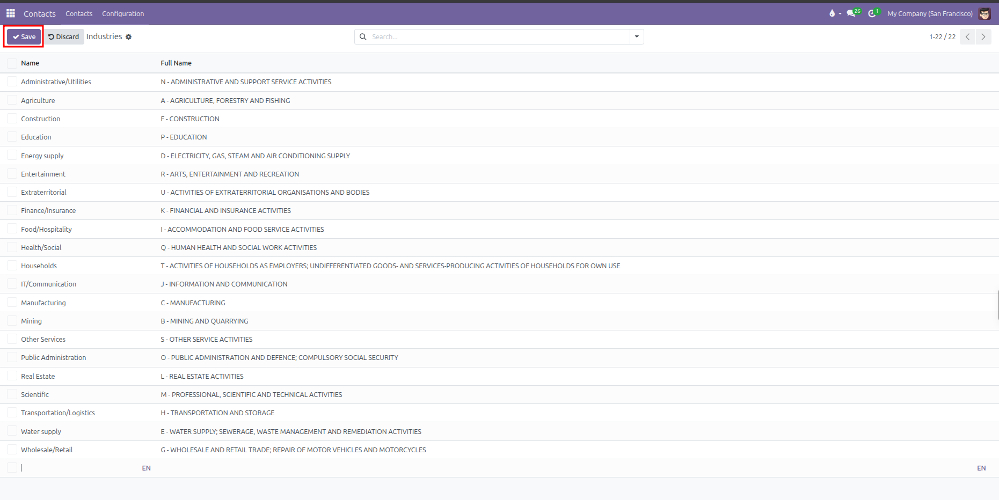
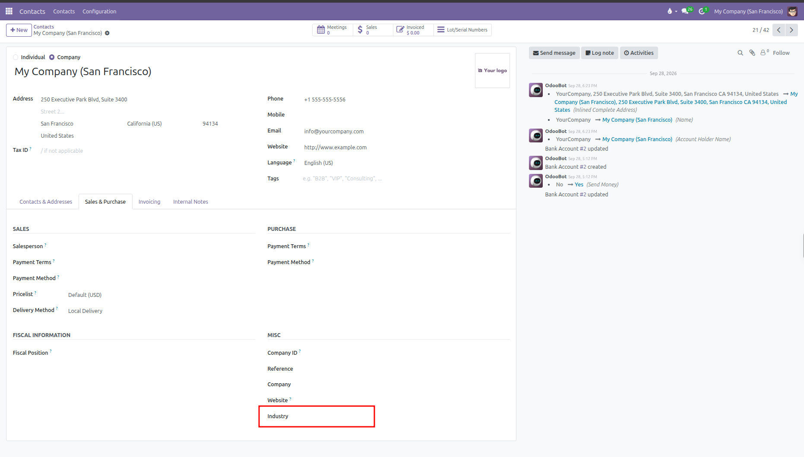

# Industries Setup

Configure business sectors and industrial classifications for company contacts in CURQ 18.

---

### 1. Overview of Industries

Industries categorize business partners according to their economic sector (such as `Manufacturing`, `Construction`, `IT/Communication`, or `Wholesale/Retail`).

Standard sector classifications included in CURQ:
* **Agriculture**: Farming, fishing, and forestry.
* **Manufacturing**: Production and goods fabrication.
* **Construction**: Building and infrastructure development.
* **Wholesale/Retail**: Trade and vehicle repair.
* **IT/Communication**: Software, telecom, and information services.
* **Finance/Insurance**: Banking, investment, and insurance activities.
* **Real Estate**: Property leasing and management.
* **Food/Hospitality**: Hotels, restaurants, and food service.

*(Industry classifications apply exclusively to companies and are hidden on individual person records).*

---

### 2. Access the Industries Menu

To view and customize the list of industries:
1. Open the **Contacts** app from the main dashboard.
2. In the top navigation bar, click **Configuration**.
3. Select **Industries**.

CURQ displays the table of economic sectors with their short code name and full description.

---

### 3. Create or Edit an Industry

You can add custom industry sectors or niche business classifications directly in the table:

1. Click **New** at the top left of the list, or click into an empty row at the bottom of the table.
2. Configure the industry fields:

| Field | Description | Practical Effect |
| :--- | :--- | :--- |
| **Name** | Short sector name or code (such as `Biotechnology` or `Solar Energy`). | Displays in selection dropdowns on company contact forms. |
| **Full Name** | Extended classification title or code standard (such as `Renewable Energy and Clean Tech`). | Clarifies the exact scope of the business sector. |

3. Click outside the row or click **Save** at the top left to store your changes:

*(To deactivate a sector without deleting historical records, click into the industry form and switch off the **Active** toggle).*

---

### 4. Assign an Industry to a Company Contact

To classify a business client or supplier by industry:
1. Open the **Contacts** app.
2. Select a company contact (or click **+ New** and leave the type as **Company**).
3. Select the **Sales & Purchase** tab.
4. Under the **Misc** section on the right, locate the **Industry** field.
5. Select the relevant sector from the dropdown list.
6. Click **Save** (cloud icon) to update the company profile.

---

### 5. Filter and Segment Contacts by Industry

Once industries are assigned, teams can segment business partners easily:
1. In the **Contacts** directory, click into the search bar.
2. Click the search dropdown and select **Add Custom Filter**.
3. Set the filter rule: **Industry** is equal to your target sector (for example, `Manufacturing`).
4. Click **Apply** to view all businesses belonging to that sector.
