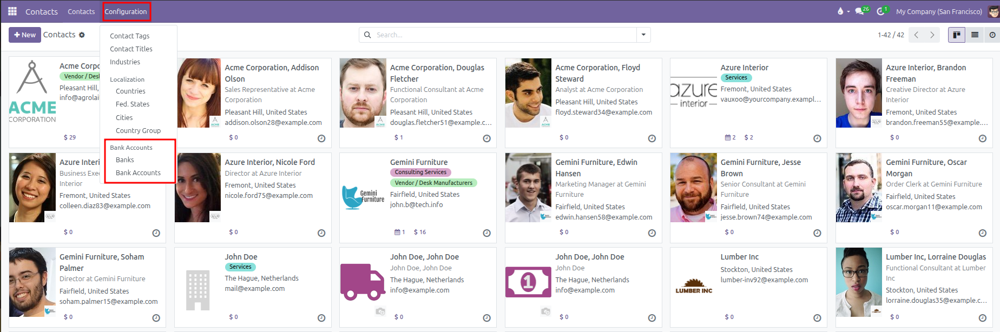
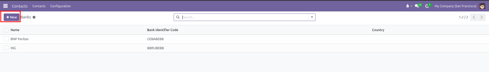
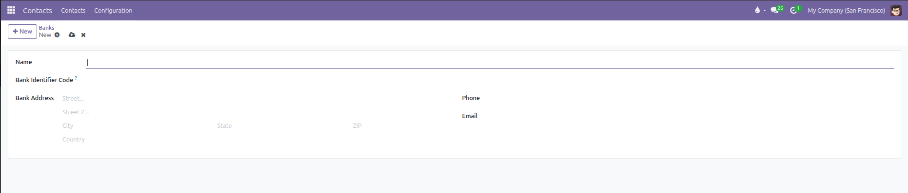
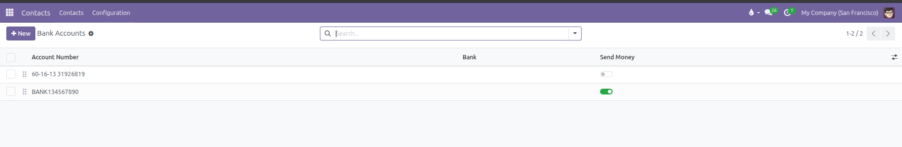
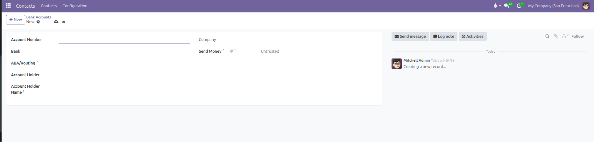

# Bank Accounts Setup

Configure bank institutions and manage customer and vendor bank accounts with payment validation in CURQ 18.

---

### 1. Overview of Banks and Bank Accounts

CURQ manages financial institution details through two connected directories under the **Bank Accounts** configuration menu:

* **Banks**: A directory of financial institutions, storing bank names, BIC/SWIFT codes, bank addresses, phone numbers, and email addresses.
* **Bank Accounts**: Specific customer, vendor, or internal accounts linked to a partner, tracking account numbers, IBANs, routing numbers, and outgoing payment authorization.

---

### 2. Register a Bank in the Directory

Before assigning bank accounts, you can register financial institutions:

1. Open the **Contacts** app from the main dashboard.
2. In the top navigation bar, click **Configuration**.
3. Under the **Bank Accounts** sub-section, select **Banks**.

CURQ displays the table of existing banks showing **Name**, **Bank Identifier Code**, and **Country**:

4. Click **New** at the top left to open the bank form.
5. Fill in the bank institution fields:

| Field | Description | Practical Effect |
| :--- | :--- | :--- |
| **Name** | Official name of the financial institution (such as `JPMorgan Chase` or `ING Bank`). | Displays when selecting banks on partner account lines. |
| **Bank Identifier Code** | BIC or SWIFT code (such as `BBRUBEBB`). | Required for international wire transfers and SEPA payments. |
| **Bank Address** | Street, City, State, ZIP, and Country of the branch. | Validates cross-border banking locations. |
| **Phone** & **Email** | Direct branch phone number and email address. | Kept for internal administrative reference. |

6. Click **Save** (cloud icon) to store the bank record.

---

### 3. Create and Link a Partner Bank Account

To add a bank account for a vendor, customer, or company branch:

1. Open the **Contacts** app.
2. In the top navigation bar, click **Configuration**.
3. Under the **Bank Accounts** section, select **Bank Accounts**.

CURQ displays all existing partner bank accounts with their validation status:

4. Click **New** at the top left.
5. Configure the account properties:

| Field | Description | Practical Effect |
| :--- | :--- | :--- |
| **Account Number** | Full bank account number or IBAN. | Formats outgoing payment files and customer billing templates. |
| **Bank** | Financial institution selected from the Banks registry. | Automatically pulls the bank name and BIC code into payment runs. |
| **ABA/Routing** | Routing transit number for domestic payments. | Validates domestic bank clearing. |
| **Account Holder** | The person or company contact who owns the account. | Links the bank account directly to the partner contact card. |
| **Account Holder Name** | Name printed on the bank records if different from the contact. | Used for exact payee reconciliation. |
| **Company** | Internal company entity that manages this bank relationship. | Controls access in multi-company environments. |
| **Send Money** | Toggle switch showing **Untrusted** or **Trusted** status badge. | Protects against wire fraud by requiring verification before paying out. |

6. Click **Save** (cloud icon) to store the account.

---

### 4. Understand Trusted Accounts and Fraud Protection

CURQ includes security controls to protect your business against payment errors and wire fraud:

* **Trusted vs Untrusted**: When a new bank account is added, it is set to **Untrusted** by default. An authorized accounting user must turn on the **Send Money** toggle to mark it as **Trusted** before automatic batch payments can be processed.
* **High Risk Warning**: If an account number belongs to a money transfer service rather than an established bank, CURQ displays a high risk alert advising you to verify the vendor by phone.
* **Medium Risk (Country Mismatch)**: If an account IBAN country code differs from the vendor's primary country, CURQ displays a warning to ensure funds are not misrouted internationally.

---

### 5. Add Bank Details Directly from the Contact Form

Users can also add bank accounts directly while reviewing a contact:

1. Open a contact in the **Contacts** app.
2. Click the **Invoicing** tab.
3. Under the **Bank Accounts** table, click **Add a line**.
4. Type the **Account Number** and select the **Bank**.
5. Click **Save** (cloud icon) to apply the banking details.
