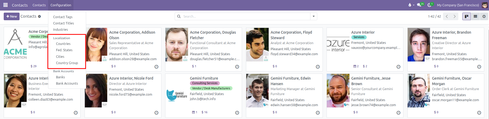
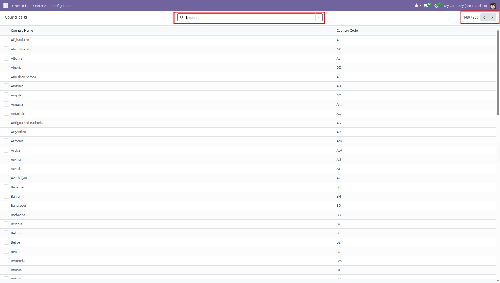
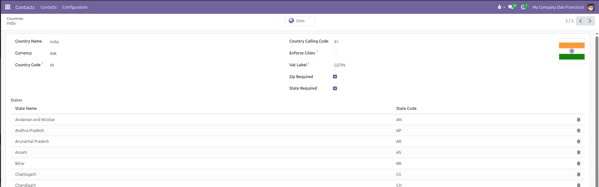
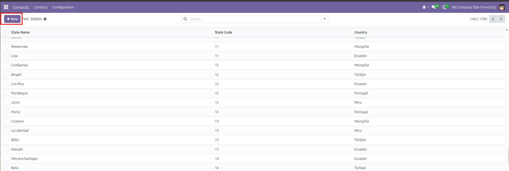
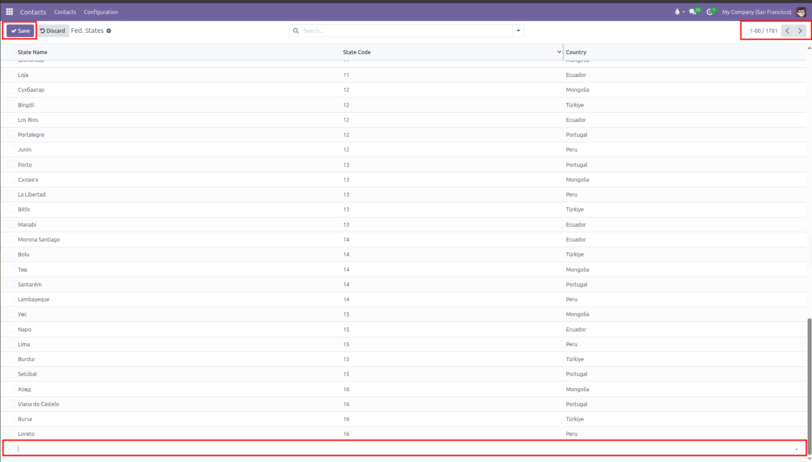
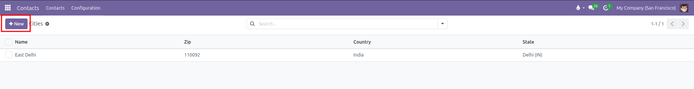
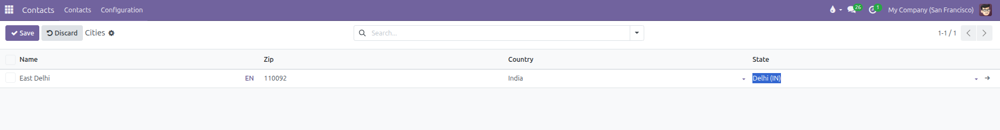
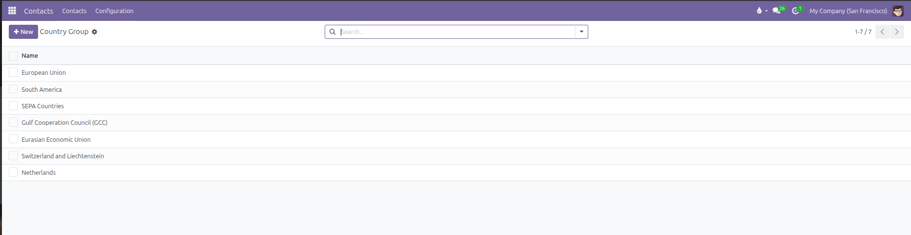
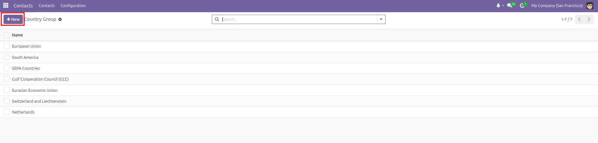
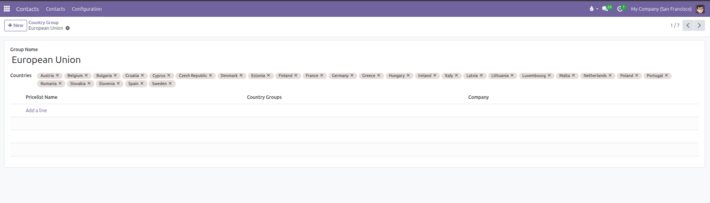

# Localization Setup

Configure geographic data, address validation rules, and country groups in CURQ 18.

---

### 1. Overview of Localization Settings

CURQ includes comprehensive geographic registries under **Contacts > Configuration > Localization**. These settings ensure consistent postal addresses, valid international tax identifiers, and automated tax or regional pricing calculations across sales and invoicing.

The Localization section includes four dedicated directories:
* **Countries**: Sovereign nations, two-letter ISO codes, national currencies, international telephone calling codes, and address layout formats.
* **Fed. States**: Administrative states, provinces, and territories linked to specific countries.
* **Cities**: Cities and municipality directories linked to postal codes and regional states.
* **Country Group**: Regional groupings (such as the European Union, SEPA, or North America) used to apply regional sales pricelists and fiscal tax positions.

---

### 2. Access the Localization Menus

To manage geographic settings:
1. Open the **Contacts** app from the main dashboard.
2. In the top navigation bar, click **Configuration**.
3. Under the **Localization** section, select one of the four menus:
   * **Countries**
   * **Fed. States**
   * **Cities**
   * **Country Group**

---

### 3. Manage Countries and Address Formatting

CURQ pre-loads all official world countries. To inspect or customize country rules:

1. Navigate to **Contacts > Configuration > Localization > Countries**.

2. Click any country in the list to open its configuration form (such as `India`).

3. Configure the country parameters:

| Field                    | Description                                                                                        | Practical Effect                                                          |
| :-------------------------| :---------------------------------------------------------------------------------------------------| :--------------------------------------------------------------------------|
| **Country Name**         | Official name of the nation (such as `India` or `United States`).                                  | Displays on contact address cards and shipping documents.                 |
| **Currency**             | Default national currency (such as `INR` or `USD`).                                                | Suggested automatically when creating customer invoices and sales orders. |
| **Country Code**         | Standard two-letter ISO country code (such as `IN` or `US`).                                       | Enables quick searching and validates tax identification numbers.         |
| **Country Calling Code** | International dialing prefix (such as `91` or `1`).                                                | Formats phone and mobile contact numbers automatically.                   |
| **Enforce Cities**       | Toggle requiring contacts in this nation to choose an existing city from the registry.             | Prevents spelling variations in city names across partner addresses.      |
| **Vat Label**            | Custom title for the tax identification field (such as `GSTIN`, `VAT`, or `EIN`).                  | Replaces the default Tax ID label on contact forms for local clarity.     |
| **Zip Required**         | Toggle requiring a postal or ZIP code before saving an address.                                    | Stops users from saving incomplete delivery or billing locations.         |
| **State Required**       | Toggle requiring a state or province selection before saving an address.                           | Ensures accurate regional taxation and legal address compliance.          |
| **States**               | Sub-table listing all regional states, provinces, or territories with their names and short codes. | Provides the allowable state choices in contact address dropdowns.        |

*(The form header also includes a **Cities** smart button that links directly to all cities registered under this country).*

4. Click **Save** (cloud icon) to store any adjustments.

---

### 4. Configure Federal States and Provinces

To manage states, provinces, or regional territories:

1. Navigate to **Contacts > Configuration > Localization > Fed. States**.
2. Click **New** at the top left (or click an empty bottom row) to add a state.

3. Enter the required details:

| Field | Description | Practical Effect |
| :--- | :--- | :--- |
| **State Name** | Full name of the state or province (such as `California` or `Friesland`). | Appears in state dropdown selectors on contact address blocks. |
| **State Code** | Standard short code (such as `CA` or `FR`). | Printed on standardized shipping labels and tax summaries. |
| **Country** | Nation that the state belongs to. | Filters states so users only see valid choices for the selected country. |

4. Click outside the row or click **Save** at the top left to keep the record.

---

### 5. Set Up Cities and Postal Codes

CURQ provides a directory of cities to simplify address entry:

1. Navigate to **Contacts > Configuration > Localization > Cities**.
2. Click **New** at the top left of the table.

3. Fill in the inline row:
   * **Name**: Name of the municipality (such as `East Delhi`).
   * **Zip**: Postal code for the city (such as `110092`).
   * **Country**: Nation where the city is located (such as `India`).
   * **State**: Regional state or province (such as `Delhi (IN)`).

4. Click **Save** at the top left to store the city.

*(When users type a recognized postal code on a contact card, CURQ automatically populates the city, state, and country).*

---

### 6. Group Countries for Regional Pricing and Taxes

Country groups organize multiple nations into single commercial zones:

1. Navigate to **Contacts > Configuration > Localization > Country Group**.

2. Click **New** at the top left to create a custom group (or select an existing group like `European Union`).

3. Set the **Group Name** (for example, `North America` or `SEPA Countries`).
4. In the **Countries** field, select all nations included in this economic or trade region.
5. In the **Pricelists** section, link regional sales pricelists if special commercial pricing applies.

6. Click **Save** (cloud icon) to store the group.

