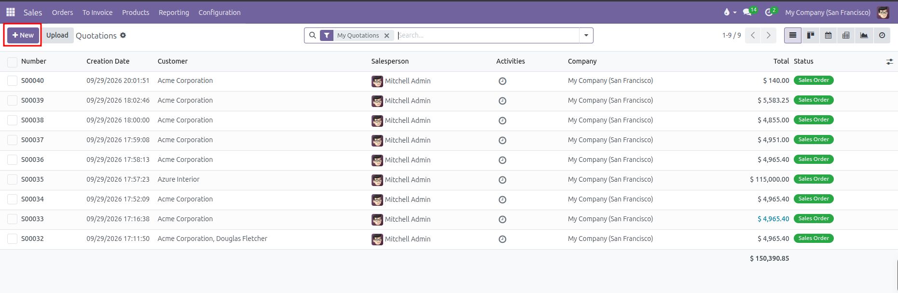
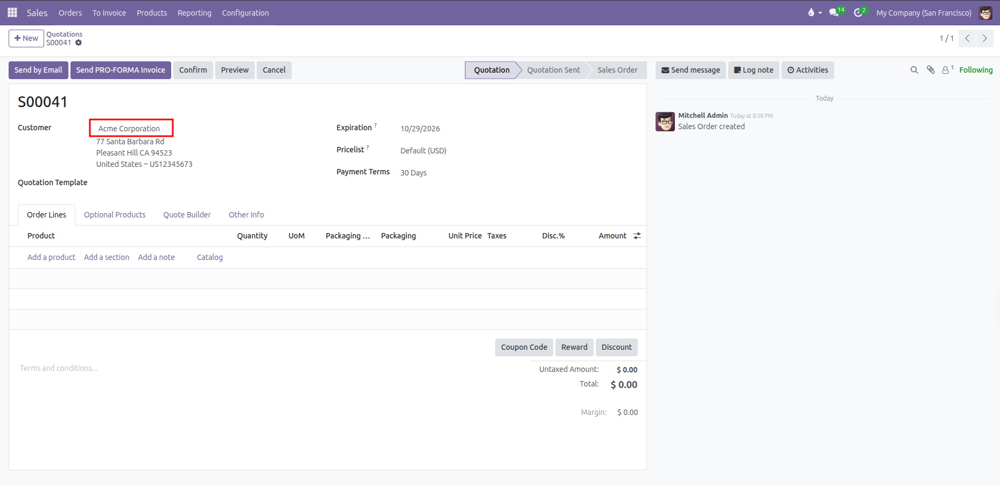
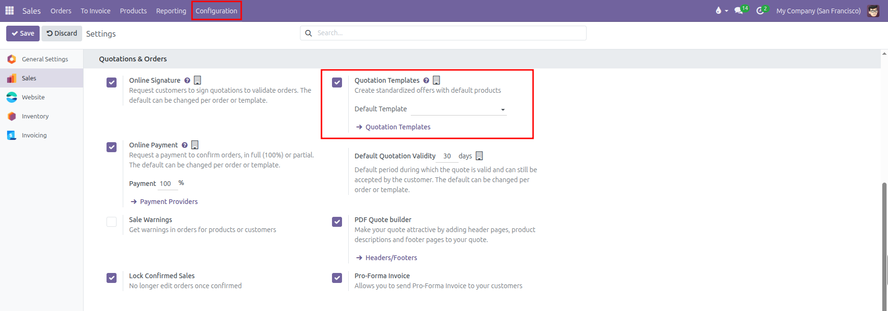
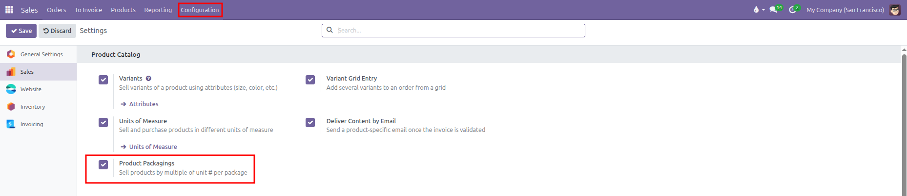
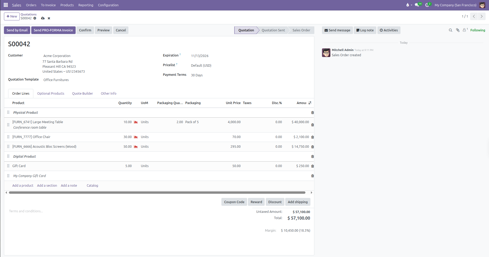
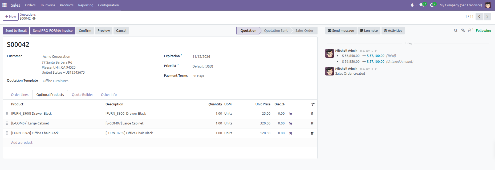
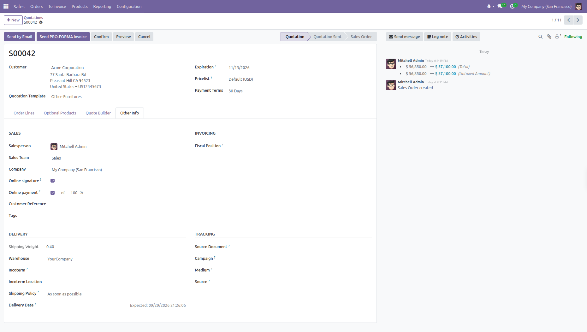

# Creating a Quotation

Follow these quick steps to create and send a quotation in CURQ 18:

### 1. Start a New Quote
1. Open the **Sales** app from the main menu.
2. Click **New** at the top left to open a blank quotation.

   

### 2. Choose the Customer
1. Select your customer in the **Customer** field.
   The system automatically fills in their **Invoice Address**, **Delivery Address**, **Pricelist**, and **Payment Terms**.
   *(You need to enable Pricelists from Sales > Configuration > Settings)*

   

2. (Optional) Select a **Quotation Template** to load prefilled items and default terms.
   *(You need to enable Quotation Templates from Sales > Configuration > Settings)*

   

3. Set an **Expiration** date to specify how long your quote stays valid.

*(Refer to [Managing Customers](../procedures/03-managing-customers.md) to create and manage customers)*
*(Refer to [Pricelists and Pricing Rules](../procedures/04-pricelists-and-pricing-rules.md) to set up pricelists)*
*(Refer to [Quotation Templates](../procedures/05-quotation-templates.md) to set up quotation templates)*

### 3. Add Products
1. Under the **Order Lines** tab, click **Add a product**.
2. Select your item, enter the **Quantity**, and adjust the **Unit Price** or **Discount** if needed.
   *(You need to enable Discounts from Sales > Configuration > Settings)*
3. If selling in packages or bulk units, select a **Packaging** type and enter the **Packaging Quantity**.
   *(You need to enable Product Packagings from Sales > Configuration > Settings)*

   

4. (Optional) Click **Catalog** to browse items visually with pictures and add them with one click.
5. (Optional) Use **Add a section** or **Add a note** to organize products with headings or custom text.

### 4. Optional Products
Under the **Optional Products** tab, add suggested accessories or upgrades that customers can choose to include before signing online.

### 5. Other Info Settings (Optional)

Open the **Other Info** tab to check commercial, shipping, and accounting details:

| Field                  | Description                                                                 |
| ------------------------| -----------------------------------------------------------------------------|
| **Salesperson**        | The internal team member managing this deal.                                |
| **Sales Team**         | The sales group credited for the revenue.                                   |
| **Online Signature**   | Check this box to require the customer to sign online to confirm the order. |
| **Online Payment**     | Check this box to require an online prepayment deposit before confirmation. |
| **Customer Reference** | Enter the purchase order number provided by the customer.                   |
| **Tags**               | Add descriptive labels to filter and search this order later.               |
| **Fiscal Position**    | Adjusts taxes automatically for international or tax exempt customers.      |
| **Invoicing Journal**  | The accounting journal where customer invoices are posted.                  |
| **Warehouse**          | The warehouse location responsible for packing and shipping the products.   |
| **Shipping Policy**    | Choose to ship items as soon as available, or wait for all items together.  |
| **Delivery Date**      | The promised delivery or shipment date agreed with the customer.            |
| **Incoterm**           | International trade rules such as EXW, FOB, or CIF.                         |
| **Tracking**           | Trace the source document or marketing campaign that brought in this sale.  |

### 6. Next Steps
Once your quote is complete:
* Click **Send by Email** to email the offer directly to your customer.
* Click **Print** to download a PDF copy.
* Click **Confirm** to turn the quotation into a confirmed sales order.
