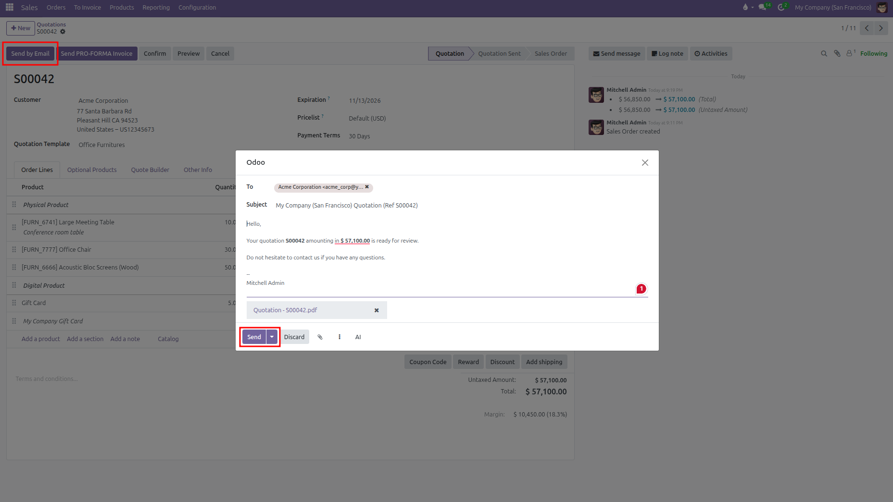
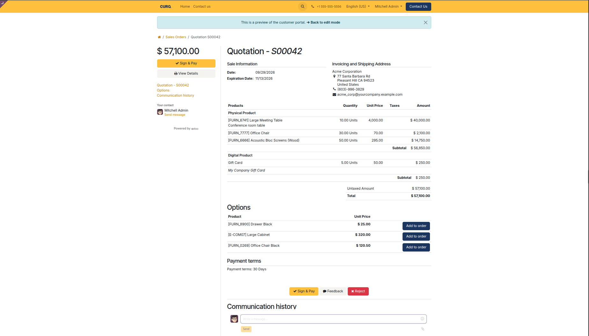
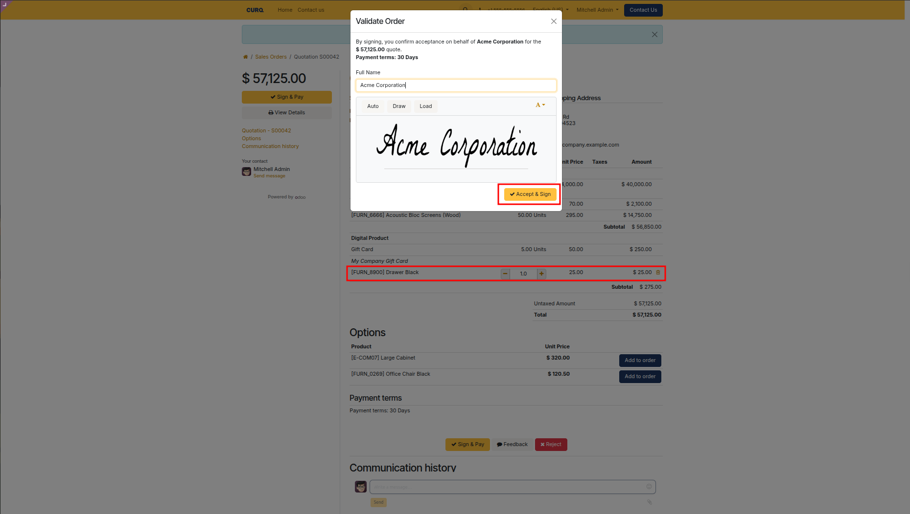
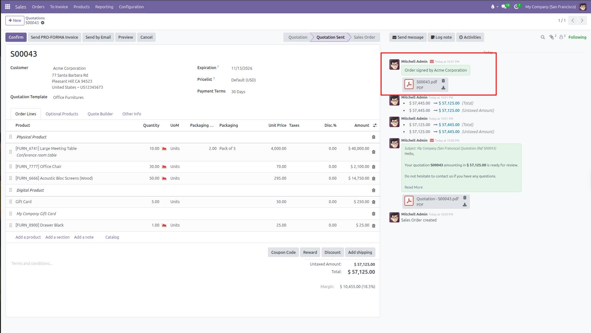

# Sending and Approving Quotations

Email quotations to customers, preview their portal view, and collect online signatures and payments in CURQ 18.

---

## 1. Sending the Quotation by Email

When your quotation is ready:

1. Click **Send by Email** at the top of the quotation form.
2. A pop up window opens with a prewritten email message.
3. Review the email details:
   * **Recipients**: Defaults to your customer email address. You can add extra email addresses if needed.
   * **Subject**: Contains your company name and the quotation number.
   * **Attachments**: The quotation PDF is automatically attached. You can attach additional files by clicking the paperclip icon.
4. Click **Send**.

   

The quotation status changes from **Quotation** to **Quotation Sent**, and a copy of the sent email is recorded in the chatter log on the right side of the screen.

---

## 2. Previewing the Customer Portal

To see the quotation exactly as your customer sees it:

1. Click the **Preview** button at the top of the form.
2. CURQ opens the customer portal view in your browser.
3. From this screen, you can check:
   * How your products, descriptions, and totals appear to the client.
   * How optional products are displayed.
   * Your payment terms and company legal terms.

To return to the backend quotation form, click **Back to edit mode** or use your browser back button.

---

## 3. Customer Online Approvals

When customers view the quotation through the email link, they have several interactive options:

| Action                    | Details                                                                                                                                  |
| ---------------------------| ------------------------------------------------------------------------------------------------------------------------------------------|
| **Download or Print**     | Customers can click **Download** to save the formal PDF copy.                                                                            |
| **Add Optional Products** | Customers can click the cart button next to any optional item to add it directly to their order. The total updates immediately.          |
| **Sign Online**           | If Online Signature is enabled, the customer clicks **Sign & Pay** or **Accept & Sign**. They can draw, type, or upload their signature. |
| **Pay Online**            | If Online Payment is enabled, the customer can complete their deposit or full payment online.                                            |
| **Ask Questions**         | Customers can send messages directly in the portal chatter box. Their reply appears in your CURQ chatter log.                            |
| **Decline Quote**         | Customers can click **Decline** and type a reason. CURQ cancels the quote and logs the feedback in the chatter.                          |

---

## 4. What Happens After Approval

Once the customer signs or completes payment on the portal:

1. **Signed PDF Stored**: A signed PDF copy containing the customer signature timestamp and IP address is automatically attached to the order chatter log.
2. **Internal Notification**: The assigned salesperson receives an activity notification confirming the customer approved the deal.
3. **Status Update Rules**:
   * **If only Online Signature was required**: The document status automatically advances from **Quotation Sent** to **Sales Order**.
   * **If Online Payment was also required**: The document stays in **Quotation Sent** until the customer completes the online payment or a salesperson clicks **Confirm** manually.

