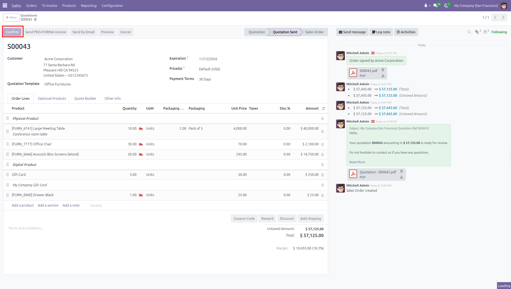
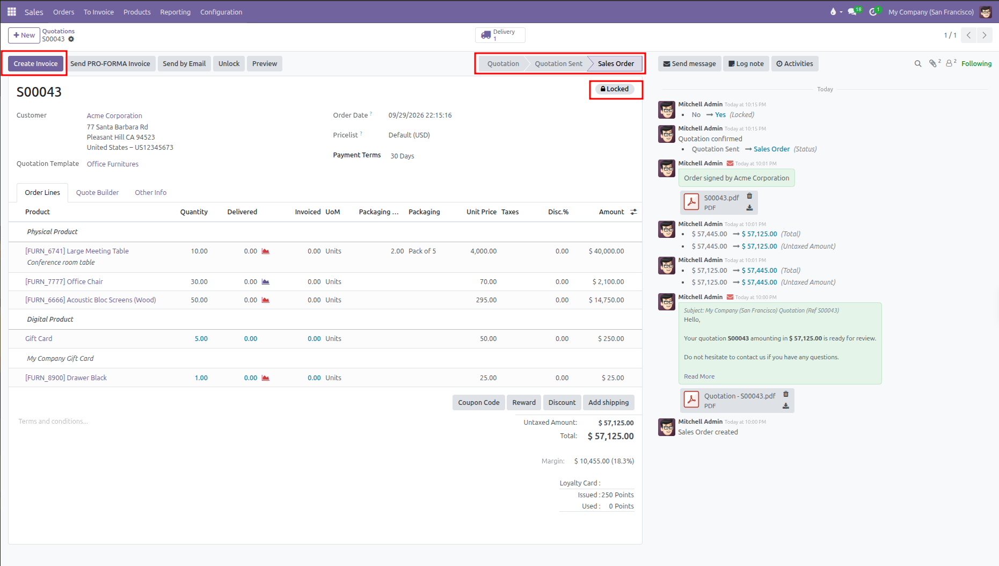
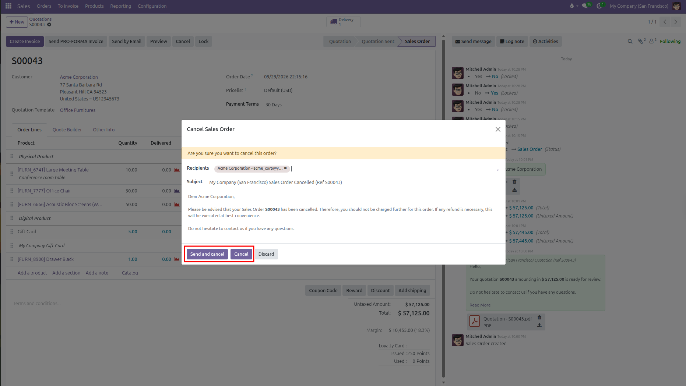

# Confirming and Managing Sales Orders

Confirm quotations into official sales orders, lock orders to prevent unwanted changes, and handle cancellations in CURQ 18.

---

## 1. Confirming an Order Manually

When a customer accepts your quotation by phone, in person, or via standard email:

1. Open the quotation from the **Orders** > **Quotations** list.
2. Click the **Confirm** button at the top left of the form.

   

The quotation status immediately advances to **Sales Order**.

---

## 2. What Happens Automatically on Confirmation

When you confirm an order, CURQ automates several background actions:

| System Action           | Details                                                                                                                                 |
| -------------------------| -----------------------------------------------------------------------------------------------------------------------------------------|
| **Status Update**       | The quotation moves to **Sales Order** and records the confirmation timestamp.                                                          |
| **Delivery Creation**   | For physical products, CURQ creates an outgoing delivery slip for the warehouse. A **Delivery** smart button appears at the top center. |
| **Invoicing Readiness** | The **Create Invoice** button prepares billing based on whether you invoice ordered or delivered quantities.                            |
| **Customer Follower**   | The customer contact record is subscribed to the order chatter log to receive future notifications.                                     |

---

## 3. Locking and Unlocking Confirmed Orders

*(You need to enable Lock Confirmed Sales from Sales > Configuration > Settings)*

Locking an order protects confirmed pricing, discounts, and quantities from accidental edits after approval.

When an order is locked, a **Locked** badge displays at the top right of the screen, and order lines become read only.

To adjust a locked order:
1. A sales manager clicks **Unlock** at the top of the form.
2. Make the necessary changes to quantities, prices, or dates.
3. Click **Lock** to protect the document again.

---

## 4. Cancelling and Reactivating an Order

If a customer changes their mind or an agreement falls through:

1. If the order is locked, click **Unlock** first. The **Cancel** button is hidden while an order is locked.
2. Click **Cancel** at the top of the order form.
3. A cancellation pop up window appears with a prewritten email notification for the customer:
   * Click **Send and cancel** to email the cancellation notice to your customer and cancel the order.
   * Click **Cancel** if you want to cancel the order internally without sending an email.

   

4. The order status moves to **Cancelled**, and any linked warehouse delivery pickings are cancelled automatically.
5. If the deal becomes active again later, click **Set to Quotation** to reopen the document as an active draft.
