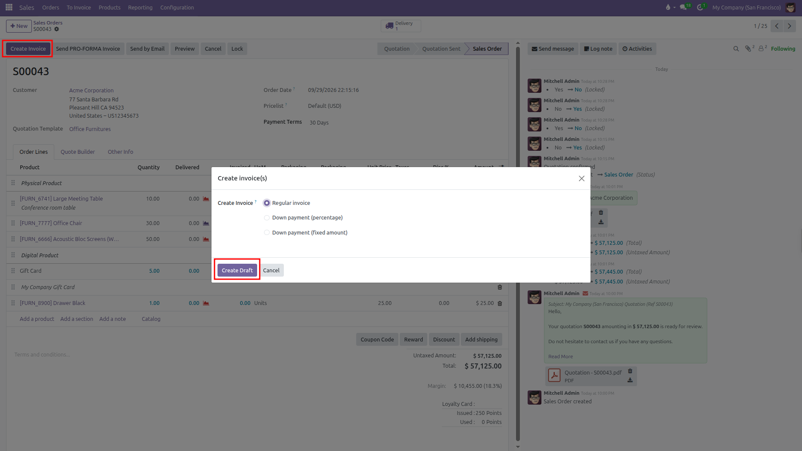
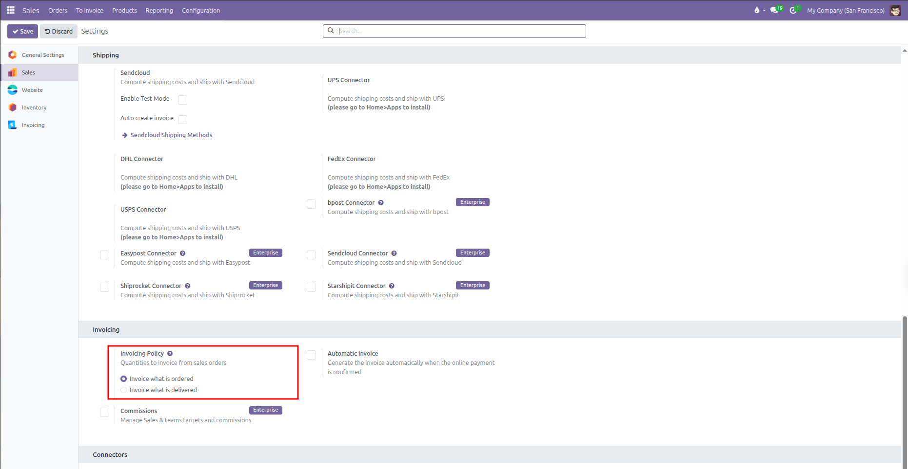
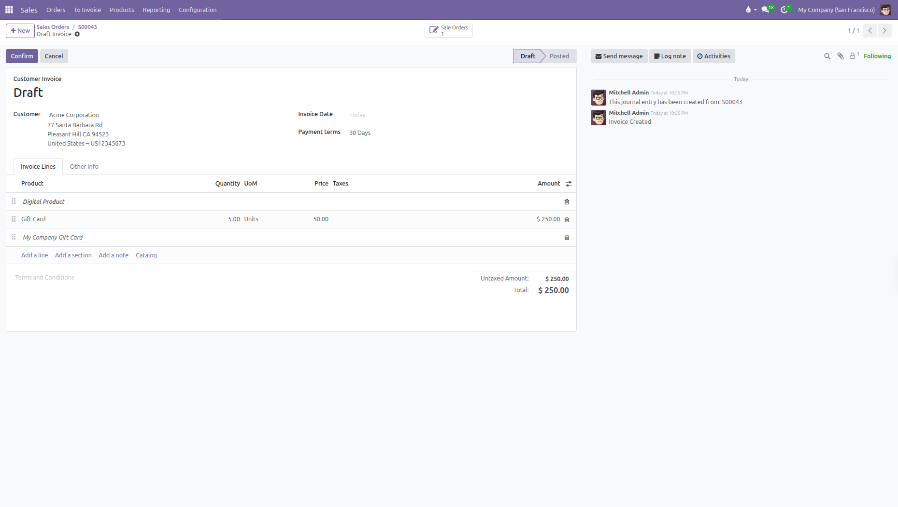
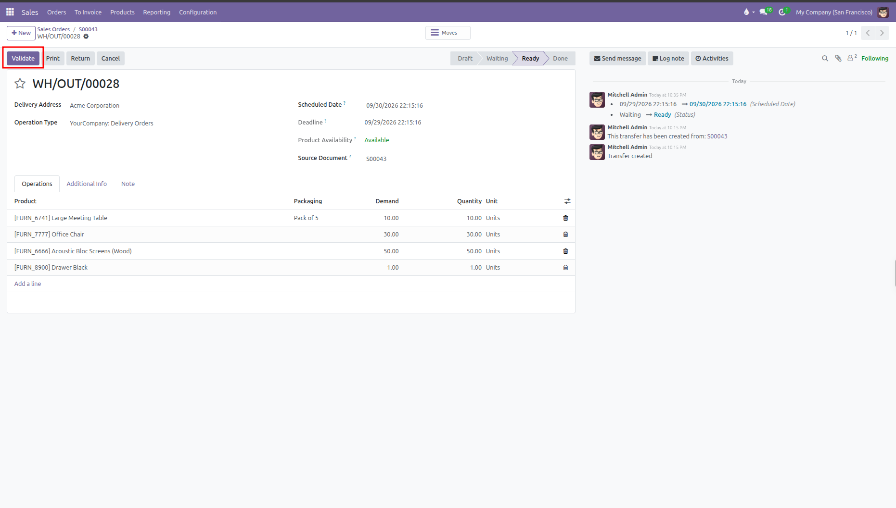
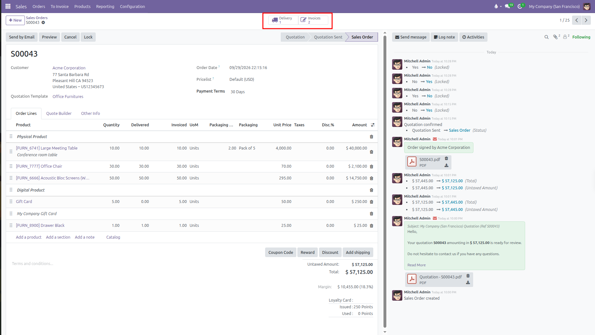

# Invoicing Sales Orders and Down Payments

Generate customer invoices, collect down payment deposits, and track billing progress from sales orders in CURQ 18.

---

## 1. Creating an Invoice

When you are ready to bill a customer for a confirmed sales order:

1. Open the confirmed order from **Orders** > **Orders**.
2. Click **Create Invoice** at the top left of the form.
3. In the pop up window, choose your invoice type:

| Invoicing Option                | When to Use                                                                                                                  |
| ---------------------------------| ------------------------------------------------------------------------------------------------------------------------------|
| **Regular invoice**             | Invoices all order lines ready for billing based on their invoicing policy. Automatically deducts any earlier down payments. |
| **Down payment (percentage)**   | Bills an advance deposit as a percentage of the total order amount.                                                          |
| **Down payment (fixed amount)** | Bills a specific fixed currency amount as a deposit.                                                                         |

4. Click **Create Draft**.
   CURQ generates a draft customer invoice linked to this sales order and opens the invoice form on your screen.

   

5. Review the invoice lines and totals, then click **Confirm** at the top left of the form to officially post the invoice to accounting.
6. Deliver the invoice to your customer using the top buttons:
   * Click **Send** to open the email composer with the invoice PDF attached, then click **Send** in the pop up to email it to the customer.
   * Click **Print** to download a copy of the invoice PDF directly to your computer.

---

## 2. Invoicing Policies: Ordered vs Delivered Quantities

*(You can configure the default Invoicing Policy from Sales > Configuration > Settings)*

Each product in CURQ follows one of two billing rules set on its product card:

| Invoicing Policy         | Billing Rule                                                                                                                                    |
| --------------------------| -------------------------------------------------------------------------------------------------------------------------------------------------|
| **Ordered quantities**   | Available to invoice as soon as the sales order is confirmed. Ideal for services or prepaid orders.                                             |
| **Delivered quantities** | Only available to invoice after the warehouse validates the shipment. Protects customers from being billed for items that have not shipped yet. |

When an order contains both types of products, creating a regular invoice only pulls in lines that are currently eligible for billing. For example, a digital gift card set to ordered quantities appears on the draft invoice immediately, while physical furniture lines remain unbilled until warehouse delivery is completed.

To invoice delivered items:

1. Open the linked delivery slip by clicking the **Delivery** smart button on the sales order.
2. Verify shipped quantities and click **Validate**.

   

3. Return to the sales order and click **Create Invoice** again. The newly delivered products will now appear on the customer invoice.

---

## 3. Down Payments on Final Invoices

If you bill one or more advance deposits, CURQ handles the balance reconciliation automatically:

1. Advance invoices are created and paid during the project or preparation phase.
2. When the final delivery is complete, click **Create Invoice** and select **Regular invoice**.
3. CURQ automatically deducts the earlier paid down payment amounts from the final bill, charging the customer only for the remaining balance.

---

## 4. Tracking Invoicing Progress

You can monitor billing status directly from the sales order:

* **Invoices Smart Button**: Located at the top center, this button shows the count of linked invoices and opens them with one click.
* **Order Line Tracking**: Review the **Quantity**, **Delivered**, and **Invoiced** columns on each line to see exactly how much has been billed so far.

