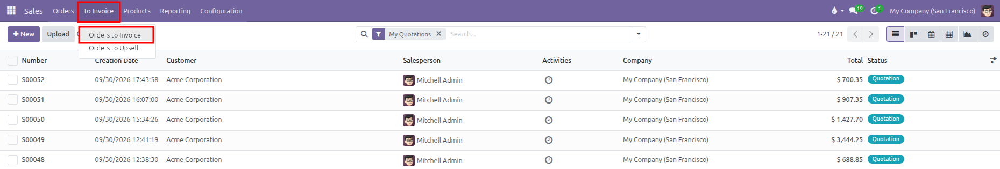
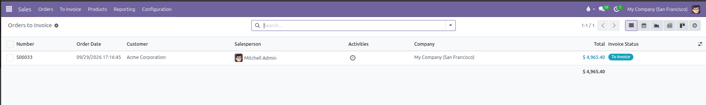
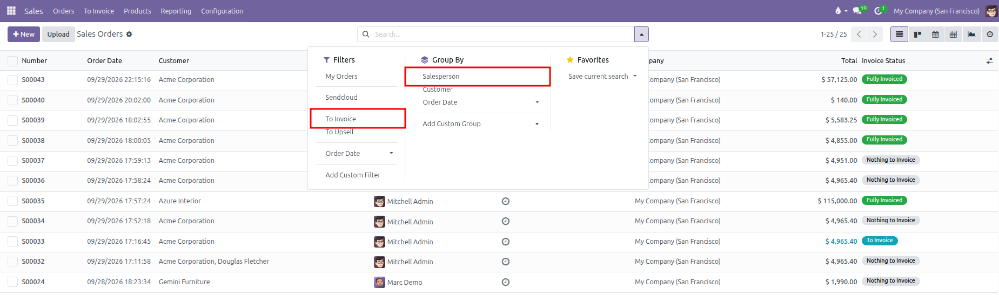
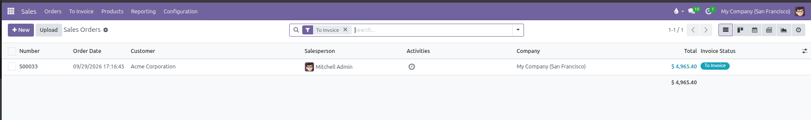
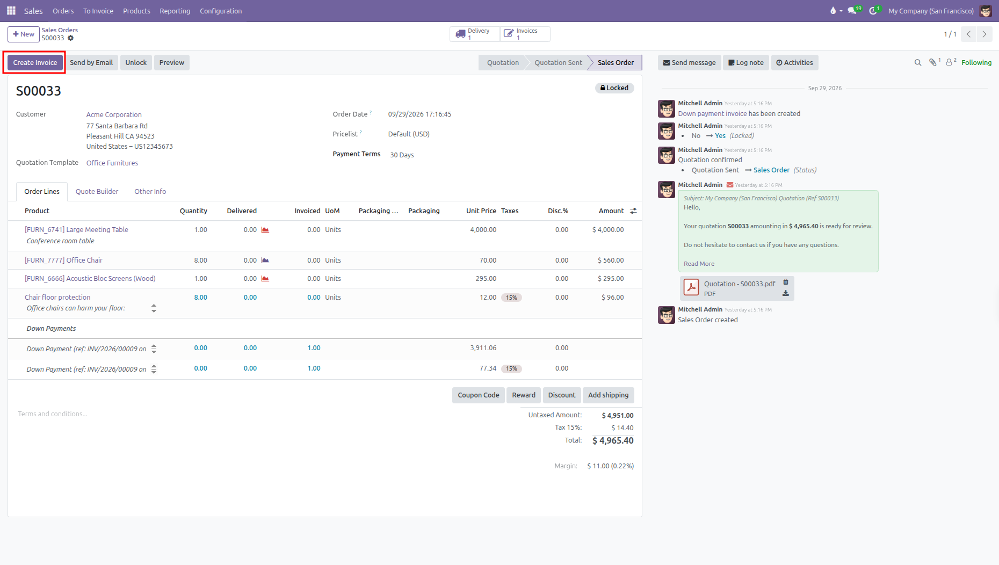
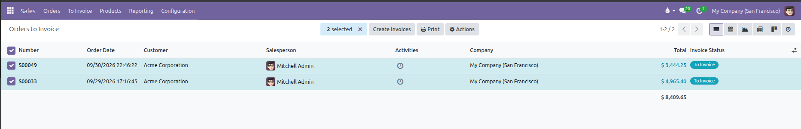

# Reviewing Orders Ready to Invoice

Follow these quick steps to find, review, and invoice all sales orders that are ready for customer billing in CURQ 18.

---

### 1. Open Orders to Invoice

1. Open the **Sales** app.
2. In the top navigation bar, click **To Invoice**.
3. Select **Orders to Invoice**.

This list automatically displays all confirmed sales orders with lines waiting to be invoiced.

Key columns in this view include:

* **Number**: The unique sales order identifier *(such as S00033)*.
* **Order Date**: The date and time the order was placed or confirmed.
* **Customer**: The purchasing partner contact or company.
* **Total**: The overall monetary value of the sales order.
* **Invoice Status**: Displays the **To Invoice** badge for orders requiring customer billing.

---

### 2. Find Orders to Invoice from the Main Orders List

You can also find orders ready for billing directly from your full orders list:

1. Go to **Orders** > **Orders**.
2. Click in the search bar at the top center to open the search dropdown.
3. Under **Filters**, select **To Invoice** to filter out fully invoiced orders.
4. Under **Group By**, select **Salesperson** *(or **Customer**)* to structure orders by account manager.

This displays only sales orders with lines waiting to be invoiced:

---

### 3. Review Order Quantities Before Invoicing

Before creating an invoice, check the quantities on the order:

1. Click on an order from the list to open it.
2. Under the **Order Lines** tab, review the three quantity columns:
   * **Quantity**: The total units ordered by the customer.
   * **Delivered**: The units shipped and validated by the warehouse.
   * **Invoiced**: The units already billed on previous invoices.
3. If an item is set to **Delivered quantities**, you can only invoice up to the amount shown in the **Delivered** column.

---

### 4. Create the Invoice

Once you confirm the quantities, generate the invoice:

#### Option A: Invoice a Single Order

1. From the open sales order, click **Create Invoice** at the top left.

2. Select **Regular invoice** in the pop up window.
3. Click **Create Draft**.
4. Review the draft invoice and click **Confirm** to post it.

#### Option B: Invoice Multiple Orders in Batch

1. Go to **To Invoice** > **Orders to Invoice**.
2. Select the checkbox next to each order you want to bill, or click the header checkbox to select all orders at once.
3. Click the **Create Invoices** action button that appears in the top control bar.

4. In the pop up window, select **Regular invoice** and click **Create and View Invoices**.

---

### 5. Check Orders to Upsell

If a customer received more units than originally ordered:

1. Click **To Invoice** in the top navigation bar.
2. Select **Orders to Upsell**.
3. Open the order, verify the extra delivered quantities, and click **Create Invoice** to bill the difference.

