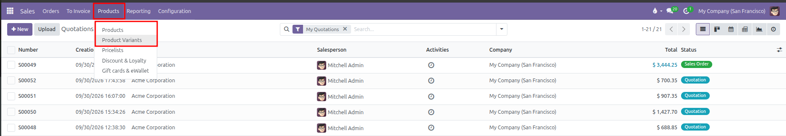
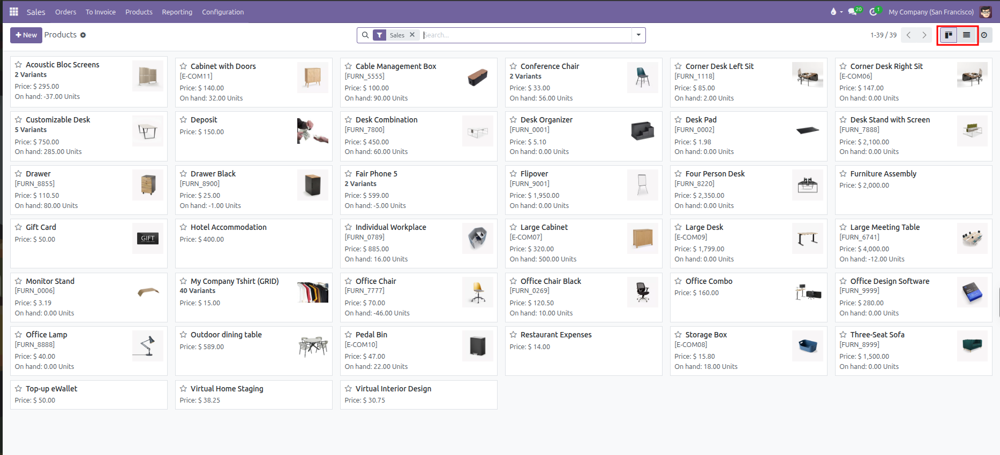
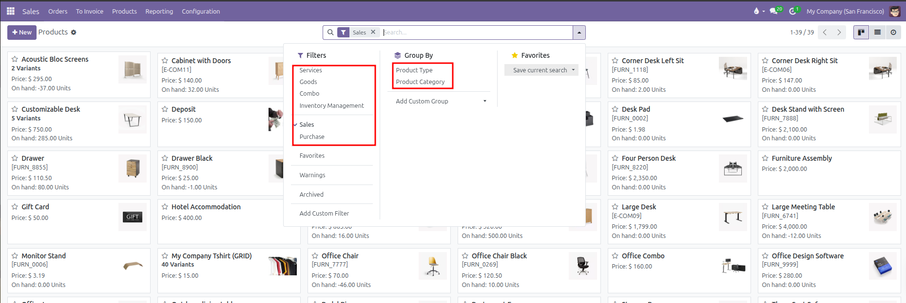
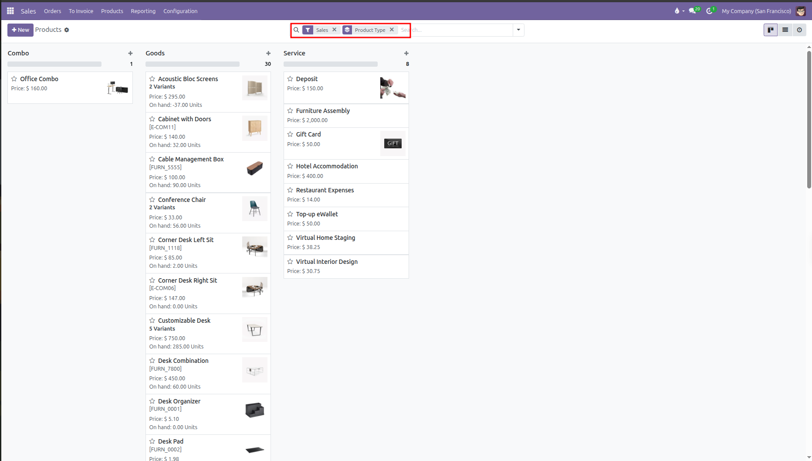
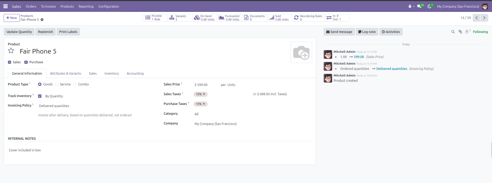

# View All Products

Follow these quick steps to find, browse, and filter all products in your CURQ 18 sales catalog.

---

### 1. Open the Products Catalog

1. Open the **Sales** app.
2. In the top navigation bar, click **Products**.
3. Choose what you want to browse:
   * Select **Products** to view your master product templates.
   * Select **Product Variants** to view specific attribute combinations *(such as individual colors and sizes)*.

---

### 2. Switch Between Card and List Views

CURQ displays your products in two main layouts:

* **Kanban Card View**: Displays visual product cards with images, sales prices, and current stock levels.
* **List View**: Displays a spreadsheet table showing internal references, product names, sales prices, costs, on-hand quantities, and units of measure.

To switch between views, click the **Kanban** or **List** icons located at the top right of the screen:

Each product card displays:

* **Image & Title**: Product picture thumbnail and master item name.
* **Variants Badge**: Displays the number of active variations *(such as `2 Variants` or `5 Variants`)* if attributes are configured.
* **Internal Reference**: The item catalog code or SKU *(such as `[FURN_5555]`)*.
* **Price**: The standard customer sales price.
* **On Hand**: Current available warehouse stock in inventory units.

---

### 3. Search and Filter Products

To find specific products quickly:

1. Click into the search bar at the top center of the screen to open the search dropdown.
2. Type a **Product Name**, **Internal Reference** *(SKU)*, or **Barcode**.
3. Under **Filters**, select options to narrow your results:
   * **Sales**: Displays active products available for customer sales *(active by default)*.
   * **Services**: Filters for intangible offerings, labor, or service contracts.
   * **Goods**: Filters for physical stock items and materials.
   * **Combo**: Filters for bundled product offerings.
   * **Inventory Management**: Filters for items tracked with inventory operations.
   * **Purchase**: Filters for products acquired from vendors.

---

### 4. Group Products by Category or Type

To organize your product catalog into neat sections:

1. Click into the search bar at the top center to open the dropdown menu.
2. Under **Group By**, choose your preferred grouping:
   * **Product Type**: Groups items by classification *(Combo, Goods, and Service)*.
   * **Product Category**: Groups items by internal catalog category *(such as Office Furniture or Electronics)*.
3. CURQ organizes the view into distinct columns or collapsible sections:

---

### 5. Open and Inspect Product Details

1. Click on any product card or table row from the list.
2. Review the product details across the main tabs:
   * **General Information**: Check the **Sales Price**, **Customer Taxes**, **Cost**, and **Invoicing Policy**.
   * **Attributes & Variants**: View available variants, attributes, and price extra values.
   * **Sales**: View configured optional accessories, quotation descriptions, and packaging.

