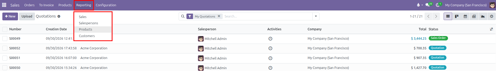
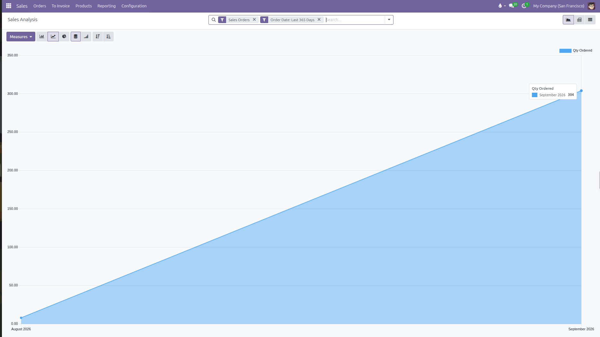
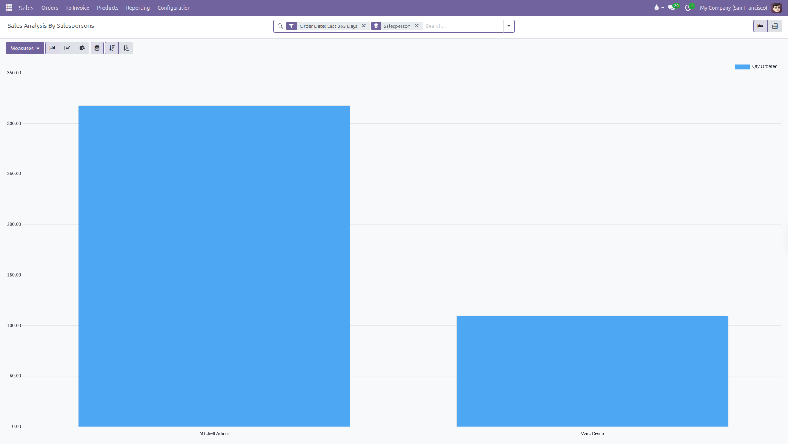
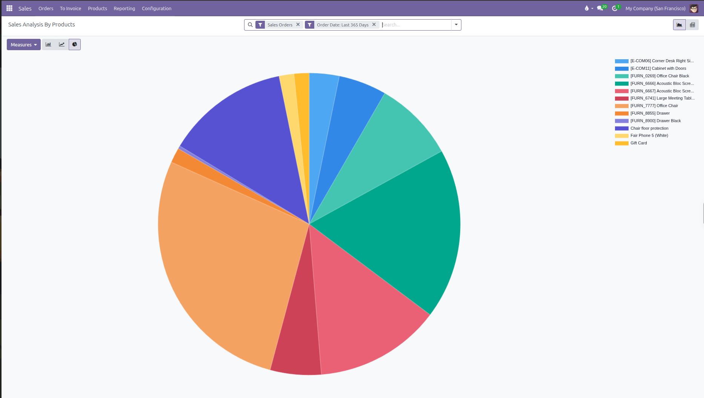
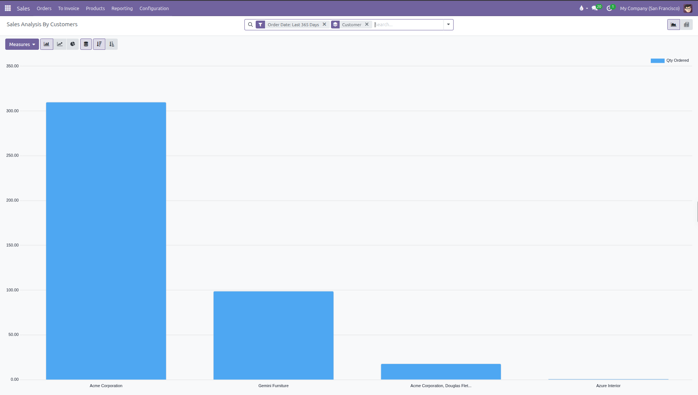

# Analyze Sales Orders

Follow these quick steps to analyze sales performance using the four dedicated reporting views in CURQ 18.

---

### 1. Access the Four Reporting Views

In the top navigation bar, click **Reporting** to access the four dedicated analysis menus:

* **Sales**: Overall sales revenue across all orders.
* **Salespersons**: Performance breakdown pre-grouped by salesperson.
* **Products**: Sales volume and revenue pre-grouped by product.
* **Customers**: Purchase volume and revenue pre-grouped by customer account.

---

### 2. Track Overall Sales Trends (Reporting > Sales)

To monitor overall revenue and volume trends across the business:

1. In the top navigation bar, click **Reporting** > **Sales**.
2. By default, CURQ opens the **Sales Analysis** report in a **Line Chart** view pre-filtered by **Sales Orders** and **Order Date: Last 365 Days**.
3. Hover over data points on the timeline to inspect exact monthly metrics *(such as units ordered or revenue)*.
4. Click the **Measures** button to switch between metrics *(such as **Total**, **Untaxed Total**, or **Quantity Ordered**)*.
5. (Optional) Use the view switcher at the top right to switch between **Graph**, **Pivot**, and **List** views.

---

### 3. Compare Sales Performance by Salesperson (Reporting > Salespersons)

To evaluate salesperson performance and team contributions:

1. In the top navigation bar, click **Reporting** > **Salespersons**.
2. CURQ opens the report in a **Bar Chart** view pre-grouped by **Salesperson** and pre-filtered by **Order Date: Last 365 Days**.
3. Click the **Measures** button to switch between metrics *(such as **Untaxed Total**, **Total**, or **Quantity Ordered**)*.
4. Review individual salesperson contributions in the bar chart or switch to the **Pivot** view to view exact values.

---

### 4. Check Which Product Sells the Most (Reporting > Products)

To find your top selling products:

1. In the top navigation bar, click **Reporting** > **Products**.
2. By default, CURQ opens the report in a **Pie Chart** view pre-filtered with two search filters:
   * **Sales Orders**: Includes confirmed sales orders and excludes unconfirmed draft quotes.
   * **Order Date: Last 365 Days**: Restricts data to orders confirmed in the past rolling year.
   Each product appears as a colored slice with a product legend listed on the right.

3. Click the **Measures** button at the top left to choose your metric:
   * Select **Total** to rank products by sales revenue.
   * Select **Quantity Ordered** to rank products by unit volume.
4. (Optional) Click the **Bar Chart** icon at the top left and select **Descending** to display products side by side from highest to lowest volume.

---

### 5. Check Customers with Highest Order Quantity or Revenue (Reporting > Customers)

To find which customers buy the most volume:

1. In the top navigation bar, click **Reporting** > **Customers**.
2. CURQ opens the report pre-grouped by **Customer** and pre-filtered by **Order Date: Last 365 Days**.
3. Click the **Measures** button at the top left:
   * Select **Quantity Ordered** to rank accounts by total unit volume.
   * Select **Total** to rank accounts by overall revenue.
4. Click the **Descending** icon in the graph controls to display your top purchasing accounts first.

