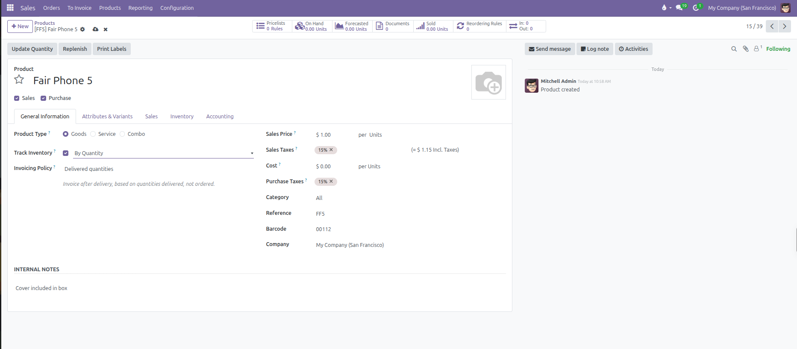
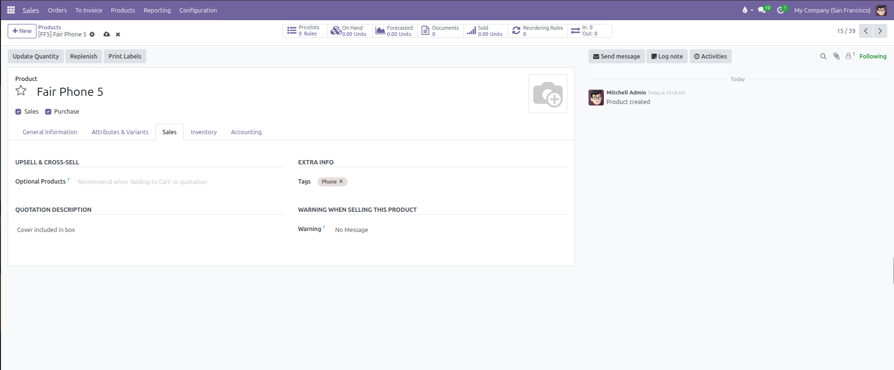

# Setting Up Products and Invoicing Policies

Configure product records, define pricing and sales tax rules, select inventory tracking, and assign invoicing policies in CURQ 18.

---

## 1. Creating a Product Record

Every quotation and sales order line in CURQ requires a product record. To create a new product:

1. Navigate to **Products** > **Products**.
2. Click **New** at the top left of the screen.
3. Enter the product title in the **Product Name** field.
4. Set the commercial availability options below the name:
   * **Sales**: Check this box to make the product selectable on sales quotations, customer invoices, and pricelists.
   * **Purchase**: Check this box if you also buy this item from suppliers or vendors.

The product record saves automatically as you complete each field.

---

## 2. Choosing the Product Type

Under the **General Information** tab, the **Product Type** determines how CURQ tracks stock, schedules fulfillments, and calculates costs:

| Product Type | Practical Application                                                     | Inventory and Delivery Behavior                                                                                                                                                                                                                           |
| --------------| ---------------------------------------------------------------------------| -----------------------------------------------------------------------------------------------------------------------------------------------------------------------------------------------------------------------------------------------------------|
| **Goods**    | Physical merchandise, raw materials, components, and supplies.            | Displays a **Track Inventory** checkbox (set to **By Quantity**). When checked, CURQ tracks stock on hand, generates warehouse delivery slips upon sales confirmation, and enables replenishment rules. When unchecked, the item behaves as a consumable with no stock accounting. |
| **Service**  | Consulting, labor, delivery fees, design work, and maintenance contracts. | Generates no warehouse moves or delivery slips. Can be configured to create tasks, projects, or timesheet trackers upon order confirmation.                                                                                                               |
| **Combo**    | Bundled offerings (such as meal packages or starter kits).                | Allows customers to select individual components from preconfigured choice lists directly on orders.                                                                                                                                                      |

---

## 3. General Information and Pricing

Configure core commercial values on the right-hand side of the **General Information** tab:

| Field              | Purpose in Sales                                      | Practical Effect                                                                                                            |
| --------------------| -------------------------------------------------------| -----------------------------------------------------------------------------------------------------------------------------|
| **Sales Price**    | Base selling price per unit.                          | Automatically populates the unit price on new quotation lines before any pricelist discount rules apply.                    |
| **Sales Taxes**    | Default tax rate applied to customer sales.           | Automatically calculates tax amounts on quotation and invoice lines unless overridden by a customer fiscal position.        |
| **Cost**           | Internal unit acquisition or production expense.      | Used across sales orders and sales reports to calculate gross margin and profitability percentages.                         |
| **Purchase Taxes** | Default tax rate applied when purchasing this item.   | Visible when **Purchase** is checked. Automatically calculates input tax on supplier purchase orders and bills.     |
| **Category**       | Classification grouping for products.                 | Applies default income accounts, expense accounts, and inventory valuation methods inherited by all items in this category. |
| **Reference**      | Internal SKU or part number.                          | Allows sales staff to search for and select products quickly on quotation lines by typing the reference code.               |
| **Barcode**        | International barcode (EAN, UPC) or internal barcode. | Enables optical scanner input when adding items to orders or scanning packages in the warehouse.                            |
| **Company**        | Restricts item visibility to a single branch.         | When blank, displays placeholder **Visible to all** to share the item across all companies in multi-company environments.   |

### Internal Notes

Located at the bottom of the **General Information** tab:
* Use this text area for staff instructions, handling guidelines, supplier specifications, or internal product knowledge.
* Information entered here remains strictly internal. It is never printed on customer quotation PDFs, delivery slips, or invoices.

---

## 4. Selecting the Invoicing Policy

The **Invoicing Policy** controls the exact moment a product becomes eligible for billing on a confirmed sales order:

| Invoicing Policy | When Billing Unlocks | Best Used For |
| --- | --- | --- |
| **Ordered quantities** | Immediately upon confirming the quotation into a sales order. | Services, subscriptions, custom manufactured goods requiring prepayments, or businesses using upfront billing. |
| **Delivered quantities** | Only after warehouse staff validate the outgoing delivery slip or confirm service fulfillment. | Physical inventory shipped from stock, preventing customer billing disputes if items are delayed, backordered, or partially delivered. |

When a sales order contains products with mixed invoicing policies, CURQ bills each line according to its individual policy:
* Lines set to **Ordered quantities** appear on the invoice immediately.
* Lines set to **Delivered quantities** remain unbilled until delivery validation occurs.

---

## 5. Sales Descriptions and Warnings

Open the **Sales** tab to configure customer-facing documentation details and salesperson alerts:

### Upsell and Cross-Sell

Use the **Optional Products** field to recommend complementary items:
* Suggested products appear automatically on customer portal quotation views.
* Clients can add these optional products to their offer with a single click before digitally signing the agreement.

### Extra Info

Assign custom labels to your items using the **Tags** field:
* Add tags to group, filter, and search products quickly in the catalog.
* Type a new tag name to create it on the spot, or select existing tags from the list.
* Tags are internal to your team and do not appear on customer documents.

### Quotation Description

The **Quotation Description** box shows extra details to your customers:
* Anything you type here prints right under the product name on quotation PDFs, the customer portal, and customer invoices.
* Use this box for customer details like technical specifications, warranty terms, included accessories, or service conditions.
* For private staff notes, use the **Internal Notes** box under the **General Information** tab instead so customers never see them.

### Warning when Selling this Product

*(You need to enable Sale Warnings from Sales > Configuration > Settings)*

You can configure automatic notifications that pop up when staff select this product on quotation lines:
* **No Message**: Default state with no alert.
* **Warning**: Displays an informative pop up alert on screen, but allows the salesperson to proceed with the line.
* **Blocking Message**: Displays a pop up error and completely prevents adding or selling this product on quotations.
