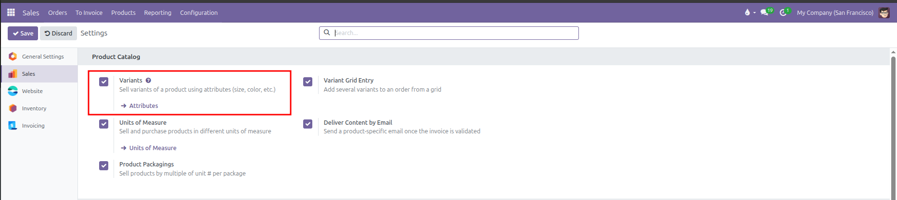
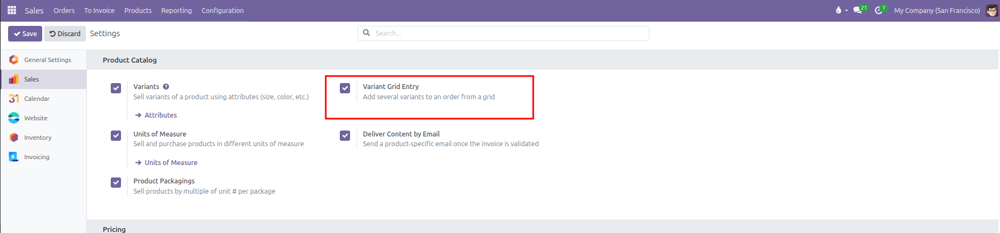
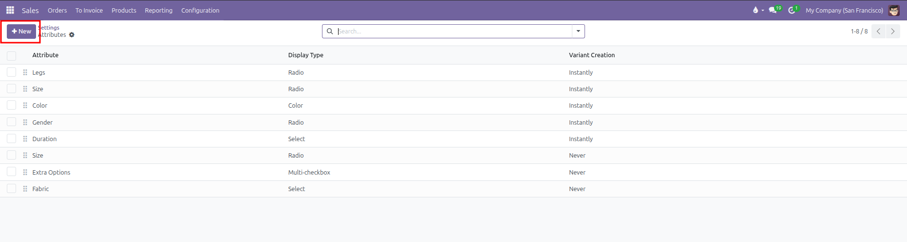
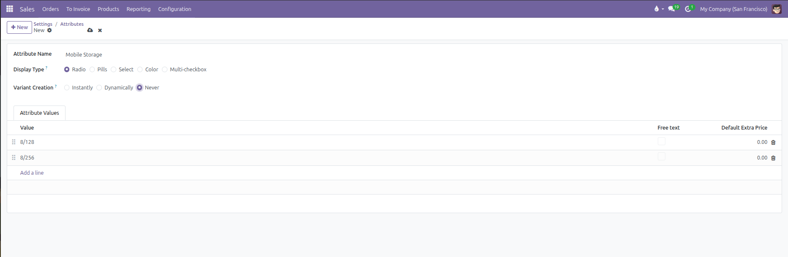
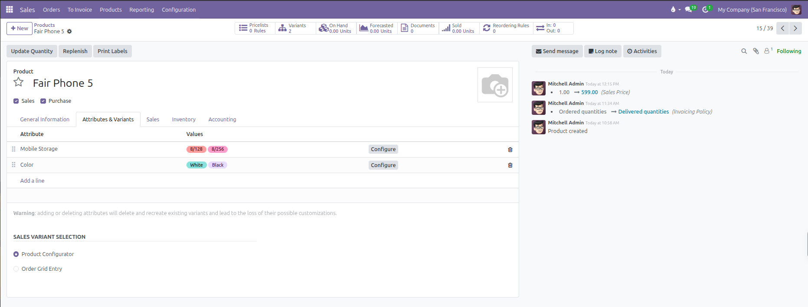
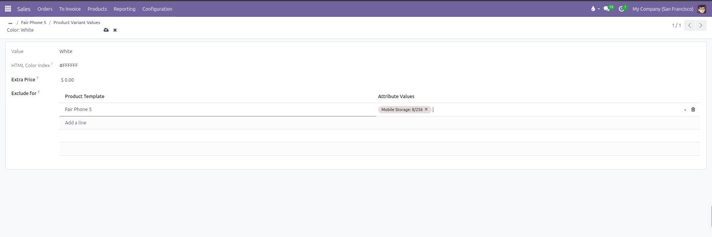
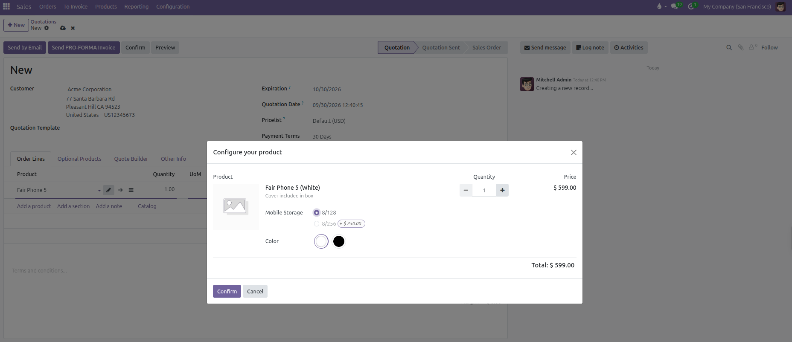
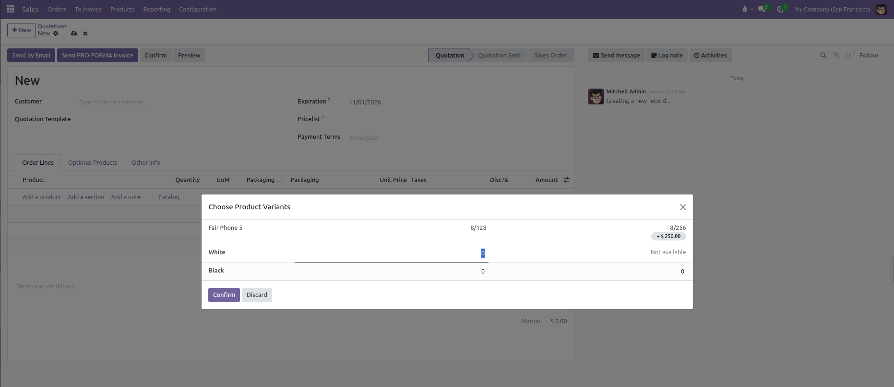

# Configuring Product Attributes and Variants

Set up product attributes, select variant creation modes, calculate price extras, and manage variant-level inventory codes in CURQ 18.

---

## Prerequisites

Before configuring attributes or using bulk matrix grids, verify that the required features are enabled in system settings:

1. Navigate to **Sales** > **Configuration** > **Settings**.
2. Under the **Product Catalog** section, enable **Variants**:

Enabling **Variants** unlocks the **Attributes & Variants** tab on product templates and adds the **Attributes** menu under **Products**.

3. If your business sells multi-attribute items in bulk *(such as apparel or wholesale hardware)*, also enable **Variant Grid Entry**:

Enabling **Variant Grid Entry** unlocks the multi-dimensional matrix dialog for bulk order entry on sales quotations.

4. Click **Save**.

---

## 1. Attributes and Display Types

Attributes represent the variable dimensions of a product (such as Size, Color, or Storage Capacity). Navigate to **Products** > **Attributes** to manage global attributes.

### Display Types

The **Display Type** controls how options look inside the product sales configurator:

| Display Type | How Customers See It | Best Used For |
| --- | --- | --- |
| **Radio** | Round single-choice option buttons. | Small sets of options where all choices should remain visible (such as 128 GB, 256 GB, 512 GB). |
| **Pills** | Clickable pill-shaped buttons with rounded borders. | Visual size pickers or quick specification tags (such as S, M, L, XL). |
| **Select** | Dropdown selection menu. | Long lists of values to keep quotation screens compact (such as Country of Origin or Shoe Size). |
| **Color** | Visual color swatches showing HTML hex colors or texture images. | Fabric swatches, finishes, and product exterior colors (such as Space Gray, Silver, or Gold). |
| **Multi-checkbox** | Square checkboxes allowing multiple simultaneous selections. | Add-on features or included items where customers choose multiple options. Only available when Variant Creation is set to Never. |

### Variant Creation Modes

The **Variant Creation** setting controls when CURQ generates concrete variant records:

| Creation Mode   | Database Behavior                                                                                           | Operational Impact                                                                                                               |
| -----------------| -------------------------------------------------------------------------------------------------------------| ----------------------------------------------------------------------------------------------------------------------------------|
| **Instantly**   | Creates all possible variant combinations immediately upon saving the product template.                     | Standard choice for products with predefined inventory SKUs, barcodes, and stock levels.                                         |
| **Dynamically** | Creates variant records only after a salesperson or customer selects that specific combination on an order. | Prevents database bloat on custom products with thousands of possible theoretical combinations.                                  |
| **Never**       | Never generates separate product variant records.                                                           | Stores selections directly on sales order lines without creating inventory SKUs (useful for personal engravings or custom text). |

### Attribute Values Table

Under the **Attribute Values** tab on the attribute record:
* **Value**: Enter the title of each selectable option (such as *8/128* and *8/256*).
* **Free text**: Check this box to allow customers or sales staff to enter custom text for this option on quotes (such as personalized engraving).
* **Default Extra Price**: Enter a baseline surcharge that applies whenever this value is added to products.

---

## 2. Adding Attributes to a Product Template

To add attributes and values to an existing product:

1. Navigate to **Products** > **Products** and open a product record (such as *Fair Phone 5*).
2. Open the **Attributes & Variants** tab.
3. Click **Add a line** in the attributes table.
4. Select an existing attribute in the **Attribute** column (such as *Mobile Storage*).
5. In the **Values** column, select or type the desired values (such as *8/128* and *8/256*).
6. Click **Add a line** again to add a second attribute (such as *Color* with values *White* and *Black*).

*(Adding or deleting attributes rebuilds existing variant records. Make sure to configure attributes before adding variant-specific barcodes or custom stock levels)*

Once saved, CURQ displays a **Variants** stat button at the top of the form showing the total count of active variants.

### Sales Variant Selection

At the bottom of the **Attributes & Variants** tab, under the **Sales Variant Selection** section, choose how sales staff add variants to quotations and sales orders:

| Selection Mode           | Operational Behavior                                                                                                                                      | Recommended Business Application                                                                                                                                                           |
| :-------------------------| :----------------------------------------------------------------------------------------------------------------------------------------------------------| :-------------------------------------------------------------------------------------------------------------------------------------------------------------------------------------------|
| **Product Configurator** | Opens an interactive pop up dialog where staff select attribute values one by one, review dynamic price adjustments, and add optional upsell accessories. | Best for consumer electronics, custom machinery, furniture, or goods sold individually where optional accessories *(such as protective cases, cables, or service warranties)* are offered. |
| **Order Grid Entry**     | Opens a multi-dimensional matrix dialog *(rows and columns)* allowing staff to enter quantities across dozens of variant combinations simultaneously.     | Best for wholesale distributors, apparel, footwear, textiles, and hardware where commercial clients order multiple sizes, colors, or specifications on a single order.                     |

---

## 3. Configuring Price Extras and Exclusions

Not all variant combinations cost the same amount to sell. You can configure price extras and block incompatible options directly from the product template:

### Setting Price Extras

To add a price premium for premium specifications:

1. On the **Attributes & Variants** tab, click the **Configure** button on the attribute row.
2. In the list of values, locate the premium value (such as *8/256*).
3. Enter the additional amount in the **Value Price Extra** column (such as *$ 250.00*).

CURQ calculates the final selling price on quotations using this formula:

$$\text{Final Variant Sales Price} = \text{Base Product Sales Price} + \text{Value Price Extra}$$

For example, if the base *Fair Phone 5* costs $599.00:
* Selecting the **8/128** value ($0.00 extra) sets the quotation price to **$599.00**.
* Selecting the **8/256** value ($250.00 extra) automatically sets the quotation price to **$849.00**.

### Setting Variant Exclusions

If certain combinations cannot be sold together (for example, *White* color is not available with *8/256* storage):

1. On the **Attributes & Variants** tab, click the **Configure** button on the attribute line (such as *Color*). This opens the **Product Variant Values** list view.
2. Click directly on the value row you want to restrict (such as *White*). This opens that specific value detail form.
3. In the detail form, locate the **Exclude for** table positioned below the **Extra Price** field.
4. Click **Add a line** inside the **Exclude for** table.
5. In the **Product Template** column, select the product (defaults to current product).
6. In the **Attribute Values** column, select the incompatible attribute value (such as *8/256*).
7. Save the record.

When staff select *White* on a quotation, the sales configurator automatically disables and blocks *8/256*, preventing invalid orders.

---

## 4. Managing Individual Variant Records

Each generated combination creates an individual variant record in CURQ. Access these records by clicking the **Variants** stat button at the top right of the product form, or via **Products** > **Product Variants**.

Each individual variant form lets you set unique operational data:

| Field                  | Purpose                                        | Practical Effect                                                                                                  |
| ------------------------| ------------------------------------------------| -------------------------------------------------------------------------------------------------------------------|
| **Internal Reference** | Unique SKU per variant.                        | Allows warehouse and sales staff to identify specific models (such as *FF5-BLK-128*).                             |
| **Barcode**            | Unique barcode per variant.                    | Enables optical scanning of specific variants during packing, shipping, and inventory counts.                     |
| **Cost**               | Acquisition or manufacturing cost per variant. | Overrides base template cost to calculate exact margins for high-spec variants.                                   |
| **Sales Price**        | Display of the computed price.                 | Displays the base price plus price extras for this specific combination (read-only when multiple variants exist). |
| **Logistics**          | Weight and Volume per variant.                 | Provides accurate shipping weight for carrier label calculations when variants differ in size or materials.       |
| **Variant Image**      | Visual photo of the specific variant.          | Replaces the base template image with a color-accurate photo on customer quotes and website product pages.        |
| **Archive**            | Deactivates a single combination.              | Hides discontinued variants from new quotations without affecting other active combinations.                      |

---

## 5. Adding Variant Products to Quotation Lines

Depending on whether the product is configured for **Product Configurator** or **Order Grid Entry**, CURQ provides two distinct order entry workflows:

### Workflow A: Individual Selection via Product Configurator

When a product is set to **Product Configurator**:

1. Navigate to **Sales** > **Orders** > **Quotations** and open or create a quotation.
2. Under the **Order Lines** tab, click **Add a product**.
3. Select the base product template *(such as `Fair Phone 5`)*.
4. CURQ automatically opens the **Configure your product** dialog window:
   * **Attribute Values**: Pick the desired specifications using the configured display types *(such as selecting `White` from color circles and `8/128` or `8/256` from storage radio buttons)*.
   * **Price Extras**: Options with surcharges display clear price badges *(such as `+ $ 250.00` next to `8/256`)*. The displayed unit price updates in real time as options are selected.
   * **Incompatible Combinations**: Any combination restricted by variant exclusions appears disabled, preventing sales staff from placing invalid orders.
   * **Optional Upsell Accessories**: If optional accessories *(such as phone cases, fast chargers, or extended warranties)* are configured under the product **Sales** tab, they appear below the main variant with quantity selectors. Staff can click **Add** to bundle accessories directly onto the quotation.
5. Review the quantity and calculated line total at the bottom of the modal.
6. Click **Confirm**. CURQ inserts the chosen product variant line *(along with any selected optional accessory lines)* directly into the quotation.

---

### Workflow B: Bulk Matrix Entry via Order Grid Entry

When a product is set to **Order Grid Entry**:

1. Navigate to **Sales** > **Orders** > **Quotations** and open or create a quotation.
2. Under the **Order Lines** tab, click **Add a product**.
3. Select the multi-attribute product template *(such as `Fair Phone 5`)*.
4. CURQ automatically displays the **Choose Product Variants** matrix modal dialog:
   * **Matrix Layout**: One attribute *(such as Mobile Storage: 8/128, 8/256)* populates the columns, while the second attribute *(such as Color: White, Black)* forms the rows.
   * **Price Surcharges**: Surcharges appear directly beneath column headers *(such as `+ $ 250.00` under `8/256`)*.
   * **Exclusion Enforcement**: Incompatible combinations display as **Not available** *(such as `White` with `8/256`)* and cannot receive quantity input.
   * **Bulk Quantity Entry**: Sales staff type desired quantities directly into multiple cells simultaneously *(for example, entering 5 for White / 8/128 and 10 for Black / 8/256)*.

5. Click **Confirm**. CURQ instantly generates individual sales quotation lines for every cell with a quantity greater than zero.
6. **Editing Matrix Lines**: If quantities need modification, clicking any existing order line for that product re-opens the matrix dialog, automatically highlighting the selected cell while preserving all previously entered quantities across the grid. Changing a cell quantity to `0` removes that specific line from draft and sent quotations.
7. **Customer PDF Quote Printing**: Under the quotation **Other Info** tab, the **Print Variant Grids** setting ensures the full matrix table prints neatly on the customer PDF quotation report.
