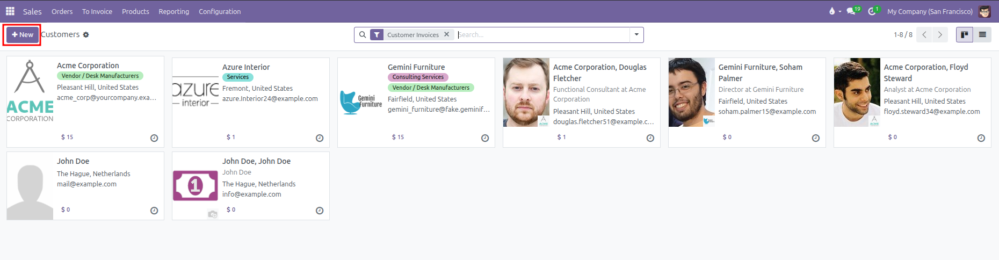
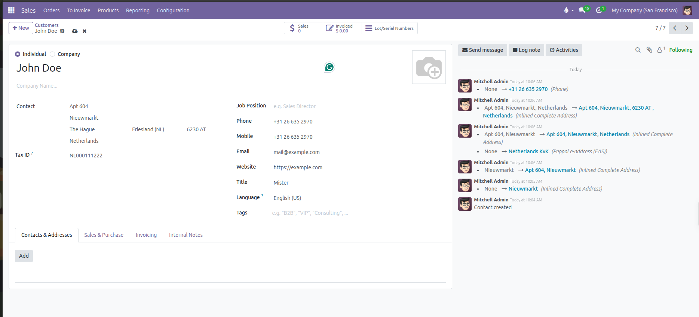
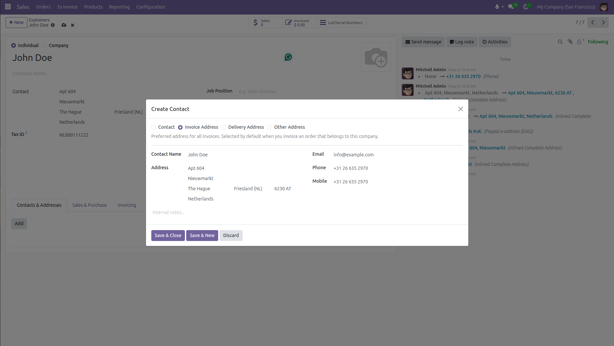
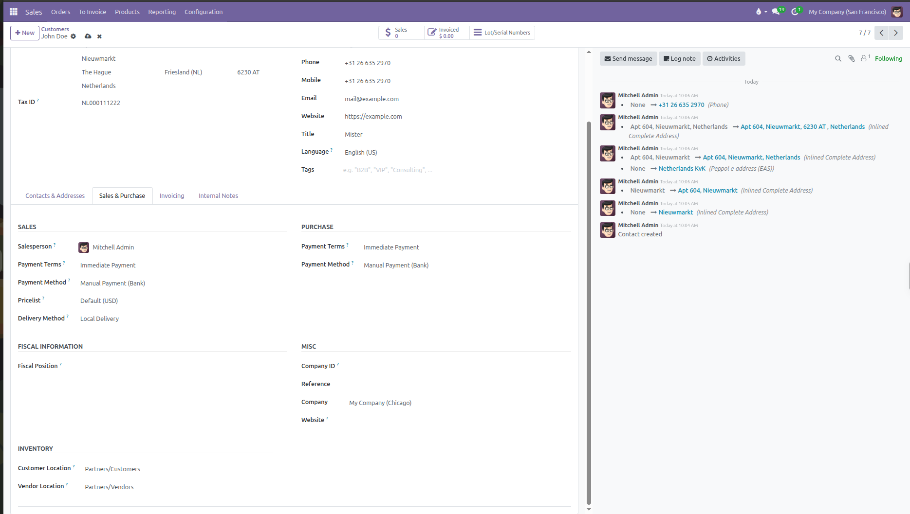
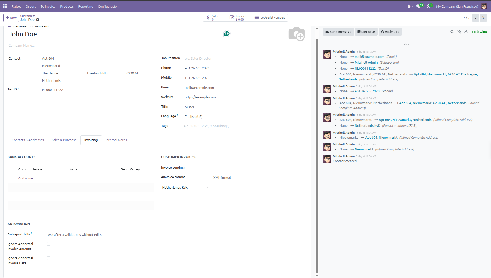
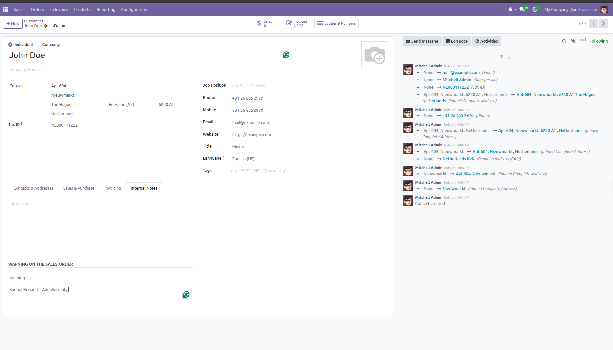

# Managing Customers and Multiple Addresses

Create customer records, configure multiple delivery and invoice addresses, and assign default commercial terms in CURQ 18.

---

## 1. Creating a Customer Record

Every sales quotation and invoice in CURQ requires a customer record. To create a new customer:

1. Navigate to **Orders** > **Customers**.
2. Click **New** at the top left of the screen.

   

3. Select whether the contact is an **Individual** or a **Company**.

   

CURQ changes the visible fields on the form based on this selection:

| Form Behavior        | When You Select Company                                                 | When You Select Individual                                                                                                                    |
| ----------------------| -------------------------------------------------------------------------| -----------------------------------------------------------------------------------------------------------------------------------------------|
| **Name Field**       | Prompts for the organization legal business name.                       | Prompts for the person full name.                                                                                                             |
| **Company Name**     | Hidden. A company cannot be parented to another company here.           | Visible. Allows linking this individual to an existing employer or parent company.                                                            |
| **Job Position**     | Hidden. Companies do not hold job titles.                               | Visible. Enter the person professional role (such as Purchasing Manager or Director).                                                         |
| **Title**            | Hidden.                                                                 | Visible. Select an honorific or salutation (such as Mr., Ms., or Dr.).                                                                        |
| **Address & Tax ID** | Enter the organization official registered address and Tax ID directly. | If linked to a parent company, inherits the company address and Tax ID automatically. If independent, enter personal address and tax details. |

### Shared Primary Details

These fields appear for both Individuals and Companies:

| Field        | Purpose in Sales                                             | How CURQ Uses It                                                                                                     |
| --------------| --------------------------------------------------------------| ----------------------------------------------------------------------------------------------------------------------|
| **Email**    | Primary electronic mailbox.                                  | Required for sending quotations by email and sending customer portal links.                                          |
| **Phone**    | Standard telephone line.                                     | Main office contact number displayed on quotes and delivery slips.                                                   |
| **Mobile**   | Direct cellular phone number.                                | Direct contact for urgent delivery or sales communication.                                                           |
| **Website**  | Corporate web address.                                       | Reference link to the customer online presence.                                                                      |
| **Language** | Document language preference.                                | Automatically renders quotation PDFs, email templates, and invoice PDFs in this language (such as English or Dutch). |
| **Tags**     | Categorization badges (such as VIP, Wholesale, or Prospect). | Used to filter, search, and group customer lists across the sales dashboard.                                         |

The customer record saves automatically as you enter details.

---

## 2. Managing Multiple Addresses

Companies often receive invoices at their central accounting office while requesting product deliveries at a warehouse, branch, or job site. You can attach multiple dedicated addresses to a single customer record.

To add an address:

1. Open the customer form from **Orders** > **Customers**.
2. Under the **Contacts & Addresses** tab, click **Add**.
3. Select the address type:

   

| Address Type | Purpose in Sales | How CURQ Uses It |
| --- | --- | --- |
| **Invoice Address** | Specific accounting office or billing department. | Automatically populates as the **Invoice Address** on quotations and customer invoices. |
| **Delivery Address** | Specific destination warehouse, distribution center, or site. | Automatically populates as the **Delivery Address** on quotations and warehouse delivery slips. |
| **Contact** | An employee, buyer, or representative at the company. | Available as a contact person when composing quotation emails and portal invitations. |
| **Other Address** | Secondary office, showroom, or regional branch. | Stored for internal records and communication. |

4. Enter the contact name, street address, and contact details for that location.
5. Click **Save & Close** to add the address, or **Save & New** to add another.

When you create a quotation for this customer, CURQ automatically fills the default invoice and delivery addresses, while letting you pick alternatives directly on the quotation form.

---

## 3. Commercial Terms and Sales Settings

You can preconfigure commercial agreements, payment schedules, tax rules, and delivery preferences on each contact record.

Open the customer form and click the **Sales & Purchase** tab:

### Sales Settings

| Field | Purpose | Practical Effect |
| --- | --- | --- |
| **Salesperson** | Assigns a dedicated internal account representative. | Automatically prefills as the salesperson on new quotations and routes customer chatter notifications to them. |
| **Payment Terms** | Sets the default customer payment schedule (such as 30 Days or Immediate Payment). | Automatically applies to quotations and customer invoices, calculating due dates without manual entry. |
| **Payment Method** | Preferred collection method for customer payments. | Recommends the default payment workflow when registering payments. |
| **Pricelist** | Assigns custom pricing tiers, wholesale rates, or currencies. | Quotation prices calculate automatically based on rules in this selected pricelist. |
| **Delivery Method** | Assigns a preferred shipping carrier or service (such as Local Delivery). | Prefills shipping calculation rules when adding delivery charges to an order. |

### Purchase Settings

*(Used when this contact also acts as a vendor or supplier)*

| Field | Purpose | Practical Effect |
| --- | --- | --- |
| **Payment Terms** | Agreed payment schedule for vendor bills. | Automatically populates payment deadlines when entering bills received from this partner. |
| **Payment Method** | How your company pays this vendor (such as bank transfer or check). | Sets the default payment mechanism for outbound vendor payments. |

### Fiscal Information

| Field | Purpose | Practical Effect |
| --- | --- | --- |
| **Fiscal Position** | Maps taxes and accounting accounts based on the customer regional status. | Automatically adapts taxes for international, domestic, or tax-exempt transactions on quotations and invoices. |

### Miscellaneous Details

| Field | Purpose | Practical Effect |
| --- | --- | --- |
| **Company ID** | Official government registration or business entity number. | Appears on formal invoices and legal business reports. |
| **Reference** | Custom internal identification code or legacy account number. | Allows sales teams to search and locate the customer quickly using internal codes. |
| **Company** | Restricts visibility to a single legal branch. | Leaves the customer available to all branches if blank, or restricts access to the selected company in multi-company setups. |
| **Website** | Corporate web address. | Stores customer URL for reference and online research. |
| **Industry** | Business sector classification. | Helps segment and filter customers for sales reporting and commercial campaigns. |

### Inventory Locations

| Field                 | Purpose                                                                         | Default Value        |
| -----------------------| ---------------------------------------------------------------------------------| ----------------------|
| **Customer Location** | Destination stock location for outgoing goods delivered to this customer.       | `Partners/Customers` |
| **Vendor Location**   | Source stock location for incoming goods or returns received from this partner. | `Partners/Vendors`   |

---

## 4. Invoicing and Banking Details

Under the **Invoicing** tab, you configure banking coordinates and electronic invoice delivery preferences for this customer.

### Bank Accounts

Click **Add a line** under Bank Accounts to register customer or vendor bank accounts:
* **Account Number**: Enter the bank account number or international `IBAN`.
* **Bank**: Select or create the financial institution name and routing identifier.
* **Send Money**: Check this option if you intend to send outbound supplier payments or customer refunds to this account.

### Customer Invoices Settings

| Field               | Purpose                                                     | Available Choices                                                                                                                                                         |
| ---------------------| -------------------------------------------------------------| ---------------------------------------------------------------------------------------------------------------------------------------------------------------------------|
| **Invoice sending** | Preferred invoice delivery route.                           | Choose **by Email** to send invoices electronically or **Download** for physical printing.                                                                                |
| **eInvoice format** | Standard electronic XML format embedded into invoices.      | Select national standards such as France Factur-X, EU Standard Peppol BIS 3.0, Germany XRechnung or ZUGFeRD, Netherlands NLCIUS, Australia BIS 3.0, or Singapore BIS 3.0. |
| **Peppol ID**       | Customer electronic address on the Peppol exchange network. | Select the national registry scheme (such as VAT, KvK, SIRET, or DUNS) and enter the company Peppol participant identifier.                                               |

### Automation

| Setting | Purpose | Practical Effect |
| --- | --- | --- |
| **Auto-post bills** | Automated posting rule for vendor bills received from this partner. | Choose **Ask after 3 validations without edits** (default) to prompt for confirmation until trustworthiness is established, **Always** to validate matching bills automatically, or **Never** to require manual review for every bill. |
| **Ignore Abnormal Invoice Amount** | Bypasses unusual total warnings. | Prevents verification warning alerts if this partner frequently bills variable or high value invoices. |
| **Ignore Abnormal Invoice Date** | Bypasses date discrepancy warnings. | Prevents warning alerts when bills or invoices carry backdated or distant future dates. |

---

## 5. Setting Customer Order Warnings

*(You need to enable Sale Warnings from Sales > Configuration > Settings)*

If a customer has a credit hold, special delivery requirements, or outstanding billing questions, you can configure automatic warning messages that appear when staff select that customer on a quotation:

1. Open the customer form from **Orders** > **Customers**.
2. Select the **Internal Notes** tab.
3. In the **Warning on the Sales Order** section, select an alert level:
   * **No Message**: Default state with no alert.
   * **Warning**: Displays an informative pop up alert on screen, but allows the salesperson to proceed with the quotation.
   * **Blocking Message**: Displays a pop up alert and completely prevents the user from saving or confirming a quotation for this customer.
4. When selecting **Warning** or **Blocking Message**, type the alert message text in the box that appears below the selection.

