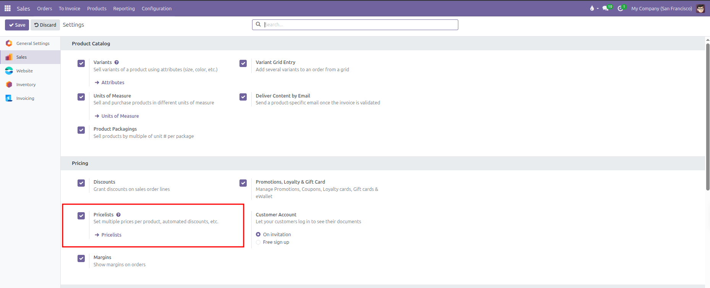
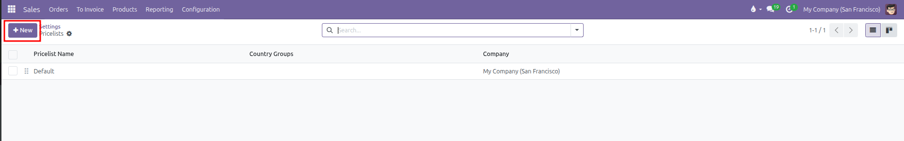
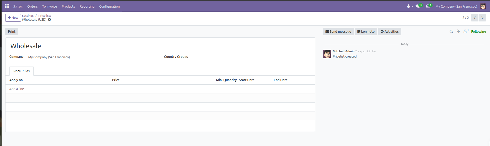
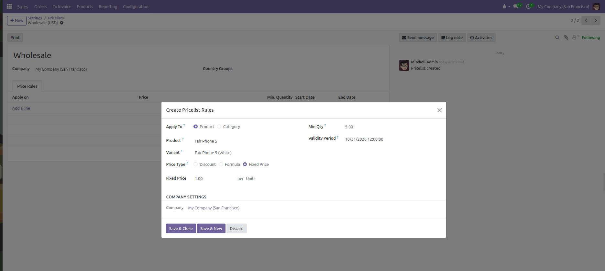
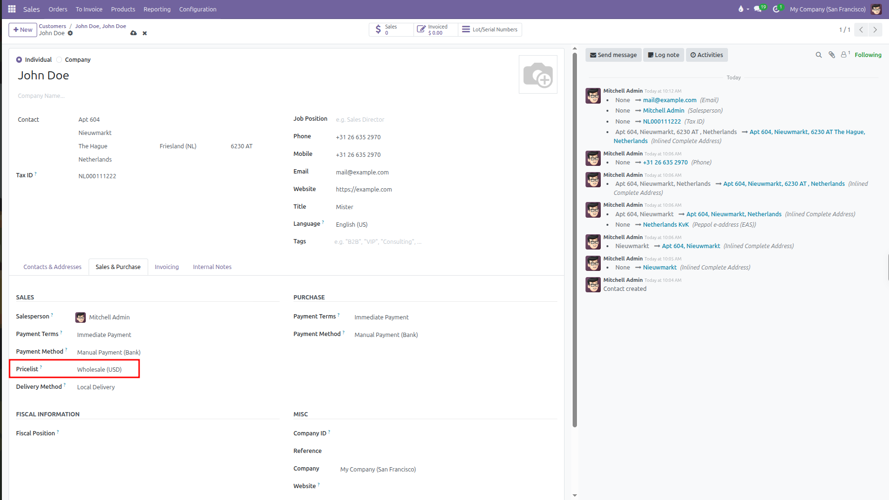
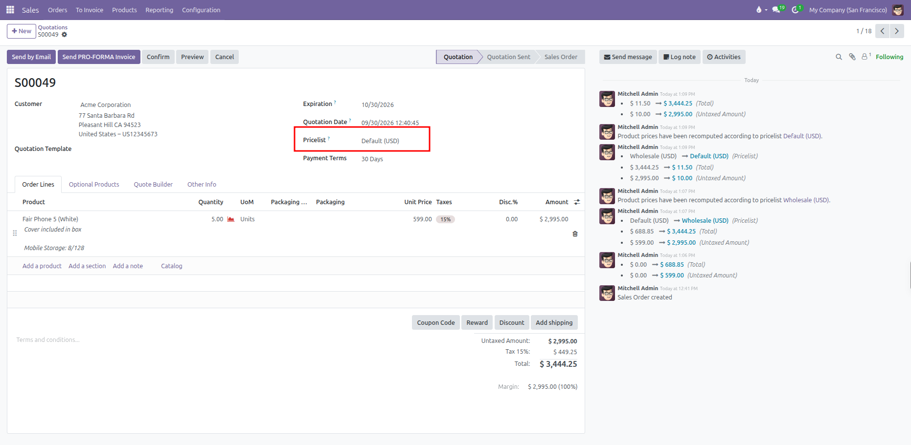

# Configuring Pricelists and Pricing Rules

Set up custom price lists, manage category and variant price rules, calculate dynamic discounts and markups, and configure volume tiers in CURQ 18.

---

## Prerequisites

*(You need to enable Pricelists from Sales > Configuration > Settings under the Pricing section)*

Enabling **Pricelists** unlocks the **Pricelists** menu under **Products** and displays pricelist selection fields on customer records and quotations.

---

## 1. Creating a Pricelist Record

Pricelists define the commercial pricing structure for specific customer segments, geographic regions, or wholesale tiers.

To create a new pricelist:

1. Navigate to **Products** > **Pricelists**.
2. Click **New** at the top left of the screen.

   

3. Enter a descriptive title in the **Pricelist Name** field (such as *Wholesale* or *Europe Retail EUR*).
4. Configure primary settings:
   * **Company**: Restrict the pricelist to a single operating branch, or leave blank to share across all companies.
   * **Country Groups**: Assign geographical regions to restrict which customer locations can use this pricelist.
   * **Currency**: *(Only visible when Multi-Currencies is enabled from Invoicing/Accounting > Configuration > Settings)*. When Multi-Currencies is disabled, CURQ locks all pricelists to your company default currency and hides the field.
5. The record saves automatically as you complete each field.

---

## 2. Setting Price Rule Scope (Apply To)

Inside the pricelist record, the **Price Rules** tab allows you to define individual pricing rules. Click **Add a line** to open the **Pricelist Rule** modal.

In CURQ 18, the **Apply To** field presents **two radio buttons**:

* **Product**: Targets items at the product, variant, or global catalog level.
* **Category**: Targets items belonging to a product category hierarchy.

### How CURQ Resolves Rule Scopes

Rather than cluttering the interface with four separate radio buttons, CURQ dynamically determines the target scope based on your field inputs:

| Target Scope              | Configuration in the Modal                                                                                                                                                                 | Resulting Behavior                                                                              |
| ---------------------------| --------------------------------------------------------------------------------------------------------------------------------------------------------------------------------------------| -------------------------------------------------------------------------------------------------|
| **All Products (Global)** | Select **Product** and leave the **Product** field blank *(shows placeholder "All products")*, or select **Category** and leave **Category** blank *(shows placeholder "All categories")*. | Applies a baseline discount or calculation across every item in your entire inventory catalog.  |
| **Product Category**      | Select **Category** and choose a specific category from the dropdown *(such as Electronics)*.                                                                                              | Applies to all existing and future products assigned to this category or its subcategories.     |
| **Product Template**      | Select **Product** and choose a specific item *(such as Fair Phone 5)*. Leave the **Variant** field blank *(shows placeholder "All variants")*.                                            | Applies across all variants of that product template.                                           |
| **Product Variant**       | Select **Product** and pick an item with multiple variants. A **Variant** field automatically appears below it. Choose the exact variant *(such as Fair Phone 5, White, 8/256)*.           | Applies strictly to that single variant combination, overriding general product template rules. |

---

## 3. Price Calculation Methods (Price Type)

The **Price Type** determines how CURQ computes line prices when this rule matches:

### Fixed Price

Sets an absolute dollar amount override regardless of standard sales prices:
* Enter the exact amount in the **Fixed Price** field (such as *$ 499.00*).
* Quotations using this pricelist will sell the item for this fixed value.

### Discount

Calculates a straight percentage reduction from base prices:
* Enter the percentage in the **Discount** field (such as *15 %*).
* Applies against the base sales price by default, or against another selected pricelist.

### Formula

Constructs dynamic, automated pricing based on real-time cost or sales numbers:

| Formula Setting         | Purpose                                                | Practical Effect                                                                                                                                                                                                           |
| -------------------------| --------------------------------------------------------| ----------------------------------------------------------------------------------------------------------------------------------------------------------------------------------------------------------------------------|
| **Based price**         | Reference baseline.                                    | Choose **Sales Price**, **Cost** (internal acquisition cost), or **Other Pricelist**.                                                                                                                                      |
| **Discount / Markup**   | Percentage adjustment.                                 | Enter a discount percentage when based on sales price, or a markup percentage when based on internal cost.                                                                                                                 |
| **Round off to**        | Decimal rounding interval.                             | Rounds calculated prices to standard intervals (such as *0.05*, *1.00*, or *10.00*).                                                                                                                                       |
| **Extra fee**           | Surcharge or reduction offset.                         | Adds or subtracts a fixed amount after rounding. Setting rounding to *10.00* and extra fee to *-0.01* produces *.99* psychological pricing (such as *$ 599.99*).                                                           |
| **Margins (Min / Max)** | Price floor and ceiling guardrails *(developer mode)*. | Defines the minimum and maximum dollar margin allowed over the base price. Protects profitability by guaranteeing the final price never drops below `Base Price + Min Margin` and never exceeds `Base Price + Max Margin`. |

#### Margin Guardrails Example

When Developer Mode is active, the **Margins** setting presents two inputs separated by an arrow (`Min. Margin → Max. Margin`). These inputs enforce profit floors and price ceilings:

* **Scenario Baseline**: A product has an internal cost of *$ 100.00*, a formula markup of *50%*, Min. Margin set to *$ 20.00*, and Max. Margin set to *$ 40.00*.
* **Floor Protection**: If promotional discounts or extra deductions lower the calculated figure to *$ 110.00*, CURQ triggers the minimum margin floor and raises the price to *$ 120.00* (`$ 100.00 cost + $ 20.00 min margin`).
* **Ceiling Protection**: If the formula calculates a price of *$ 150.00*, CURQ triggers the maximum margin ceiling and caps the price at *$ 140.00* (`$ 100.00 cost + $ 40.00 max margin`).

---

## 4. Volume Breaks and Promotional Periods

On the right-hand side of each pricelist rule, configure order quantity triggers and calendar schedules:

### Volume Price Breaks (Min Qty)

Use **Min Qty** to offer quantity-based volume discounts:
* Leave as *1* for general pricing with no quantity requirements.
* Enter a higher threshold (such as *5* or *20*) to reward bulk purchases.

When salespeople enter quantities on quotation lines, CURQ automatically picks the rule matching the highest fulfilled quantity threshold.

### Promotional Schedules (Validity Period)

Use the **Validity Period** date range picker to schedule automated promotions:
* Select a start date and an end date.
* The promotional price activates automatically at 00:00 on the start date and expires automatically at 23:59 on the end date.
* Outside this window, CURQ falls back to the next applicable standard rule or base sales price.

---

## 5. Applying Pricelists to Customers and Quotations

Pricelists integrate directly into customer records and sales documents:

### Assigning to Customer Profiles

1. Navigate to **Orders** > **Customers** and open a customer profile.
2. Open the **Sales & Purchase** tab.
3. In the **Sales** column, select the default pricelist in the **Pricelist** dropdown.
4. Future quotations created for this customer automatically use this pricelist.

### Overriding on Quotations

1. Navigate to **Orders** > **Quotations** and click **New**.
2. Select the customer. The header **Pricelist** field populates automatically with their assigned default.
3. To switch to a different pricelist, select a new one from the dropdown.
4. When switching pricelists on an order with existing line items, CURQ automatically recalculates product unit prices against the new pricelist rules and records the change in the order chatter log.

