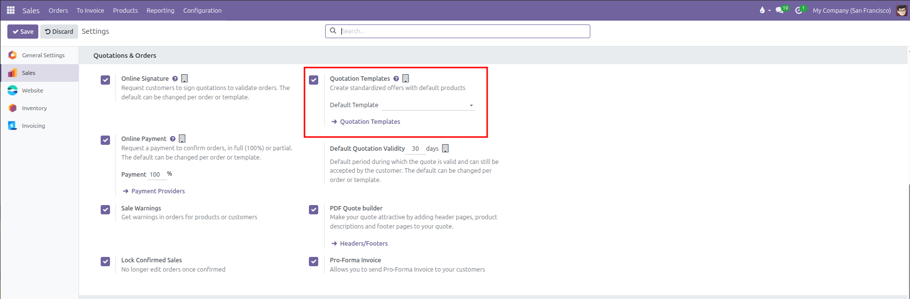
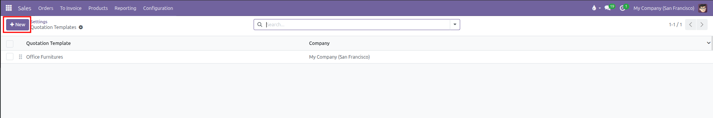
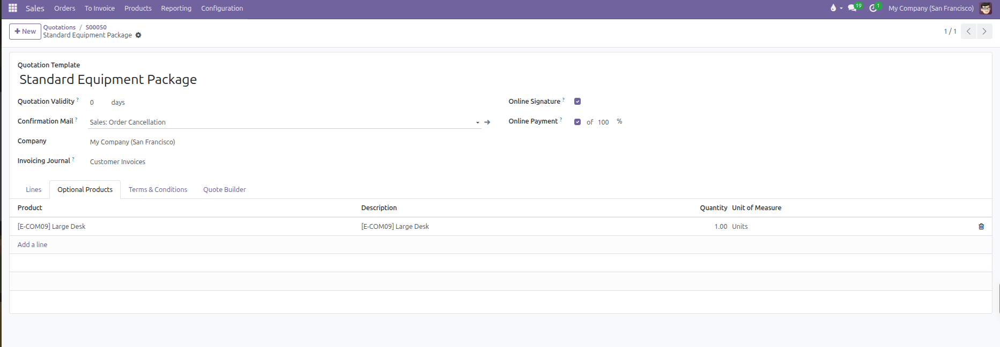
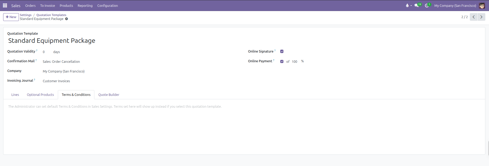
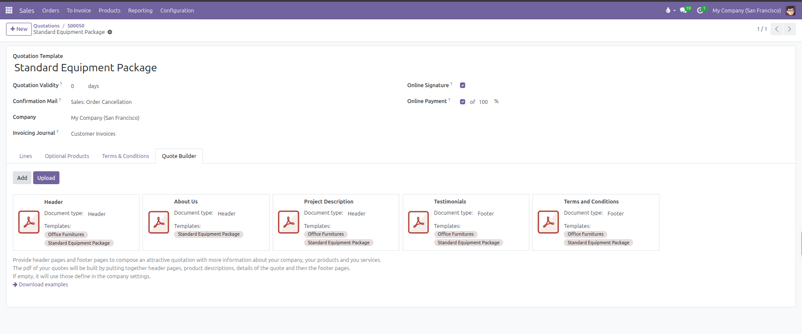
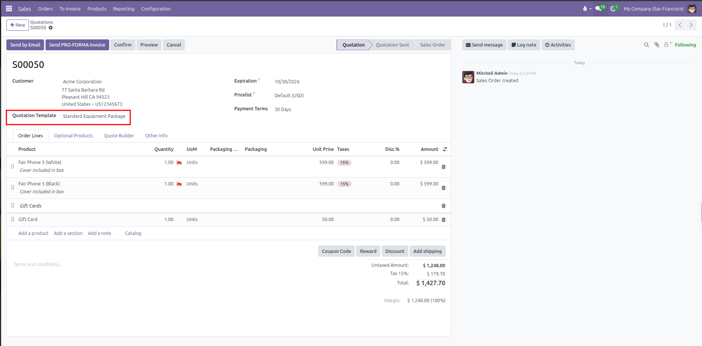

# Configuring Quotation Templates and PDF Quote Builder

Create standardized sales quotation templates, automate default order lines and optional products, configure electronic signature and prepayment rules, and build polished PDF sales proposals with headers and footers in CURQ 18.

---

## Prerequisites

*(You need to enable Quotation Templates from Sales > Configuration > Settings under the Quotations & Orders section)*

Enabling **Quotation Templates** activates the **Quotation Templates** menu under **Configuration** and adds a **Default Template** selector in Sales Settings.

---

## 1. Creating a Quotation Template

Standard quotation templates save time for sales teams by pre-populating recurring line items, payment terms, and validity windows.

To create a new template:

1. Navigate to **Sales** > **Configuration** > **Quotation Templates**.
2. Click **New** in the top left corner.

   

3. Enter a title in the **Quotation Template** field (such as *Standard Equipment Package* or *Annual Service Agreement*).
4. Configure quotation parameters in the header:
   * **Quotation Validity**: Enter the number of days the quote remains valid (such as *30* days). When applied to a quotation, CURQ automatically computes the **Expiration** date by adding these days to the quotation date.
   * **Confirmation Mail**: Select the email template sent automatically upon order confirmation.
   * **Invoicing Journal**: Assign a dedicated accounting journal if sales from this template must post to a specific ledger.
   * **Company**: Restrict the template to a specific company branch, or leave blank to share globally across all operating units.

---

## 2. Customer Confirmation Policies (Online Signature & Prepayment)

In the upper-right section of the template form, configure the customer confirmation requirements:

| Confirmation Setting | UI Field Layout                                                                      | Practical Effect                                                                                                                                                                                      |
| ----------------------| --------------------------------------------------------------------------------------| -------------------------------------------------------------------------------------------------------------------------------------------------------------------------------------------------------|
| **Online Signature** | Checkbox (`require_signature`).                                                      | Enables an interactive digital signature pad on the customer portal. The customer can review terms and sign directly from their web browser.                                                          |
| **Online Payment**   | Checkbox with dynamic percentage input (`require_payment` and `prepayment_percent`). | Checking this box requires customers to pay an advance deposit through a payment gateway before the quote confirms. When checked, an inline percentage field dynamically appears: `[✓] of [ 100 % ]`. |

*(The percentage input is hidden until you check the Online Payment box. It does not appear as a separate standalone row, but as an inline field next to the checkbox)*

---

## 3. Pre-populating Order Lines, Sections, and Notes

The **Lines** tab defines the default product layout that appears whenever a salesperson selects this template:

1. Click **Add a product** to insert standard goods or services. Specify the default quantity and unit of measure.
2. Click **Add a section** to organize products into grouped categories (such as *Hardware*, *Installation*, or *Support*).
3. Click **Add a note** to insert descriptive instructions, scope boundaries, or project milestones.
4. Drag and drop rows using the handle icon on the far left to adjust presentation order.

Sales representatives can still modify quantities, delete lines, or add additional custom products once the template loads into a live quotation.

---

## 4. Upselling with Optional Products

The **Optional Products** tab allows sales managers to suggest complementary items, accessories, or premium service upgrades:

1. Switch to the **Optional Products** tab.
2. Click **Add a line** and select suggested items (such as *Protective Carrying Case* or *Extended Warranty*).
3. When the customer opens the quotation in their online portal, these optional products appear with interactive **Add to Cart** buttons.
4. If the customer accepts an optional item, CURQ automatically moves it to the main order lines and recalculates the total balance due.

---

## 5. Custom Terms & Conditions

The **Terms & Conditions** tab provides a dedicated rich-text editor to set contractual, warranty, or delivery policies specific to this template:

* **Template-Specific Terms**: Enter unique legal clauses, payment schedules, or service level agreements (SLAs) applicable to this offer.
* **Quotation Override**: Selecting this template on a quotation replaces the company-wide default terms with the text entered here, automatically translated to the customer's language.
* **Default Fallback**: If you leave this field blank, quotations created with this template continue using the standard terms and conditions defined globally in **Sales** > **Configuration** > **Settings**.

---

## 6. Attaching Custom PDF Quote Builder Documents

CURQ 18 includes a dynamic PDF Quote Builder that stitches together marketing cover pages, technical spec sheets, and terms around the standard quote:

1. Switch to the **Quote Builder** tab.
2. Add dynamic PDF documents:
   * **Header Pages**: Upload PDF files to appear before the quotation lines (such as company profile, project overview, or proposal cover page).
   * **Footer Pages**: Upload PDF files to appear after the quotation lines (such as standard terms, warranties, or service level agreements).
3. When a salesperson clicks **Print** or sends the offer by email, CURQ compiles a unified, professional PDF document merging the header pages, line items, and footer pages.

---

## 7. Applying Templates on Quotations

1. Navigate to **Orders** > **Quotations** and click **New**.
2. Select the customer.
3. In the **Quotation Template** field, select the desired template from the dropdown.
4. CURQ automatically:
   * Populates order lines, sections, and notes into the **Order Lines** tab.
   * Loads suggested cross-sells into the **Optional Products** tab.
   * Sets the **Expiration** date based on template validity days.
   * Enables online signature and prepayment requirements according to template rules.
   * Replaces default terms with template-specific terms and conditions.

