# Configuring Discount and Loyalty Programs

Create promotional campaigns, configure discount codes, issue coupons and loyalty cards, and manage rewards on sales orders in CURQ 18.

---

## Prerequisites

*(You need to enable Discounts and Promotions, Loyalty & Gift Card from Sales > Configuration > Settings under the Pricing section)*

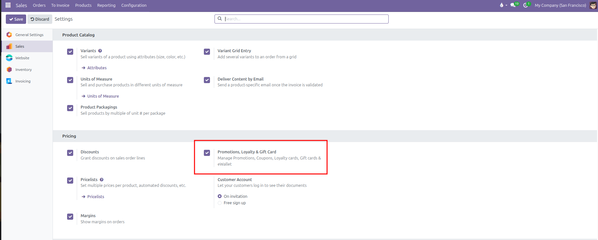

* **Discounts**: Enables manual line-by-line discount percentages on sales quotation lines.
* **Promotions, Loyalty & Gift Card**: Activates promotional campaigns, loyalty cards, coupons, and gift card programs, unlocking the **Discount & Loyalty** and **Gift cards & eWallet** menus under **Products**.

---

## 1. Accessing Promotional Programs

Promotion and loyalty programs are managed from the **Products** menu:

* **Products** > **Discount & Loyalty**: Manages automated promotions, promo codes, coupon campaigns, loyalty point schemes, and Buy X Get Y offers.
* **Products** > **Gift cards & eWallet**: Manages balance-backed digital gift cards and prepaid customer electronic wallets.

---

## 2. Choosing a Program Type

Click **New** under **Products** > **Discount & Loyalty** to open the program configuration form.

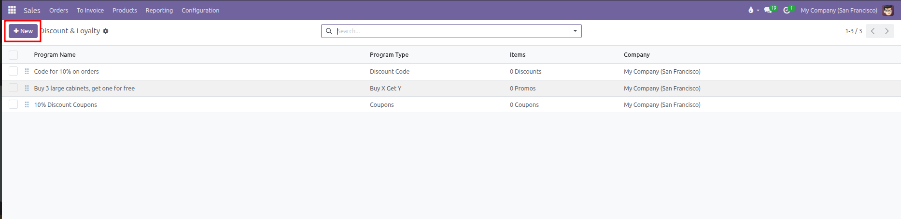

CURQ provides specialized program templates tailored for different commercial strategies:

| Program Type | Target Mechanism | Practical Use Case |
| --- | --- | --- |
| **Discount Code** | A single public promotional code. | Marketing campaigns sharing codes *(such as SUMMER10)* that grant percentage or fixed discounts when entered on quotations. |
| **Coupons** | Unique, single-use generated voucher codes. | Individual discount codes generated for specific customers through email campaigns or automated triggers. |
| **Loyalty Cards** | Point accumulation per dollar spent or item purchased. | Long-term customer retention schemes where points convert into rewards or discounts once target thresholds are reached. |
| **Buy X Get Y** | Quantity threshold triggers. | Volume promotions where purchasing a designated product quantity automatically grants free items or discounts *(such as Buy 3, Get 1 Free)*. |
| **Promotions** | Automatic condition-based discounts. | System-wide promotional rules applied automatically without requiring a code whenever cart conditions are fulfilled. |
| **Next Order Coupons** | Post-purchase incentives. | Automatically issues a coupon code for future purchases after the current order is completed. |

---

## 3. Configuring Rules & Conditions

In the program header, establish overarching validity parameters and limits:

* **Pricelist**: Restrict the promotional program to a specific pricing tier *(such as Wholesale USD)* or leave blank for universal availability.
* **Start Date & End Date**: Define the calendar window during which the promotion is active.
* **Limit Usage**: Restrict total program redemptions across all customers *(such as to 10 usages)*.
* **Available On**: Choose whether this program applies to backend **Sales** orders, **Point of Sale**, or **Website** ecommerce orders.
* **Program Stat Button**: The stat button at the top right tracks active coupons, loyalty cards, or redemptions associated with this program.

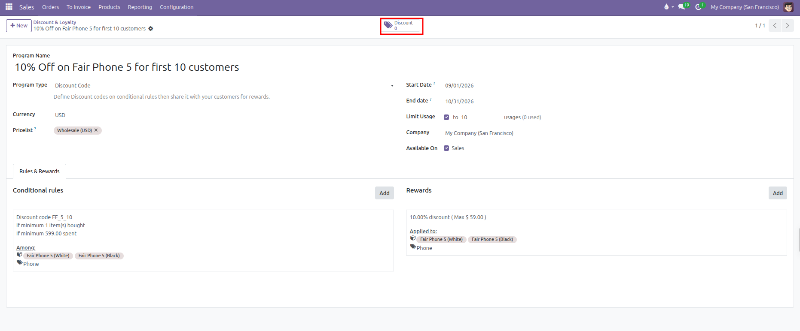

Under the **Rules & Rewards** tab, click into **Conditional rules** to establish qualifications:

* **Discount Code**: Enter the exact promo code string customers must provide *(such as FF_5_10)*.
* **Minimum Quantity**: The minimum number of qualifying products required in the order lines before the rule applies.
* **Minimum Purchase**: The minimum monetary subtotal required, with the option to evaluate tax-included or tax-excluded totals.
* **Among (Target Restrictions)**: Filter eligible items by **Products** *(such as Fair Phone 5 White and Black)*, **Categories**, or **Product Tag** *(such as Phone)*.
* **Grant Points**: For loyalty programs, define how many points are awarded *(such as 1 point per $ 10.00 spent)*.

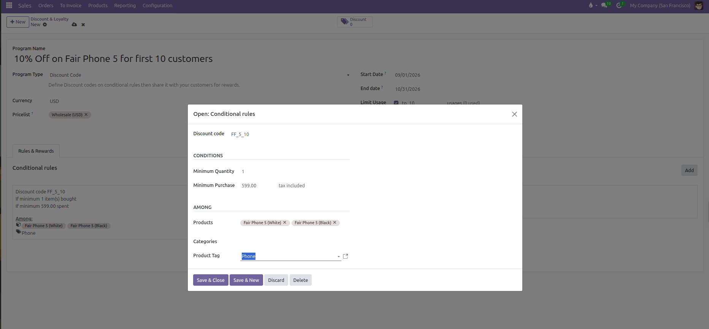

### Tracking and Generating Individual Codes

Clicking the stat button at the top right of the program form opens the registry of issued voucher codes and customer cards:

* **Generate Codes**: Click **New** in the top left to generate new voucher codes or register customer loyalty cards manually.
* **Track Expirations and Balances**: Inspect individual codes *(such as 044e-b3d5-4ce5)*, point balances, expiration dates, and assigned customer contacts.
* **Dispatch via Email**: Click the **Send** button on any line to email the promotional voucher directly to the client.

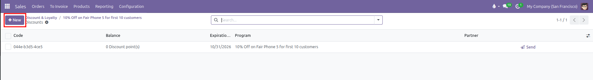

### Adjusting Balances and Viewing History

Open any individual card or coupon record to inspect its detailed parameters:

* **Manual Balance Adjustments**: Click the **Balance** value to launch the **Update Balance** modal. Input the desired figure *(such as 100.00)* along with an audit reason in the **Description** field, then click **Confirm**.
* **Transaction History**: The **History Lines** tab maintains a complete audit trail tracking every issued credit, redeemed debit, and linked sales order document.

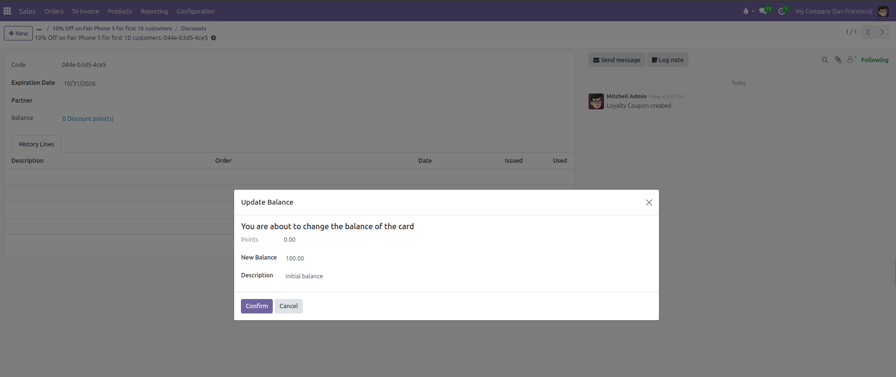

---

## 4. Defining Rewards

The **Rewards** tab specifies what the customer receives when conditions are met:

| Reward Type       | Configuration Options                                                            | Practical Effect                                                                               |
| -------------------| ----------------------------------------------------------------------------------| ------------------------------------------------------------------------------------------------|
| **Free Product**  | Select the exact reward item and quantity.                                       | Adds a zero-dollar line to the quotation for the specified free product.                       |
| **Discount**      | Specify **Percentage** *(such as 10 %)* or **Fixed Amount** *(such as $ 25.00)*. | Deducts the discount from the order subtotal, the cheapest item, or specific designated items. |
| **Free Shipping** | Max discount amount *(optional)*.                                                | Reimburses or waives shipping delivery fees up to the specified limit.                         |

### Reward Target Scopes and Caps

When configuring a **Discount** reward, refine how the reduction applies:

* **Discount Scope**: Choose whether the discount calculates across the entire **Order**, exclusively on the **Cheapest Product**, or restricted to **Specific Products** *(such as Fair Phone 5 variants)*.
* **Max Discount**: Establish a monetary cap *(such as $ 59.00)* to ensure percentage reductions never exceed a maximum safety budget.
* **Description on order**: Customize the line item description that appears on the quotation *(such as 10% on specific products (Max $ 59))*.

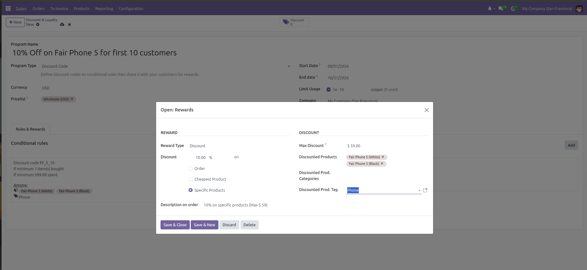

---

## 5. Configuring Gift Cards & eWallet Programs

Gift cards and electronic wallets track monetary balances rather than percentage discounts. Manage these programs under **Products** > **Gift cards & eWallet**:

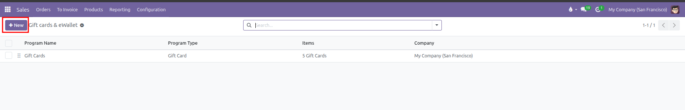

Open an existing gift card program or click **New** to configure card generation and automated delivery parameters:

* **Program Name**: Identifies the gift card or eWallet campaign *(such as Gift Card)*.
* **Program Type**: Set to **Gift Card** *(or eWallet)* to dictate whether balances are distributed as redeemable code vouchers or stored customer wallet credits.
* **Gift Card Products**: Specifies the product variant sold to customers to issue the card *(such as Gift Card)*. When purchased on a sales order, CURQ automatically generates and links a unique card code.
* **Email template**: Defines the automated notification template used to deliver gift card codes, PINs, and balance details directly to recipients *(such as Gift Card: Gift Card Information)*.
* **Currency**: Designates the transactional monetary unit for card valuation *(such as USD)*.
* **Generate Gift Cards Button**: Click **Generate Gift Cards** to batch-create pre-loaded gift vouchers manually without requiring a customer purchase.
* **Gift Cards Stat Button**: Tracks all issued active, redeemed, and expired card codes with their remaining balances.

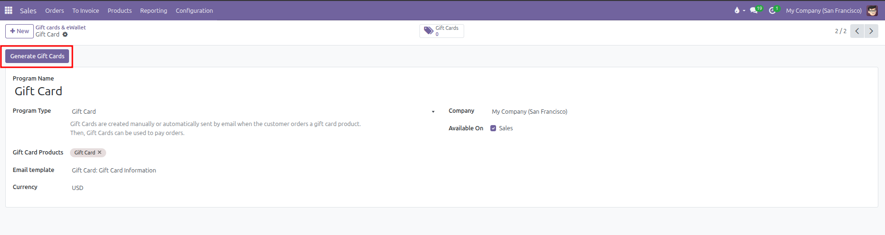

### Generating Gift Cards in Batches

Clicking **Generate Gift Cards** opens the batch generation modal:

* **For**: Choose **Anonymous Customers** for generic physical or promotional vouchers, or **Selected Customers** to link generated cards directly to designated partner accounts.
* **Description**: Provide an internal reference or label *(such as $10 gift cards)*.
* **Quantity to generate**: Specify the number of voucher codes to create *(such as 5)*.
* **Gift Card value**: Define the initial credit balance allocated per card *(such as $ 10.00)*.
* **Valid Until**: Establish an optional expiration date *(such as 10/31/2026)*.
* Click **Generate Gift Card** to create the vouchers and register them under the program.

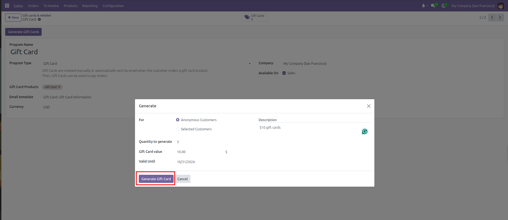

### Tracking Generated Gift Cards

Once generated, the program stat button updates with the total number of issued gift cards:

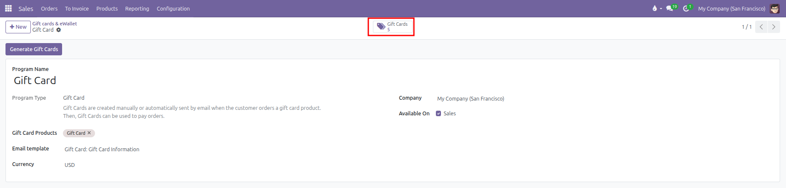

Clicking the **Gift Cards** stat button opens the registry of individual card vouchers:

* **Code**: The unique redemption voucher key *(such as 044f-3cf9-47c2)* provided to customers during checkout.
* **Balance**: The remaining spendable balance *(such as $ 10.00)*.
* **Expiration Date**: The date through which the card remains redeemable *(such as 10/31/2026)*.
* **Send**: Click **Send** on any row to email the voucher code and instructions directly to the cardholder.

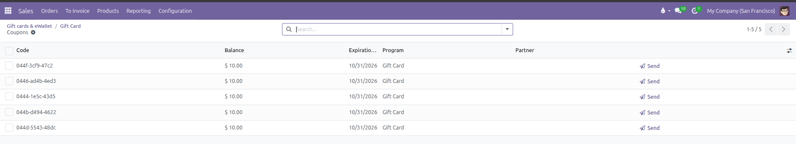

---

## 6. Applying Discounts, Coupons, and Rewards on Quotations

On quotation forms, sales representatives manage discounts and rewards using interactive action buttons located directly below the order lines:

1. **[Discount] Button**:
   * Opens an interactive discount modal.
   * Allows applying a manual percentage *(such as 5 %)* or fixed amount discount directly to line items or the global order total.
2. **[Coupon Code] Button**:
   * Opens the coupon redemption window.
   * Enter public promotional codes *(such as FF_5_10)* or unique customer coupon codes and click **Apply**.
   * CURQ verifies validity against active conditional rules and appends the promotional reward line to the quotation.

   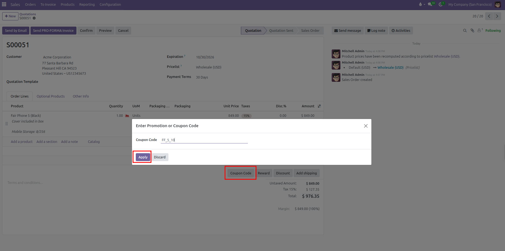

3. **[Reward] Button**:
   * Available when quotation items meet active promotion or loyalty conditions.
   * Clicking **Reward** opens the **Available Rewards** modal prompting the salesperson to select and apply eligible rewards *(such as 10% on specific products)*.

   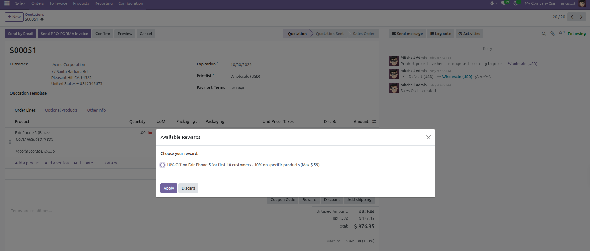

4. **Reward Line Presentation**:
   * CURQ inserts reward lines with negative amounts or zero-dollar entries.
   * Reward lines are marked as read-only to prevent manual price tampering while keeping full visibility on customer quote summaries.

   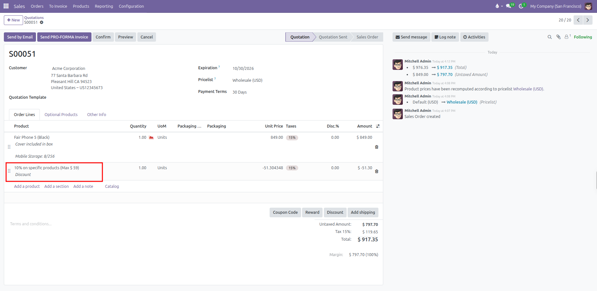
