# Configuring Shipping and Delivery Methods

Define flat delivery rates, build dynamic rule-based shipping calculations, configure destination and product constraints, and manage shipping costs on sales orders in CURQ 18.

---

## Prerequisites

*(You need to enable Delivery Methods from Sales > Configuration > Settings under the Shipping section)*

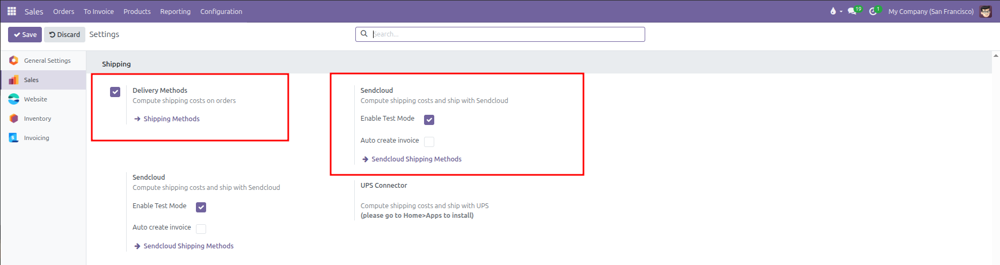

* **Delivery Methods**: Enables shipping cost calculation on sales orders and provides the `Shipping Methods` configuration link.
* **Sendcloud**: Connects CURQ to Sendcloud for carrier rate computation and parcel shipping, with options to **Enable Test Mode** and **Auto create invoice**.

---

## 1. Accessing Delivery Methods

Manage shipping carriers and delivery services from either the Sales or Inventory applications:

* **Sales** > **Configuration** > **Sales Orders** > **Delivery Methods**
* **Inventory** > **Configuration** > **Delivery** > **Delivery Methods**

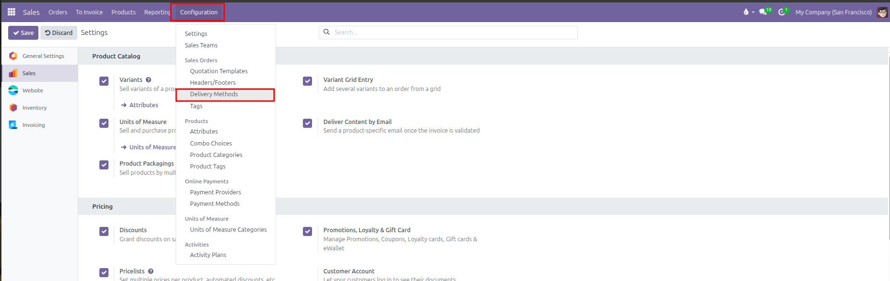

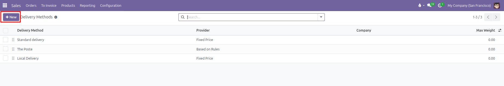

Click **New** to create a delivery service, or select an existing carrier *(such as Standard delivery, The Poste, or Local Delivery)* to modify its calculation rules and geographic availability.

---

## 2. Fixed Price Delivery Methods

A fixed price method charges a flat shipping fee regardless of package weight or dimensions, with optional qualification for free shipping once order subtotals reach a specified threshold.

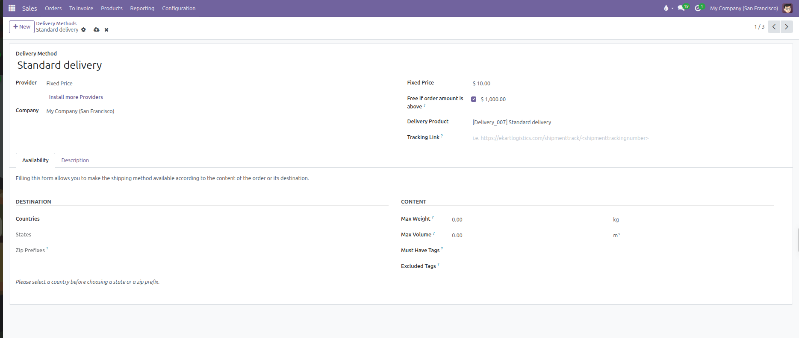

### Configuration Fields

* **Delivery Method**: Enter the public title of the shipping service *(such as Standard delivery, Local Delivery, Next-Day Express, or Sendcloud)*.
* **Provider**: Select **Fixed Price** *(other available providers include Based on Rules and Sendcloud)*.
* **Company**: Limit availability to a specific company in multi-company environments, or leave blank for universal availability.
* **Fixed Price**: Enter the standard monetary delivery fee applied to orders *(such as $ 10.00)*.
* **Free if order amount is above?**: Check this option to waive delivery charges for orders exceeding a target subtotal.
* **Threshold Amount**: Enter the qualifying order amount required to trigger free shipping *(such as $ 1,000.00)*.
* **Delivery Product**: Select the service product representing the shipping charge on order lines. CURQ configures this service with an invoicing policy based on ordered quantities.
* **Tracking Link?**: Enter an external tracking URL pattern with the `<shipmenttrackingnumber>` wildcard placeholder *(such as https://carrier.com/track?num=<shipmenttrackingnumber>)* to generate dynamic tracking links on customer delivery slips.

---

## 3. Rule-Based Delivery Calculation

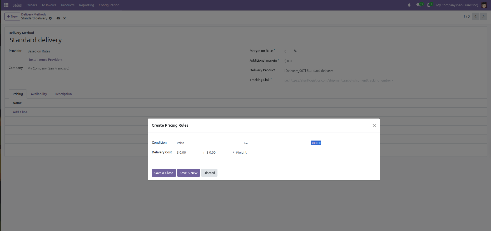

Set **Provider** to **Based on Rules** to reveal the **Pricing** grid tab along with carrier margin adjustments:

* **Margin on Rate?**: Percentage markup applied on top of the calculated rule rate *(such as 10 %)*.
* **Additional margin?**: Flat monetary fee added on top of the final calculated rate *(such as $ 2.50)*.
* **Pricing Tab**: Maintains the sequence-ordered matrix of conditional rules evaluated from top to bottom. Click **Add a line** to launch the **Create Pricing Rules** modal.

### Price Rule Calculation Formula

Each rule row evaluates an order attribute against a comparison operator and calculates a fee using the following formula:

$$\text{Shipping Fee} = \text{Base Price} + (\text{Variable Price} \times \text{Factor})$$

### Rule Parameters

| Parameter              | Configuration Options                                                   | Functional Behavior                                                  |
| ------------------------| -------------------------------------------------------------------------| ----------------------------------------------------------------------|
| **Condition Variable** | **Weight**, **Volume**, **Weight * Volume**, **Price**, or **Quantity** | Determines which order property triggers the rule.                   |
| **Operator**           | `==`, `<=`, `<`, `>=`, `>`                                              | Comparison logic evaluated against the package threshold.            |
| **Threshold Value**    | Numeric threshold *(such as 5.00 kg or $ 300.00)*                       | The target value required for the rule to match.                     |
| **Base Price**         | Fixed monetary figure *(such as $ 20.00)*                               | Flat baseline charge applied whenever this tier matches.             |
| **Variable Factor**    | **Weight**, **Volume**, **Weight * Volume**, **Price**, or **Quantity** | Multiplier attribute for incremental charges.                        |
| **Variable Price**     | Rate per unit of variable factor *(such as $ 2.00 per kg)*              | Added to the base price for each unit exceeding baseline thresholds. |

### Practical Rule Examples

When clicking into a rule line, CURQ displays two structured input groups:

1. **Condition**: Select the evaluation variable, operator, and threshold limit.
2. **Delivery Cost**: Configure base price plus variable price multiplied by the factor:
   $$\text{Delivery Cost} = \text{[Sale Base Price]} + \text{[Sale Price]} \times \text{[Variable Factor]}$$

Common rule configurations:

* **Flat Tier by Weight**:
  * *Condition*: `Weight <= 5.00`
  * *Delivery Cost*: `$ 10.00 + $ 0.00 * Weight`
  * *Generated Rule Summary*: `if weight <= 5.00 then fixed price $ 10.00`
* **Base Fee Plus Per-Kilogram Charge**:
  * *Condition*: `Weight > 5.00`
  * *Delivery Cost*: `$ 10.00 + $ 2.00 * Weight`
  * *Generated Rule Summary*: `if weight > 5.00 then fixed price $ 10.00 plus $ 2.00 times Weight`
* **Free Delivery Above Spend Threshold**:
  * *Condition*: `Price >= 300.00`
  * *Delivery Cost*: `$ 0.00 + $ 0.00 * Weight`
  * *Generated Rule Summary*: `if price >= 300.00 then fixed price $ 0.00`
* **Volumetric Density (Dimensional Weight)**:
  * *Condition*: `Weight * Volume <= 15.00`
  * *Delivery Cost*: `$ 20.00 + $ 1.50 * Weight * Volume`
  * *Generated Rule Summary*: `if wv <= 15.00 then fixed price $ 20.00 plus $ 1.50 times Weight * Volume`

---

## 4. Destination and Content Availability Constraints

Restricting shipping methods prevents customers or sales agents from selecting carriers that cannot service specific territories, package sizes, or product types.

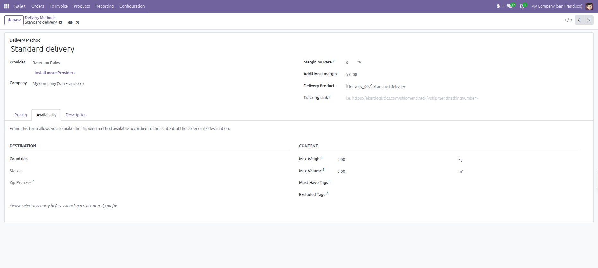

Configure delivery restrictions across two dedicated groups in the **Availability** tab:

### Destination Group

Filtering by destination requires choosing the country first before refining state or postal boundaries:

* **Countries**: Select eligible delivery countries. Leaving blank allows shipments to any global address.
* **States**: Select specific regional states or provinces within the chosen countries *(such as California or Ontario)*. Disabled until at least one country is selected.
* **Zip Prefixes?**: Enter comma-separated postal code prefixes to restrict courier services to designated municipal areas or postal routes. Disabled until at least one country is selected.

### Content Group

* **Max Weight?**: Cap the maximum permissible parcel weight in kilograms *(such as 30.00 kg)*. If the cumulative weight of order products exceeds this threshold, CURQ hides the method.
* **Max Volume?**: Cap the maximum allowable package volume in cubic meters *(such as 1.50 m³)*.
* **Must Have Tags?**: The carrier only appears if the sales order contains at least one line item carrying the designated product tag *(such as Fragile or Heavy Freight)*.
* **Excluded Tags?**: The carrier is hidden completely if any product in the order carries this tag *(such as Perishable or Dangerous Goods)*.

### Description Tab

Use the **Description** tab to specify customer-facing shipping instructions, delivery lead times, or courier terms. Text entered here prints at the bottom of quotations, sales order confirmations, and customer dispatch emails.

### Setting Customer Default Delivery Methods

To automate carrier selection, open any customer card under **Sales** > **Orders** > **Customers**, open the **Sales & Purchase** tab, and assign a preferred carrier in the **Delivery Method** field. All future quotations created for this customer automatically default to this shipping provider.

---

## 5. Third-Party Carrier Integration & Sendcloud

For automated real-time courier quotes and barcode label printing, CURQ integrates with external parcel delivery platforms like Sendcloud.

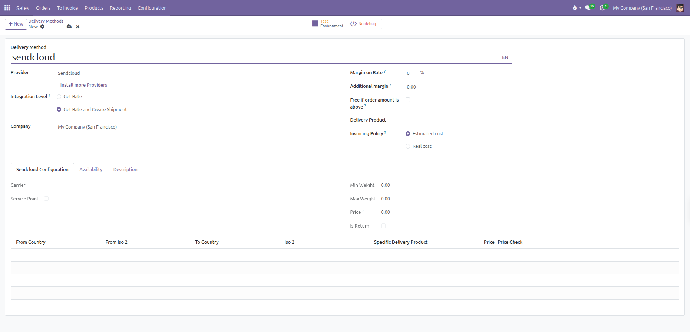

### Sendcloud Setup Prerequisites

*(You need to configure your Sendcloud API credentials and link them to your company under the Sendcloud settings before activating Sendcloud delivery carriers)*

### Carrier Configuration Fields

* **Delivery Method**: Enter the public name of the carrier service *(such as Sendcloud DHL Express or Sendcloud PostNL Standard)*.
* **Provider**: Select **Sendcloud**.
* **Integration Level?**:
  * **Get Rate**: Calculates real-time shipping costs on quotations without creating an external tracking shipment.
  * **Get Rate and Create Shipment**: Fetches live rates on quotations, generates official carrier tracking numbers upon sales confirmation, and downloads printable shipping labels upon warehouse validation.
* **Company**: The operating company. Must be consistent with the company configured in the linked Sendcloud integration.
* **Margin on Rate?**: Enter a percentage markup applied on top of raw courier API rates to cover handling and packaging *(such as 10 %)*.
* **Additional margin?**: Enter a flat monetary fee added on top of the calculated shipping price *(such as $ 2.50)*.
* **Free if order amount is above?**: Check to offer zero-dollar shipping once order subtotals reach the qualifying threshold.
* **Delivery Product**: Select the service product used to inject the delivery charge on quotations and invoices.
* **Invoicing Policy?**:
  * **Estimated cost**: Invoices the shipping price calculated and agreed upon at the time of quotation confirmation.
  * **Real cost**: Re-calculates and invoices the actual shipping cost recorded once the warehouse team packs and weighs the final parcel.

### Sendcloud Configuration Tab

When Provider is set to Sendcloud, a dedicated **Sendcloud Configuration** tab activates:

* **Carrier**: Displays the synchronized third-party parcel carrier name *(such as PostNL, DHL, DPD, or UPS)*.
* **Service Point**: Indicates whether parcel shop pickup point selection is enabled or mandatory for customer checkouts.
* **Min Weight & Max Weight**: Displays the technical weight boundaries supported by the carrier service.
* **Price?**: Displays the baseline courier contract rate returned by Sendcloud.
* **Is Return**: Flags whether this carrier method is reserved for customer return shipments.
* **Country Matrix Table**:
  * **From Country & To Country**: Origin and destination international country routes.
  * **Specific Delivery Product**: Custom service product mapped to designated country routes.
  * **Price**: Override price for the specific destination lane.
  * **Price Check**: Direct action button to evaluate custom rates against live Sendcloud API tariffs.

### Availability and Description Tabs

* **Synchronize countries with Sendcloud**: Checkbox under the Availability tab allowing automatic geographic synchronization with Sendcloud shipping zones.
* **Description**: Custom courier terms, delivery estimates, or parcel shop instructions printed on order confirmations and dispatch emails.

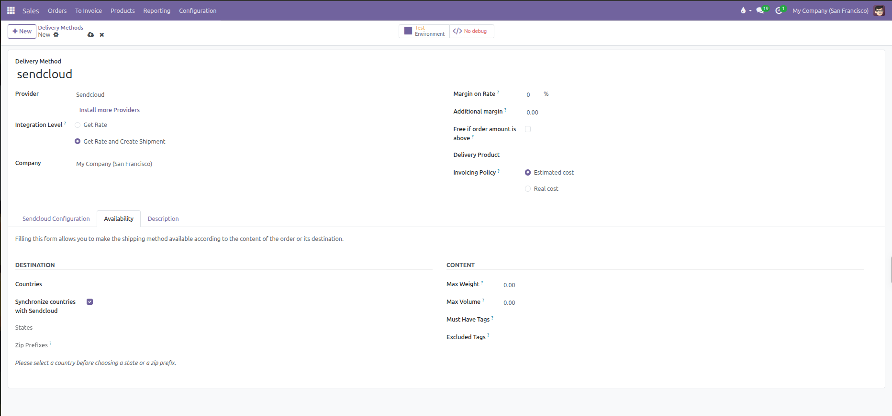

---

## 6. Applying and Updating Shipping on Quotations

Sales representatives apply, verify, and recalculate shipping costs directly within the quotation workflow.

### Adding Delivery Service to a Quotation

When creating or modifying a sales quotation, click the **Add shipping** action button located directly below the order lines:

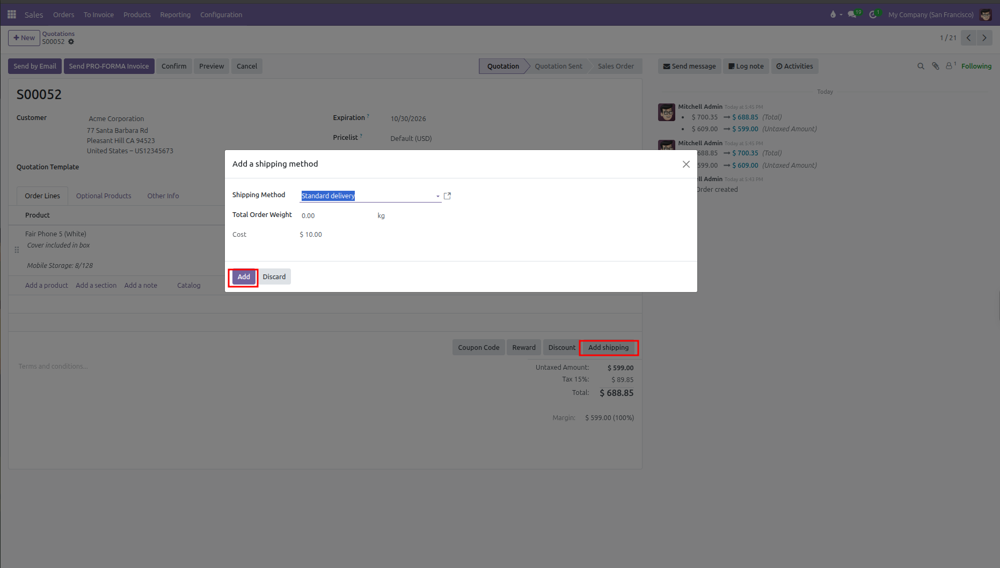

1. Clicking **Add shipping** opens the **Add a shipping method** modal.
2. **Shipping Method**: Select the preferred delivery carrier from the dropdown list. Available options filter automatically based on customer delivery address, destination restrictions, and order constraints.
3. **Total Order Weight**: Displays the cumulative weight of all physical goods on the quotation lines.
4. **Cost**: For fixed or rule-based methods, the calculated price displays automatically. For live carrier integrations, click **Get rate** to query current API rates.
5. Click **Add** to confirm and apply the shipping charge to the quotation.

### Quotation Delivery Line Presentation

CURQ inserts a dedicated delivery service line into the quotation table:

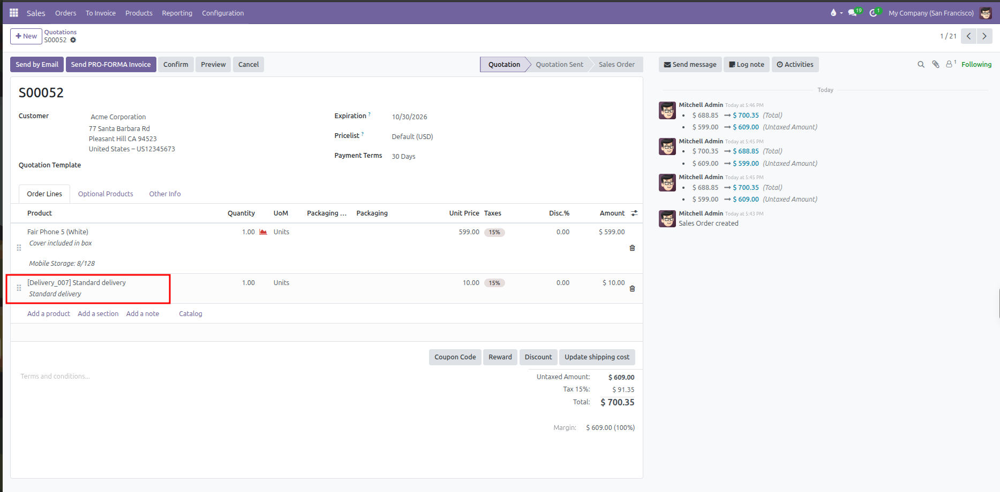

* **Product & Description**: Displays the delivery service product code and name *(such as `[Delivery_007] Standard delivery`)* along with carrier terms.
* **Pricing & Taxes**: The unit price reflects the computed carrier cost *(e.g. $10.00)*, applying configured customer fiscal positions and sales taxes *(e.g. 15%)*.
* **Dynamic Action Button**: Once shipping is applied to the quotation, the action button below the order lines dynamically transitions from **Add shipping** to **Update shipping cost**.

### Updating Shipping Costs After Order Modifications

When order contents, quantities, weights, or delivery addresses change after shipping has been added:

1. Click the **Update shipping cost** button located directly below the order lines.
2. The **Update shipping cost** modal dialog opens.
3. Review the **Shipping Method**, the recalculated **Total Order Weight**, and the updated **Cost**.
4. Click **Update** to commit the refreshed shipping rate to the quotation delivery line.

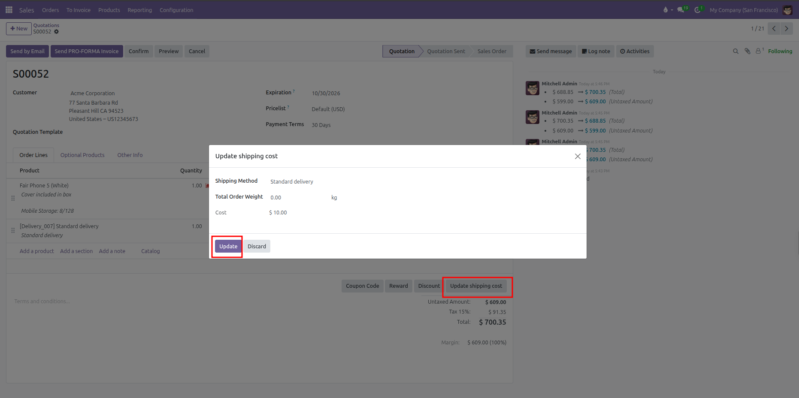
