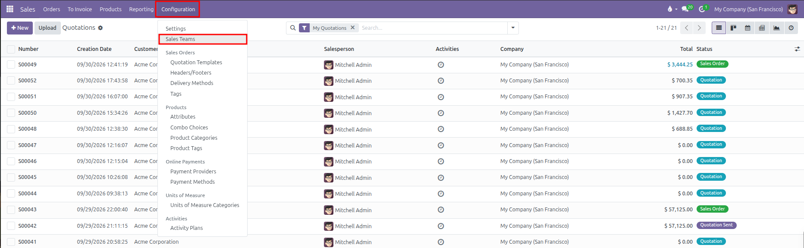
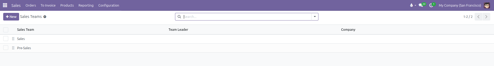
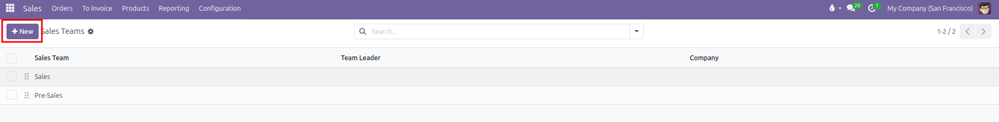
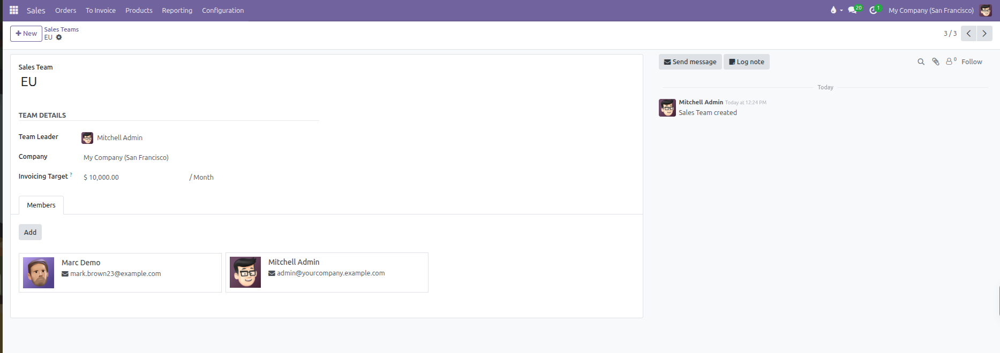
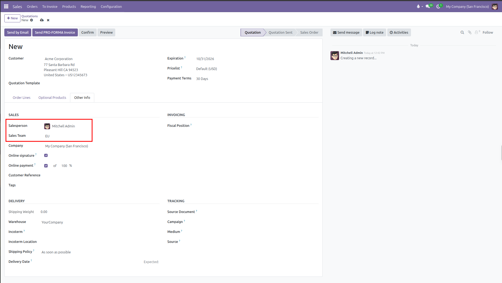
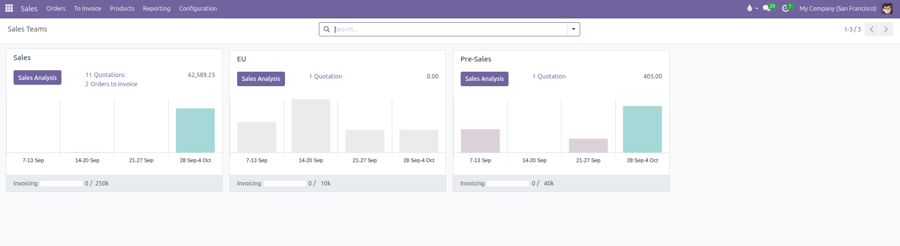

# Sales Team Setup

Configure sales teams, assign team leaders, define monthly invoicing targets, and organize salespeople in CURQ 18.

---

### 1. Overview of Sales Teams

Sales teams allow you to structure your commercial organization by division, region, or product focus *(such as Direct Sales, Wholesale, or North America)*. 

Configuring sales teams enables:

* **Automatic Team Assignment**: When a salesperson drafts a quotation, their default sales team automatically links to the order.
* **Target Tracking**: Set a monthly invoicing goal and track team revenue attainment in real time.
* **Segmented Reporting**: Filter and group sales performance reports by team in pivot tables and graphs.

---

### 2. Access the Sales Teams Menu

To view and manage sales teams:

1. Open the **Sales** app.
2. In the top navigation bar, click **Configuration**.
3. Select **Sales Teams**.

CURQ displays the list of existing sales teams showing team names, team leaders, and associated companies:

---

### 3. Create or Edit a Sales Team

To create a new sales team:

1. From the Sales Teams list, click **New** at the top left.

   

2. Enter the **Sales Team** name *(such as `Enterprise Sales` or `EMEA Region`)*.
3. Configure the team details in the main form:

| Field                | Description                                           | Practical Effect                                                                                                 |
| :---------------------| :------------------------------------------------------| :-----------------------------------------------------------------------------------------------------------------|
| **Sales Team**       | The title or regional label of the team.              | Appears in filters, reporting, and quotation assignment dropdowns.                                               |
| **Team Leader**      | The manager or supervisor heading the team.           | Acts as the primary point of contact and can receive team escalations.                                           |
| **Invoicing Target** | Monetary revenue goal per month.                      | Displays a live progress bar on the sales team dashboard tracking monthly billed revenue against this benchmark. |
| **Company**          | Assigned legal entity *(in multi-company databases)*. | Restricts this sales team and its performance data to the selected subsidiary.                                   |

---

### 4. Assign Team Members

Under the **Members** tab on the sales team form:

1. Click **Add** to open the user directory.
2. Select the salespeople who belong to this team.
3. Click **Select**.

By default in CURQ, each salesperson belongs to a single sales team. If you add a user who is already a member of another team, CURQ displays an alert banner:

> *"Adding [Salesperson] in this team will remove them from [Other Team]."*

---

### 5. Sales Teams on Quotations and Orders

When creating a sales quotation:

1. Open the quotation and select the **Other Info** tab.
2. The **Sales Team** field automatically populates based on the default team of the selected **Salesperson**.
3. Sales managers can manually override the sales team by selecting a different team from the dropdown.

---

### 6. Sales Team Dashboard and Target Tracking

CURQ provides a dedicated visual dashboard for monitoring team targets:

1. Go to **Sales** > **Orders** > **Sales Teams**.
2. Each sales team appears as a Kanban card showing:
   * **Sales Analysis**: One-click access to filtered performance reports, graphs, and pivot tables.
   * **Pipeline Metrics**: Counts and monetary totals for open quotations and confirmed orders ready to invoice.
   * **Volume Trends**: Weekly sales trend charts across the current month.
   * **Invoicing Progress Bar**: Real-time meter showing total invoiced revenue against the monthly target.
3. Click any metric link or chart on the card to jump directly into the filtered records for that team.

