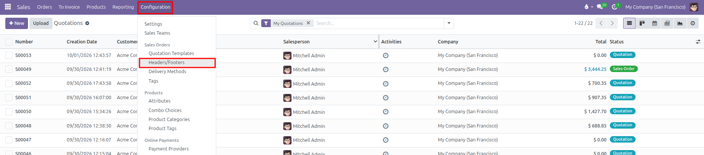
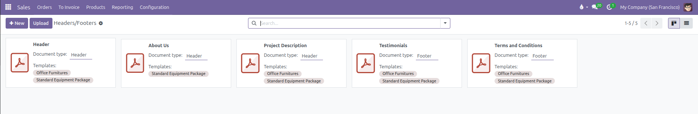
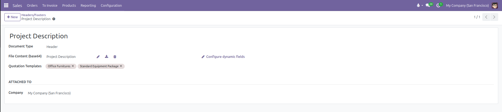
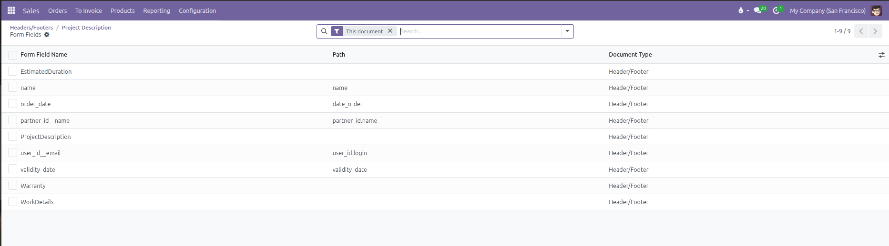
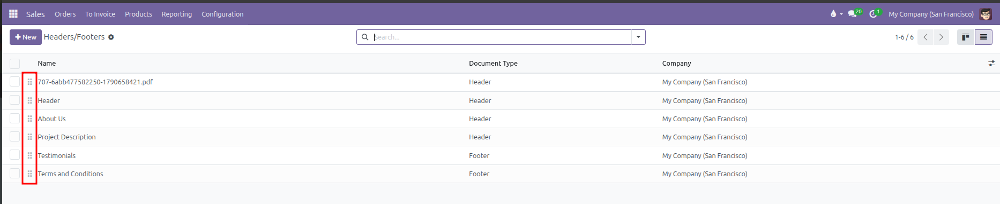
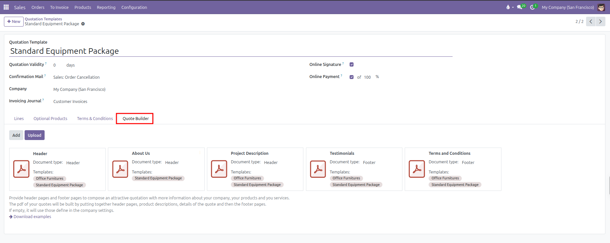
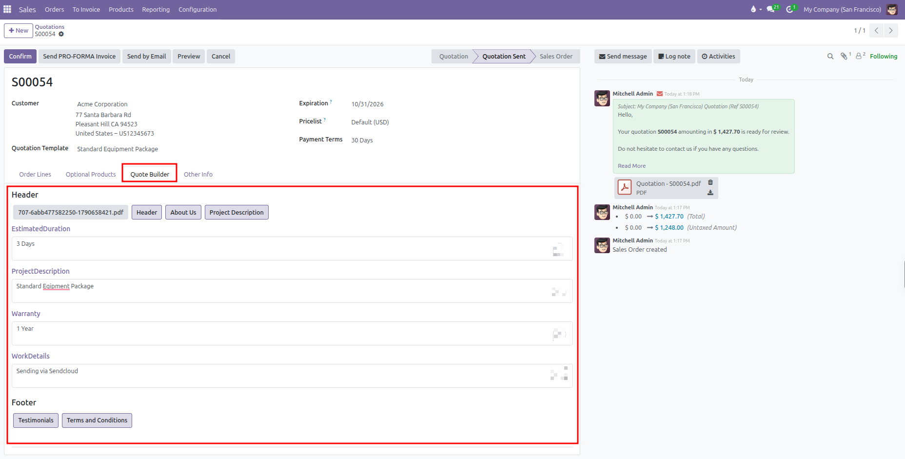

# Headers and Footers Setup

Configure custom PDF header pages and footer pages to automatically enhance quotation documents in CURQ 18.

---

### 1. Overview of Quotation Headers and Footers

The PDF Quote Builder in CURQ 18 allows commercial teams to attach professionally designed PDF pages to customer quotations and sales orders:

* **Header Pages**: Placed at the very beginning of the quotation PDF before the product lines table *(such as a corporate cover page, company introduction, or executive summary)*.
* **Footer Pages**: Appended to the end of the quotation PDF after the pricing and signature sections *(such as general terms and conditions, service level agreements, or warranty certifications)*.
* **Template Targeting**: Link specific headers and footers to designated quotation templates, or leave them unassigned to make them globally available across all quotations.

---

### 2. Access the Headers and Footers Menu

To view and manage quotation header and footer documents:

1. Open the **Sales** app.
2. In the top navigation bar, click **Configuration**.
3. Under the **Sales Orders** section, select **Headers/Footers**.

*(You can also access this menu from **Sales** > **Configuration** > **Settings** by clicking the **Headers/Footers** arrow link under the **PDF Quote builder** setting)*

CURQ displays the existing headers and footers in Kanban or list view, showing document names, document types, and linked quotation templates:

---

### 3. Upload and Configure a Header or Footer

To add a new header or footer document:

1. Click **New** at the top left of the Headers/Footers screen.
2. Configure the document details in the form view:

| Field | Description | Practical Effect |
| :--- | :--- | :--- |
| **Document Name** | Descriptive label for the document. | Automatically populates from the uploaded PDF filename, but can be manually edited. |
| **Document Type** | Selection between **Header** or **Footer**. | Determines whether the PDF pages merge before the quotation lines (Header) or after the totals and signatures (Footer). |
| **File** | The PDF attachment upload button. | Accepts `.pdf` files only. The PDF must be valid and unencrypted. |
| **Quotation Templates** | Linked template records *(optional)*. | Restricts this header or footer to specific quotation templates. Leaving this blank makes it available across all quotations. |
| **Company** | Associated legal entity *(in multi-company databases)*. | Restricts the document to quotations created under the selected subsidiary. |

3. Upload your `.pdf` file. CURQ automatically checks the file and extracts document properties.
4. Click outside the fields or return to the list to save your changes.

---

### 4. Configure Dynamic Form Fields

When an uploaded PDF includes interactive form fields, CURQ automatically detects them and activates the **Configure dynamic fields** button:

1. Click **Configure dynamic fields** to open the detected fields list.
2. Configure how each PDF field is populated:
   * **Automated Data Mapping**: Enter a model field path *(such as `partner_id.name` for customer name, `name` for quotation reference, or `amount_total` for total price)*. CURQ pulls these values directly from the quotation record into the PDF.
   * **Customizable Quotation Inputs**: Leave the **Path** column blank. This turns the field into an editable text box on the quotation form's **Quote Builder** tab, allowing salespeople to type custom text for each specific customer.

---

### 5. Sequence and Reorder Documents

When multiple header pages or footer pages apply to the same quotation, their display order is determined by their sequence:

1. Switch to the **List** view using the list icon in the top right corner.
2. Click and hold the handle icon next to the sequence column.
3. Drag the document up or down to set the desired priority.

Headers with lower sequence numbers appear first in the generated PDF. Footers follow the same ascending sequence order after the order lines.

---

### 6. Link Headers and Footers to Quotation Templates

You can link headers and footers directly from a Quotation Template:

1. Go to **Sales** > **Configuration** > **Quotation Templates**.
2. Open an existing template or create a new one.
3. Select the **Quote Builder** tab at the bottom of the template form.
4. Click **Add** or **Upload** to attach the relevant header and footer cards.

When a salesperson selects this quotation template on a quote, the linked headers and footers automatically attach to the order.

---

### 7. Verify Headers and Footers on Quotations

When preparing a quotation:

1. Open a sales quotation in **Sales** > **Orders** > **Quotations**.
2. Select the **Quote Builder** tab on the quotation form.
3. Review the active header and footer documents linked to the order. Fill in any customizable dynamic fields *(such as project descriptions, estimated durations, or warranty terms)*.
4. Click **PDF Quote** (or **Print** > **Quotation / Order**) to generate the compiled document.

The downloaded PDF seamlessly merges your custom header pages, the standard CURQ order summary, and your custom footer pages into a single commercial document.
