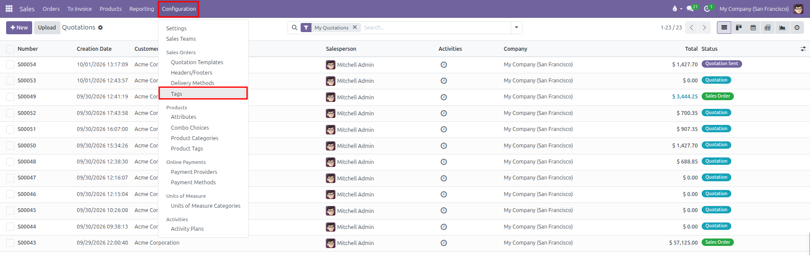
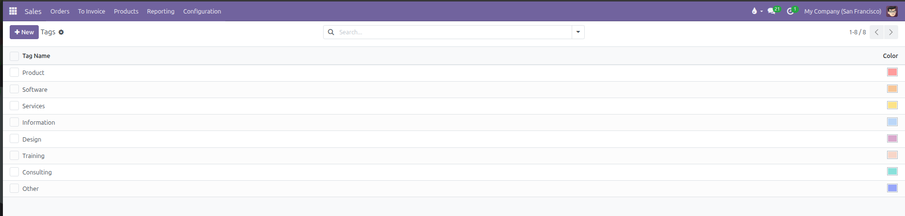
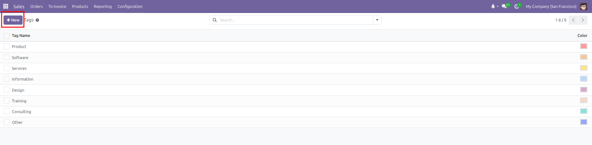
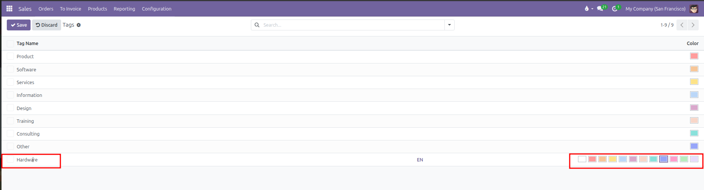
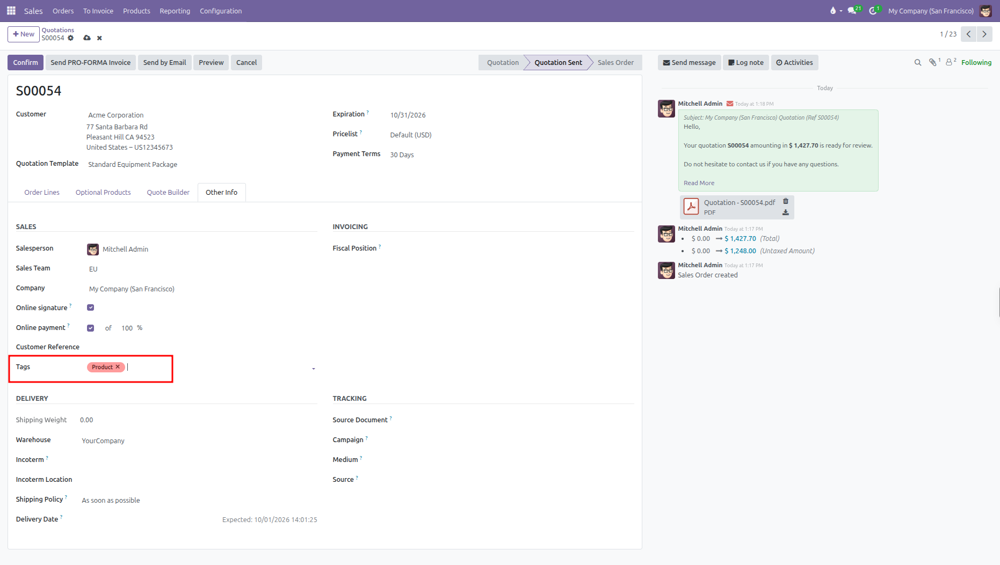
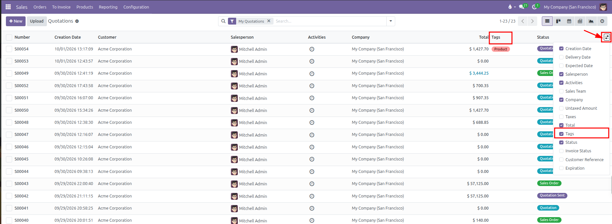

# Tags Setup

Configure and organize commercial tags to categorize quotations and sales orders in CURQ 18.

---

### 1. Overview of Order Tags

Order tags provide a flexible, color-coded classification system for commercial documents. They enable sales teams to segment orders by priority, project type, marketing channel, or special handling requirements without creating rigid custom fields.

Key advantages of configuring tags include:

* **Visual Identification**: Color-coded badges highlight critical order statuses directly in list views *(such as `VIP`, `Urgent`, or `Government`)*.
* **Segmented Searching**: Filter quotations and confirmed orders by tag in the search bar.
* **Flexible Categorization**: Attach multiple tags to a single quotation to capture multiple business dimensions.

---

### 2. Access the Tags Menu

To manage sales order tags:

1. Open the **Sales** app.
2. In the top navigation bar, click **Configuration**.
3. Under the **Sales Orders** section, select **Tags**.

CURQ displays the list of existing tags alongside their assigned color badges:

---

### 3. Create or Edit a Tag

To create a new tag:

1. Click **New** at the top left of the Tags list, or click into an empty row at the bottom of the table.

   

2. Configure the tag properties:

| Field        | Description                                                                            | Practical Effect                                                              |
| :-------------| :---------------------------------------------------------------------------------------| :------------------------------------------------------------------------------|
| **Tag Name** | Descriptive label for the category *(such as `Wholesale`, `Urgent`, or `Consulting`)*. | Appears on quotation badges, filter dropdowns, and search results.            |
| **Color**    | Color swatch selected from the color picker palette.                                   | Determines the background color of the tag badge across forms and list views. |

3. Click the color picker box to select a distinct visual shade from the 12 available color options:

   

4. Click outside the row or click **Save** at the top left to apply the changes.

---

### 4. Assign Tags to Quotations and Sales Orders

To tag a quotation or sales order:

1. Open a sales quotation in **Sales** > **Orders** > **Quotations**.
2. Select the **Other Info** tab.
3. Locate the **Tags** field under the **Sales** section.
4. Select one or more tags from the dropdown list.

*(Salespeople can also create a new tag on the fly by typing the tag name into the Tags field and clicking Create and edit)*

---

### 5. View and Filter Orders by Tag

Tags can be displayed directly in list views and used to filter orders:

1. Navigate to **Sales** > **Orders** > **Quotations** (or **Orders**).
2. Click the optional columns toggle icon at the far right of the table header.
3. Check the **Tags** column to display tag badges in the list view.
4. Use the search bar at the top to filter orders by specific tags.

