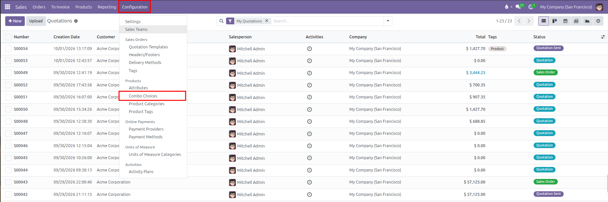
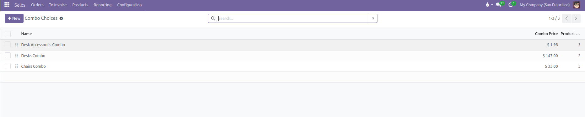
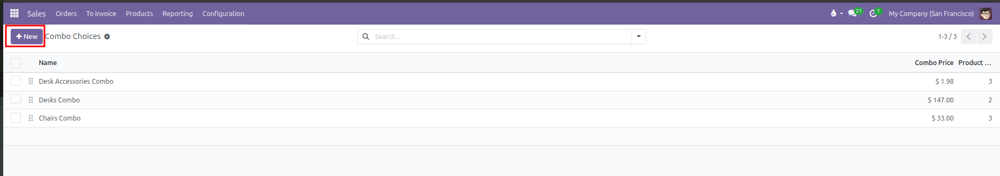
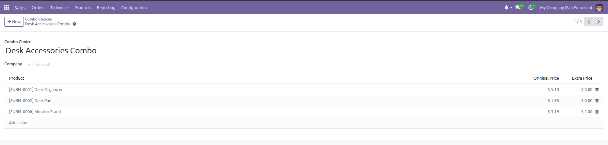
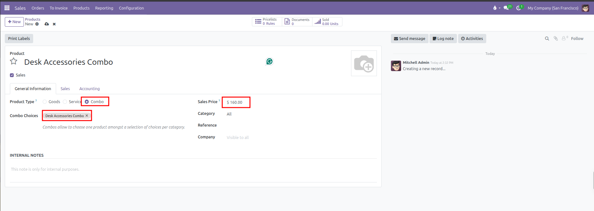
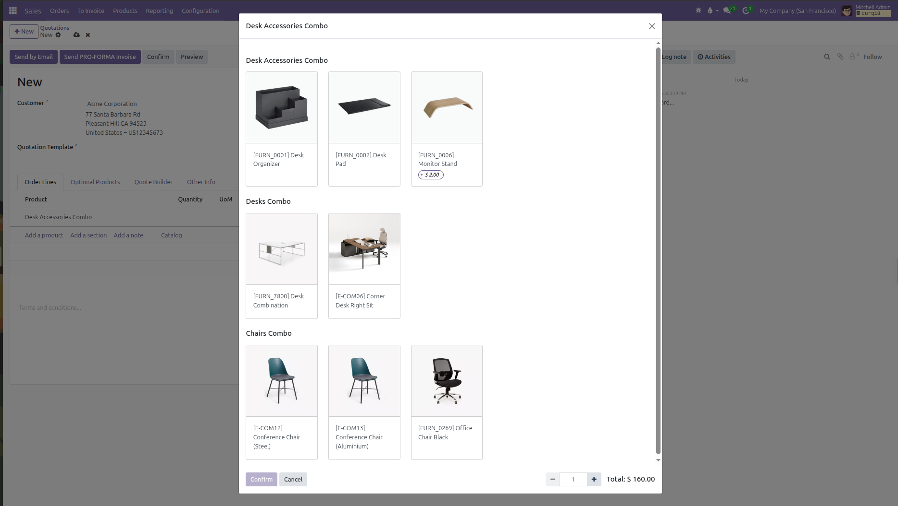
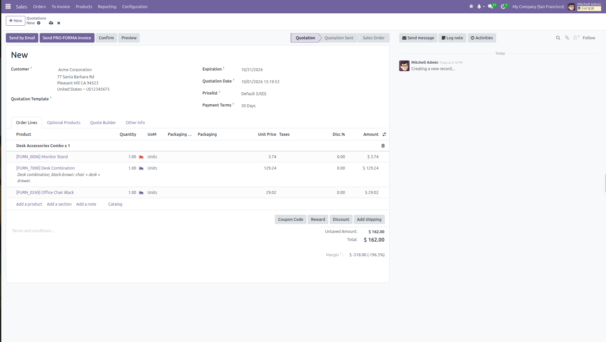

# Combo Choices Setup

Configure combo choices and bundle products with selectable components and price surcharges in CURQ 18.

---

### 1. Overview of Combo Choices and Combo Products

Combo choices enable businesses to bundle multiple products together while allowing customers or salespeople to select specific options within each category. This functionality is ideal for modular packages, meal combinations, workstation sets, or customizable product bundles.

Key concepts of the combo system include:

* **Combo Choices**: Reusable selection groups *(such as Desks, Chairs, or Accessories)* that contain a list of eligible products.
* **Combo Products**: Commercial bundle products with the Product Type set to Combo that link one or more combo choices together at an attractive package price.
* **Extra Price Surcharges**: Individual items within a combo choice can carry an additional fee that is added to the bundle total when selected.
* **Prorated Accounting**: The parent combo line carries zero price on the quotation, while the package price is prorated across the selected child components based on their minimum base prices, ensuring accurate accounting and invoicing.
* **System Safeguards**: Combo products cannot contain other combo products, sellable combos only accept sellable products, and combo products cannot be purchased directly from suppliers.

---

### 2. Access the Combo Choices Menu

To manage combo choices:

1. Open the **Sales** app.
2. In the top navigation bar, click **Configuration**.
3. Under the **Products** section, select **Combo Choices**.

CURQ displays the list of existing combo choices:

The list view provides the following information:

| Column | Description |
| :--- | :--- |
| **Drag Handle** | Allows manual reordering of combo choices by dragging the handle icon up or down. |
| **Name** | The descriptive label of the combo choice group *(such as `Desks Combo` or `Desk Accessories Combo`)*. |
| **Combo Price** | The calculated minimum price among all products assigned to this combo choice. |
| **Product Count** | The total number of alternative products available within this selection category. |

---

### 3. Create or Edit a Combo Choice

To create a new combo choice:

1. Click **New** at the top left of the Combo Choices list.

   

2. Enter a descriptive title in the **Combo Choice** header field *(for example, `Desk Accessories Combo`)*.
3. If operating in a multi-company environment, specify a **Company** or leave the field blank to keep the choice available across all companies.
4. In the items table, click **Add a line** to register products for this choice:

| Column | Configuration Details | Practical Effect |
| :--- | :--- | :--- |
| **Product** | Select an existing product variant. *(Products of type Combo are excluded by system validation)*. | Defines an eligible item that the customer or salesperson can select. |
| **Original Price** | System-populated standard sales price of the selected product. | Serves as a reference value and calculates the baseline minimum price for the combo. |
| **Extra Price** | Enter an optional monetary surcharge *(for example, `2.00`)*. | Adds a surcharge on top of the base bundle price when this specific item is chosen. |

5. Repeat the line addition for all selectable alternatives in this category. *(A combo choice must contain at least 1 product, and duplicate products are rejected)*.
6. Click the manual save icon or navigate away to store the combo choice.

---

### 4. Create and Configure a Combo Product

Once the required combo choices are established, attach them to a parent combo product:

1. Navigate to **Sales** > **Products** > **Products**.
2. Click **New** to create a product, or open an existing product template.
3. Enter the bundle title in the **Product Name** field *(for example, `Office Combo`)*.
4. In the **General Information** tab, set **Product Type** to **Combo**.
5. Locate the **Combo Choices** field and select one or more predefined combo choice groups *(such as `Desks Combo`, `Chairs Combo`, and `Desk Accessories Combo`)*.
6. In the **Sales Price** field, enter the overall base package price for the complete bundle *(for example, `160.00`)*.
7. Save the product record.

*(Note: When Product Type is set to Combo, CURQ automatically disables the Can be Purchased option because combo bundles are assembled for sales orders rather than procured directly)*

---

### 5. Select Combo Choices on Quotations

When a salesperson adds a combo product to a quotation, CURQ launches an interactive configurator:

1. Navigate to **Sales** > **Orders** > **Quotations** and open or create a quotation.
2. In the **Order Lines** tab, click **Add a product**.
3. Select the combo product *(for example, `Desk Accessories Combo`)*.
4. The **Combo Configurator** window opens immediately, presenting each combo choice as a distinct section *(such as `Desk Accessories Combo`, `Desks Combo`, and `Chairs Combo`)*.
5. Select one option within each combo choice category. Any item carrying an extra surcharge displays its additional cost clearly *(for example, the `Monitor Stand` option displays `+ $ 2.00`)*:

6. Click **Confirm** to insert the selections into the sales order.
7. CURQ generates the order lines automatically:
   * The **Parent Combo Section**: Displays the bundle header *(for example, `Desk Accessories Combo x 1`)*.
   * The **Child Lines**: Display each chosen component linked to the combo bundle with its unit price reflecting its prorated share of the package price plus any extra surcharge *(for example, `$ 3.74` for the Monitor Stand including the `$ 2.00` surcharge, `$ 129.24` for the Desk Combination, and `$ 29.02` for the Office Chair, totaling the exact `$ 162.00` bundle price)*.

