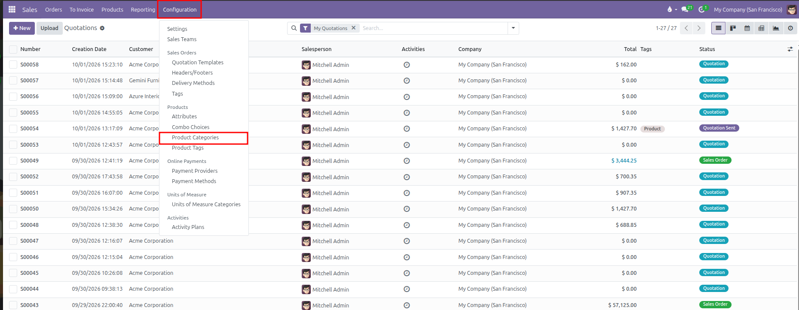
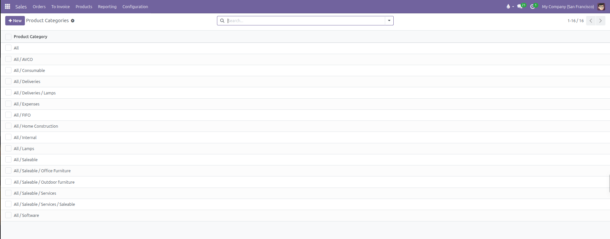
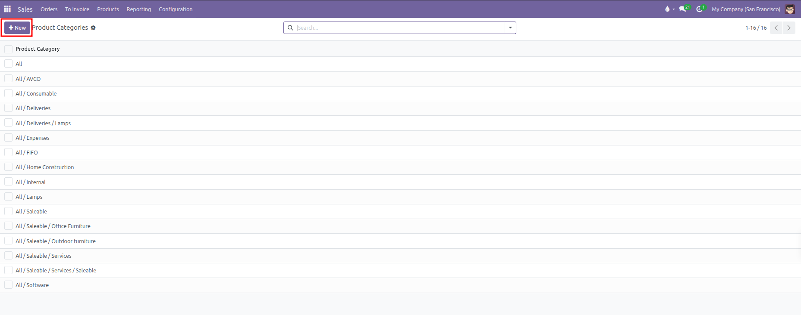
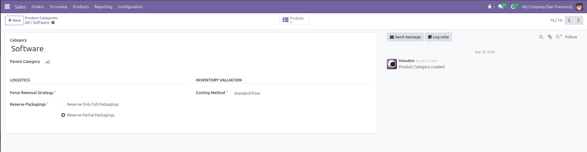
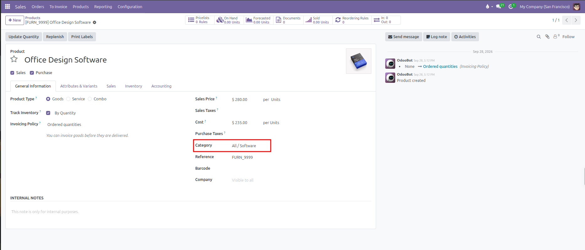
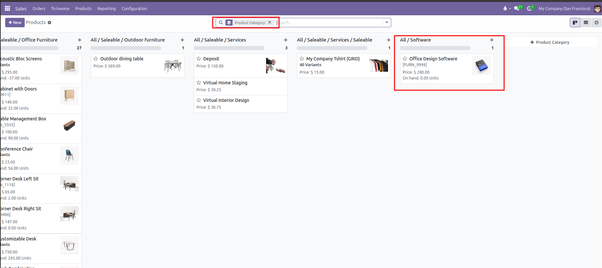
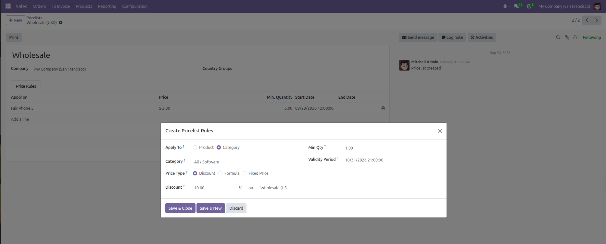

# Product Categories Setup

Configure product categories to organize the catalog, establish warehouse logistics rules, manage costing methods, and set category pricing in CURQ 18.

---

### 1. Overview of Product Categories

Product categories organize goods and services into structured groups in CURQ 18. While tags allow attaching multiple labels to a product, every product belongs to exactly one category arranged in a parent and child tree *(such as `All / Saleable / Office Furniture`)*.

Key benefits of configuring product categories include:

* **Catalog Organization**: Groups products logically for clear navigation, easy searching, and organized reports.
* **Warehouse Logistics Rules**: Defines how products are picked in the warehouse and how packaging units are reserved for orders.
* **Costing Methods**: Determines how product costs are calculated *(such as Standard Price, Average Cost, or FIFO)*.
* **Category-Based Pricing Rules**: Pricelists can apply discounts or price adjustments to an entire category and all subcategories under it in a single step.
* **Promotion and Coupon Targeting**: Discount programs can restrict special offers to specific product categories.
* **Quick Product Access**: A smart button on the category form displays the total number of products and opens all products in that category with one click.

---

### 2. Access the Product Categories Menu

To view and manage product categories:

1. Open the **Sales** app.
2. In the top navigation bar, click **Configuration**.
3. Under the **Products** section, select **Product Categories**.

CURQ displays the list of existing categories arranged by their full group path:

---

### 3. Create or Edit a Product Category

To create a new category:

1. Click **New** at the top left of the Product Categories list.

   

2. In the top section of the form, configure the basic category details:

| Field | Configuration Details | Practical Effect |
| :--- | :--- | :--- |
| **Category** | Enter a clear name *(for example, `Office Furniture`)*. | Identifies the category name within the product list. |
| **Parent Category** | Select the broader category this group belongs to *(such as `Saleable` or `All`)*, or leave empty for a top-level category. | Places this category inside the overall category tree. |

3. Under the **Logistics** section, configure warehouse picking and packaging rules:

| Field | Available Options | Practical Effect |
| :--- | :--- | :--- |
| **Force Removal Strategy** | **First In First Out (FIFO)**, **Last In First Out (LIFO)**, **Closest Location**, or **Least Packages**. *(First Expiry First Out only becomes available when the Expiration Dates inventory setting is enabled)*. | Determines which specific stock lots or shelves the warehouse picker takes products from first when fulfilling sales deliveries. |
| **Reserve Packagings** | **Reserve Only Full Packagings** or **Reserve Partial Packagings**. | Controls whether delivery orders can break open packaging boxes or pallets. |

*Detailed packaging reservation behavior:*

* **Reserve Only Full Packagings**: Prevents splitting packages. If a customer orders 2 pallets of 1,000 units and only 1,600 units are in stock, CURQ reserves only 1 full pallet *(1,000 units)* and leaves the remaining 600 units unreserved.
* **Reserve Partial Packagings**: Allows reserving all available units even if it breaks a package. In the same scenario, all 1,600 units are reserved.

4. Under the **Inventory Valuation** section, establish product costing:

| Field | Available Options | Practical Effect |
| :--- | :--- | :--- |
| **Costing Method** | **Standard Price**, **Average Cost (AVCO)**, or **First In First Out (FIFO)**. | Controls how CURQ calculates the product cost price for items in this category. |

*Detailed costing method options:*

* **Standard Price**: The cost price is set manually by editing the Cost field on each product card. New purchases do not alter the recorded cost.
* **Average Cost (AVCO)**: The cost price is recalculated automatically as a weighted average every time new items are purchased and received into stock.
* **First In First Out (FIFO)**: Products are costed based on the actual purchase price of the oldest available stock lot. When goods are sold, the oldest purchase cost is used.

5. Click the manual save icon or navigate away to save the category.

*(Note: CURQ prevents circular loops where a category is set as its own parent, and protects standard categories such as All and Saleable from being deleted)*

---

### 4. Assign Categories to Products

To assign a product to a category:

1. Navigate to **Sales** > **Products** > **Products**.
2. Open an existing product or click **New**.
3. In the **General Information** tab, locate the **Category** field.
4. Select the desired category from the dropdown list *(such as `All / Software`)*.
5. Save the product record.

All products assigned to this category automatically use its logistics rules, costing methods, and qualify for any pricing rules set on that category.

#### View Products Grouped by Category

To organize and review catalog items by their category:

1. Navigate to **Sales** > **Products** > **Products**.
2. Click the Kanban view icon at the top right.
3. In the search box, click the search options dropdown, open **Group By**, and select **Product Category**.
4. CURQ displays the catalog arranged in columns by category *(such as `All / Software`)*, showing product cards and on-hand inventory totals.

---

### 5. Apply Category Pricing in Pricelists

Product categories allow setting prices and discounts across multiple products at once without editing each item individually:

1. Navigate to **Sales** > **Products** > **Pricelists** and select an active pricelist *(such as `Wholesale (USD)`)*.
2. In the **Price Rules** tab, click **Add a line**.
3. In the **Create Pricelist Rules** window, set **Apply To** to **Category**.
4. In the **Category** field, select the target category *(such as `All / Software`)*.
5. Set the **Price Type** *(such as `Discount`)* and enter the value *(for example, `10.00` %)*.
6. Configure any minimum quantity or validity dates if required.
7. Click **Save & Close** to add the rule to the pricelist.

The rule automatically applies to every product inside this category and any subcategories under it. For comprehensive instructions on configuring advanced price rules, formulas, and customer price lists, refer to [Pricelists and Pricing Rules](./04-pricelists-and-pricing-rules.md).
