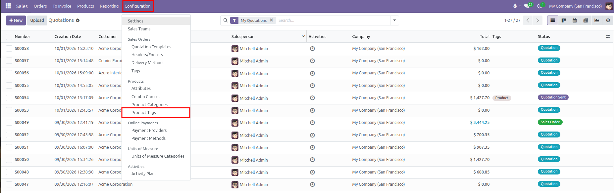
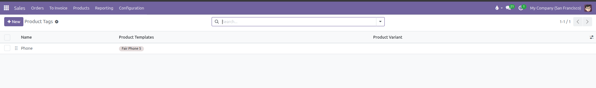
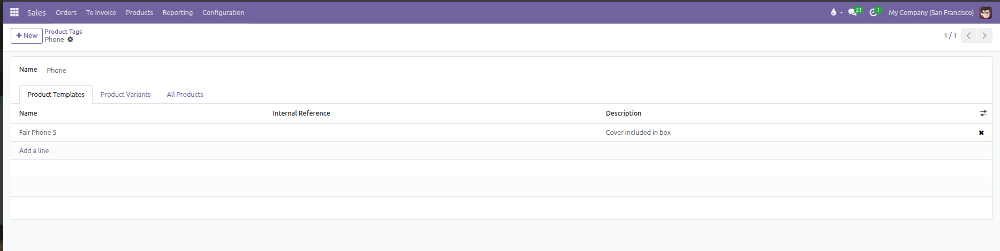
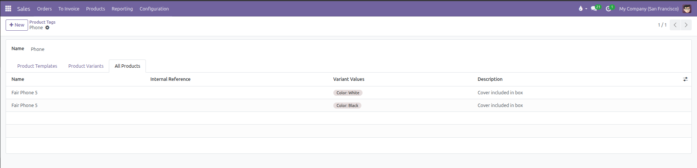
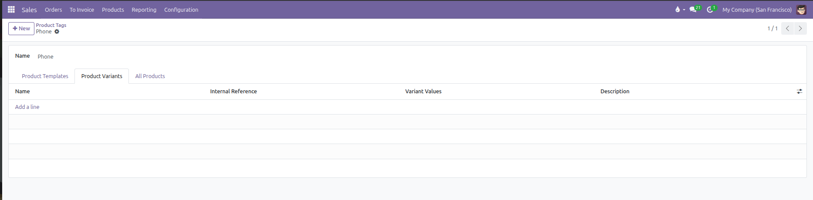
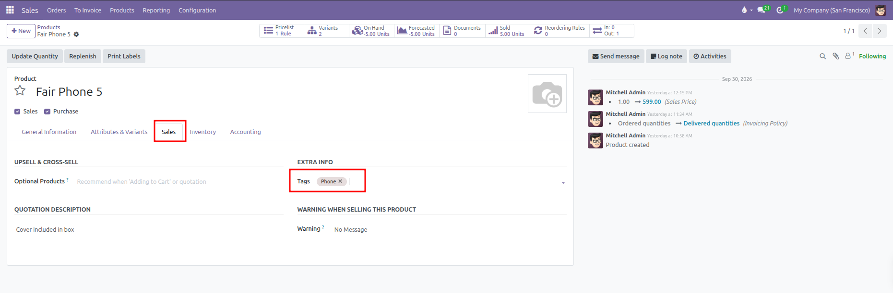
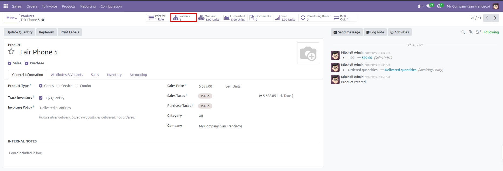
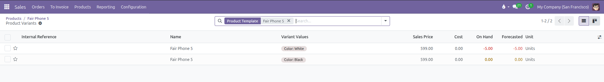
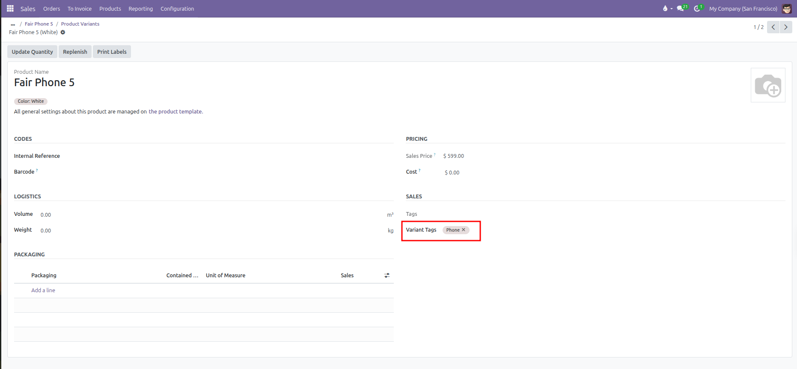
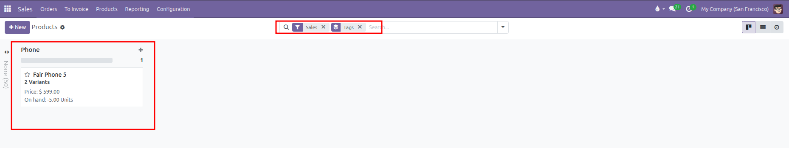

# Product Tags Setup

Configure product tags to classify catalog items, enable quick multi-attribute searching, and organize products and variants with flexible labels in CURQ 18.

---

### 1. Overview of Product Tags

Product tags provide a flexible labeling system for products and product variants in CURQ 18. Unlike product categories, which enforce a single rigid group for accounting and warehouse logistics, tags allow attaching multiple labels to any item across different categories.

| Characteristic        | Product Categories                                                           | Product Tags                                                                            |
| :----------------------| :-----------------------------------------------------------------------------| :----------------------------------------------------------------------------------------|
| **Structure**         | Hierarchical parent and child tree *(such as `All / Saleable / Furniture`)*. | Flat, non-hierarchical labels *(such as `Bestseller`, `Eco-Friendly`, or `Clearance`)*. |
| **Quantity per Item** | Exactly **one** category per product.                                        | **Multiple** tags can be assigned to a single product or variant.                       |
| **Primary Purpose**   | Defines costing methods, removal strategies, and category pricelist rules.   | Flexible search filtering, catalog grouping, and marketing classification.              |
| **Application Level** | Product template level only.                                                 | Both product templates *(all variants)* and individual product variants.                |

Common business use cases for product tags include:

* **Marketing Highlights**: Tagging items as `Featured`, `Bestseller`, `New Arrival`, or `Seasonal Promotion`.
* **Handling and Storage Warnings**: Marking items as `Fragile`, `Heavy`, `Perishable`, or `Temperature Sensitive`.
* **Product Line Classifications**: Grouping items across different categories with labels like `Indoor`, `Commercial Grade`, or `Waterproof`.
* **Catalog Lifecycle Management**: Flagging discontinued or phased items with `End of Life` or `Clearance`.

---

### 2. Access the Product Tags Menu

To view and manage the centralized list of product tags:

1. Open the **Sales** app.
2. In the top navigation bar, click **Configuration**.
3. Under the **Products** section, select **Product Tags**.

CURQ opens the Product Tags list view showing all configured tags, their display sequence, and the products linked to each:

| Column | Description |
| :--- | :--- |
| **Sequence Handle** | A drag icon on the far left used to manually reorder tags in dropdown lists and catalog displays. |
| **Name** | The unique label name assigned to the tag *(such as `Phone` or `Bestseller`)*. |
| **Product Templates** | Displays tag badges for all main product templates linked to this tag. |
| **Product Variant** | Displays tag badges for any specific individual variants assigned to this tag. |

---

### 3. Create and Configure Product Tags

Product tags can be created in the centralized configuration menu or created directly while editing a product.

#### Create a Tag from the Configuration Menu

1. In **Sales** > **Configuration** > **Products** > **Product Tags**, click **New**.
2. In the **Name** field, enter a concise label *(for example, `Phone`)*.
3. Manage tagged items using the form tabs:
   * **Product Templates tab**: Click **Add a line** to link base products that should carry this tag across all their variants *(such as `Fair Phone 5`)*.
   * **Product Variants tab**: Click **Add a line** to attach this tag only to specific variants *(such as only a specific color or model)*.
   * **All Products tab**: Automatically displays every product variant covered by this tag, including variants linked through the main product template.
4. Click the manual save icon or navigate away to save the tag.

#### Manage Variants and All Products Tabs

Understanding how the **Product Templates**, **Product Variants**, and **All Products** tabs interact prevents confusion when assigning tags:

* **Automatic Variant Coverage**: Adding a base product *(such as `Fair Phone 5`)* under the **Product Templates** tab automatically applies the tag to every variant of that product.
* **Consolidated Overview**: The **All Products** tab displays the complete resulting list of variants carrying the tag, whether attached directly or through their parent product:

* **Preventing Duplicate Assignments**: Because all variants of an assigned product template already carry the tag, CURQ intentionally excludes them from the selection list in the **Product Variants** tab:

*(Note: To tag only one specific variant, such as tagging only `Fair Phone 5 (White)` while leaving `Fair Phone 5 (Black)` untagged, remove the parent product from the Product Templates tab first. Its individual variants will then become available for selection in the Product Variants tab)*

#### Reorder Product Tags

The order of tags in the list view controls the order in which tag badges appear on product pages and search filters. To reorder tags:

1. Hover over the left side of any tag row until the crosshair grab handle appears.
2. Click and hold the handle.
3. Drag the row up or down to the desired sequence position and release.

---

### 4. Assign Tags to Products and Variants

Tags can be assigned at the product template level or at the variant level.

#### Assign Tags to a Product Template

When a tag is assigned to a product template, it automatically applies to all variants of that product:

1. Navigate to **Sales** > **Products** > **Products**.
2. Select an existing product *(such as `Fair Phone 5`)* or click **New**.
3. Open the **Sales** tab.
4. Under the **Extra Info** section, locate the **Tags** field.
5. Click the field to select an existing tag from the dropdown *(such as `Phone`)*, or type a new tag name and press Enter to create it on the spot.
6. Add as many tags as needed.
7. Save the product record.

#### Assign Tags to an Individual Product Variant

For products with multiple variants *(such as sizes or colors)* where only specific models need a label:

1. Open the parent product in **Sales** > **Products** > **Products** *(for example, `Fair Phone 5`)*.
2. Click the **Variants** stat button at the top:

3. CURQ displays the list of variants for this product. Select the specific variant you want to tag *(such as `Fair Phone 5 (White)`)*:

4. On the variant form, locate the **Sales** section on the right.
5. In the **Variant Tags** field, select an existing tag from the dropdown or type a new tag name:

6. Save the record. Any tag assigned here applies exclusively to this specific variant without affecting other models in the product family.

---

### 5. Search and Filter Products by Tag

Product tags make finding products fast and reliable across large product catalogs:

#### Group Products by Tag in Kanban View

1. Navigate to **Sales** > **Products** > **Products**.
2. Switch to the **Kanban** view if not already selected.
3. In the search box, click the search options dropdown, open **Group By**, and select **Tags**.
4. CURQ displays the catalog in columns grouped by each tag *(such as `Phone`)*, making it simple to monitor specific product lines:

#### Search and Filter by Tag

1. In the top search box, type the tag name *(for example, `Phone`)*.
2. In the search dropdown, select **Search Tags for: [name]**.
3. CURQ filters the catalog immediately to display only items carrying that tag.
4. Switch to the **List** view to see the **Tags** column displaying all active tags beside each product record.
