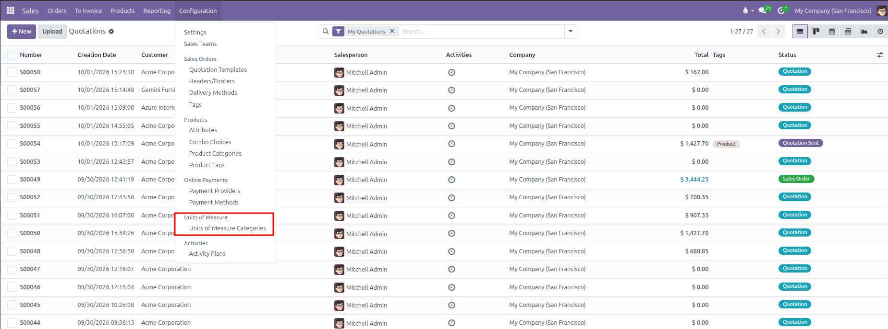
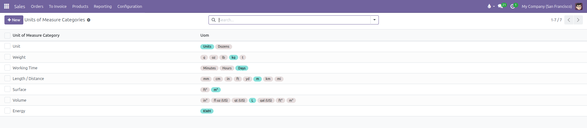
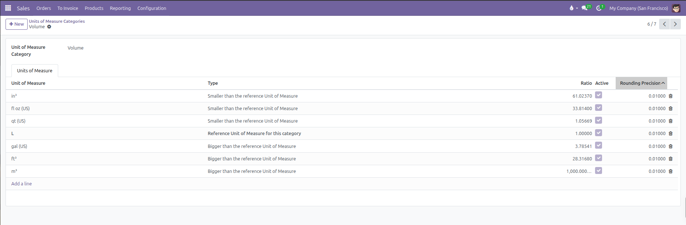
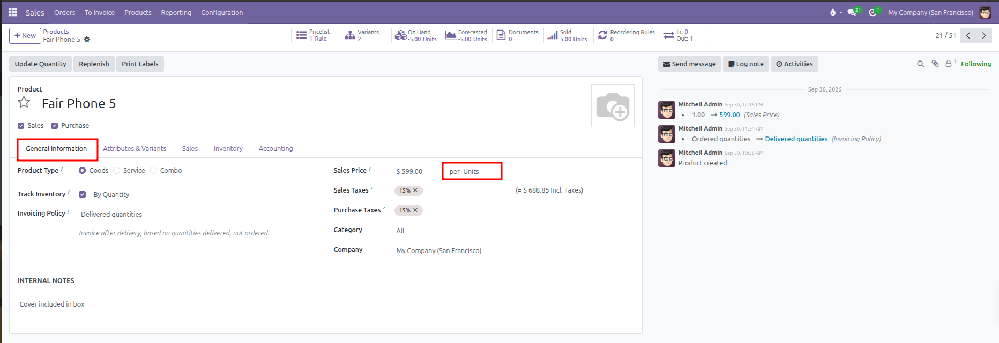
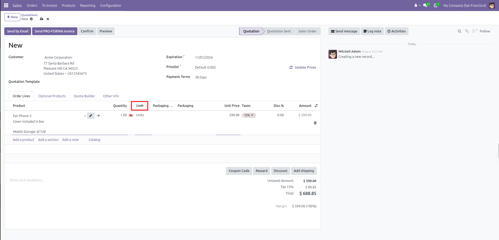
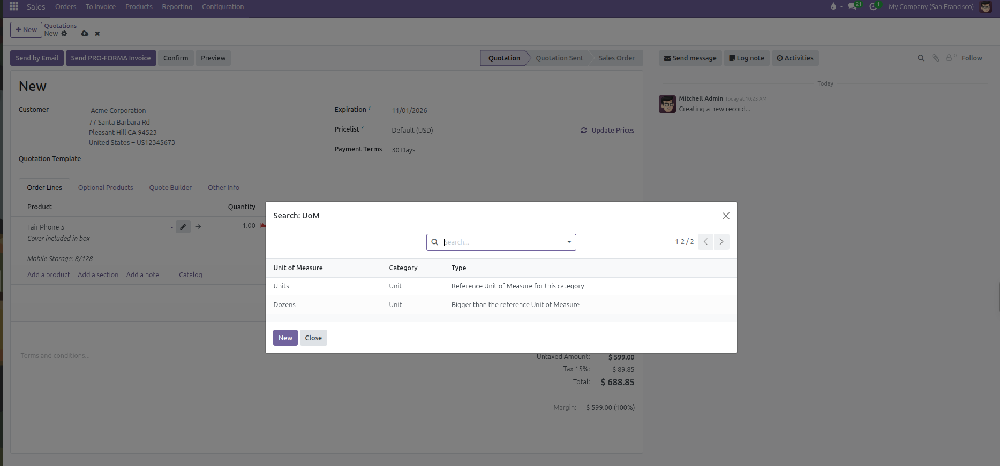
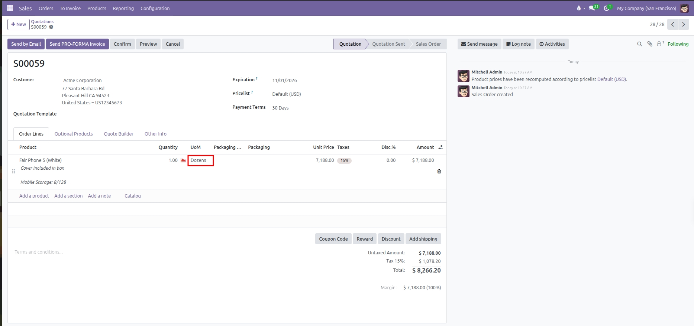

# Units of Measure Setup

Configure units of measure and measurement categories to sell, price, and track products in various quantities such as units, dozens, kilograms, hours, or liters in CURQ 18.

---

### 1. Overview of Units of Measure

Units of measure (UoM) allow businesses to sell, purchase, and stock items in different units while maintaining accurate pricing and inventory levels. For example, a business can purchase beverages by the pallet or crate and sell them by the bottle or pack of six.

Key rules governing units of measure in CURQ 18 include:

* **Category Boundaries**: Conversions only occur between units within the **same category**. For instance, converting between `Units` and `Dozens` is valid because both belong to the `Unit` category. Converting between `Kilograms` *(Weight)* and `Liters` *(Volume)* is not possible.
* **The Reference Unit**: Each category contains exactly one **Reference Unit** with a ratio of `1.00000`. All other units in that category are defined as either larger or smaller relative to this base unit.
* **Automatic Price Calculation**: When a salesperson changes the unit of measure on a sales quotation line *(such as switching from `Units` to `Dozens`)*, CURQ multiplies the price and updates delivery quantities automatically based on the conversion ratio.

| Measurement Category  | Reference Unit *(Ratio = 1.0)* | Common Additional Units with UI Ratios                                                  |
| :----------------------| :-------------------------------| :----------------------------------------------------------------------------------------|
| **Unit**              | Units *(1.00000)*              | Dozens *(Bigger: 12.00000)*                                                             |
| **Weight**            | kg *(1.00000)*                 | t *(Bigger: 1000.00000)*, lb *(Smaller: 2.20462)*, g *(Smaller: 1000.00000)*            |
| **Working Time**      | Days *(1.00000)*               | Hours *(Smaller: 8.00000)*, Minutes *(Smaller: 480.00000)*                              |
| **Length / Distance** | m *(1.00000)*                  | km *(Bigger: 1000.00000)*, ft *(Smaller: 3.28084)*, cm *(100.00000)*, mm *(1000.00000)* |
| **Volume**            | L *(1.00000)*                  | m³ *(Bigger: 1000.00000)*, gal *(Bigger: 3.78541)*, fl oz *(Smaller: 33.81400)*         |

---

### 2. Access the Units of Measure Categories Menu

To view and manage measurement categories and units:

1. Open the **Sales** app.
2. In the top navigation bar, click **Configuration**.
3. Under the **Units of Measure** section, select **Units of Measure Categories**.

CURQ displays the list of existing measurement categories along with all active units configured under each:

| Column | Description |
| :--- | :--- |
| **Unit of Measure Category** | The general classification name *(such as `Unit`, `Weight`, or `Working Time`)*. |
| **Units of Measure** | Colored badges showing all individual units belonging to that category *(reference units appear in turquoise and secondary units in gray)*. |

---

### 3. Create or Edit a Unit of Measure Category

To edit an existing category or configure new units:

1. From the **Units of Measure Categories** list, click an existing category *(such as `Volume` or `Unit`)* or click **New**.
2. Enter or review the **Category Name**.
3. Under the **Units of Measure** tab, review the conversion table:

| Field                  | Configuration Rule                                                                                                                                                                                        | Practical Example                                                                                                                     |
| :-----------------------| :----------------------------------------------------------------------------------------------------------------------------------------------------------------------------------------------------------| :--------------------------------------------------------------------------------------------------------------------------------------|
| **Unit of Measure**    | Enter the name of the unit.                                                                                                                                                                               | `L`, `gal (US)`, `fl oz (US)`, or `Dozens`.                                                                                           |
| **Type**               | Select one of three roles: • **Reference Unit of Measure for this category** *(base unit)* • **Bigger than the reference Unit of Measure** • **Smaller than the reference Unit of Measure**      | For Volume, `L` is the Reference unit; `gal (US)` is Bigger than the reference unit; `fl oz (US)` is Smaller than the reference unit. |
| **Ratio**              | Defines the conversion rate relative to the reference unit: • **Reference**: Locked at `1.00000` • **Bigger**: Number of reference units in 1 of this unit *(1 this unit = ratio x reference units)* • **Smaller**: Number of this unit in 1 reference unit *(1 reference unit = ratio x this unit)* | For `gal (US)` *(Bigger)*, ratio is `3.78541` *(1 gal = 3.78541 L)*. For `fl oz (US)` *(Smaller)*, ratio is `33.81400` *(1 L = 33.81400 fl oz)*. |
| **Active**             | Checkbox controlling whether the unit is available on products and sales orders.                                                                                                                          | Uncheck to retire a unit without breaking past sales records.                                                                         |
| **Rounding Precision** | The smallest permitted quantity step.                                                                                                                                                                     | Set to `1.00000` for indivisible discrete goods, or `0.01000` for decimal fractions.                                                  |

4. Click **Add a line** to introduce a new packaging or sales unit *(such as `Pack of 6` with ratio `6.00000`)*.
5. Click the manual save icon or navigate away to save changes.

*(Note: Every category must always have exactly one Reference Unit. Do not delete or change the reference unit while active products are linked to that category)*

---

### 4. Assign Default Units of Measure to Products

Products use units of measure to determine how they are priced, invoiced, and tracked:

1. Navigate to **Sales** > **Products** > **Products**.
2. Open an existing product *(such as `Fair Phone 5`)* or click **New**.
3. In the **General Information** tab, locate the **Sales Price** field on the right side.
4. The Unit of Measure is embedded inline directly beside the sales price as **per [Unit]**:

5. Click the unit name *(such as `Units`)* to open the dropdown and select an alternative default unit from the category *(such as `Dozens` or `Hours`)*.
6. The Cost field below it automatically reflects the same unit *(for example, `Cost: $ 0.00 per Units`)*.
7. Save the product record.

---

### 5. Sell in Different Units of Measure on Quotations

Sales orders allow selecting any unit of measure from the product category:

1. Navigate to **Sales** > **Orders** > **Quotations** and open a draft quotation.
2. In the **Order Lines** tab, click **Add a product** and select an item *(such as `Fair Phone 5`)*.
3. Locate the **UoM** column on the order line:

4. Click the **UoM** field or select **Search More...** to open the unit selection window:

5. Select an alternative unit *(such as `Dozens`)*.
6. CURQ recalculates the order line immediately:
   * The **Unit Price** automatically multiplies by the conversion ratio. For example, selecting 1 Dozen of `Fair Phone 5` recalculates the unit price from `$ 599.00` *(single phone price)* to `$ 7,188.00` *(12 phones x $ 599.00)*.
   * The line amount and tax totals update automatically to reflect the dozen bundle price.
   * Upon order confirmation, the warehouse delivery order reserves 12 individual base units from stock.

7. Save or send the quotation.
