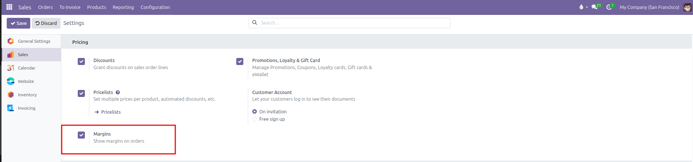
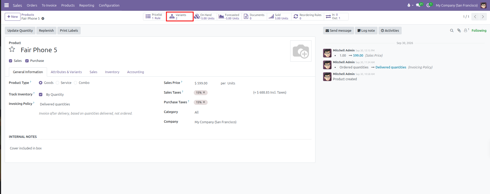
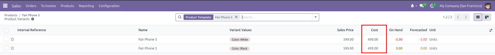
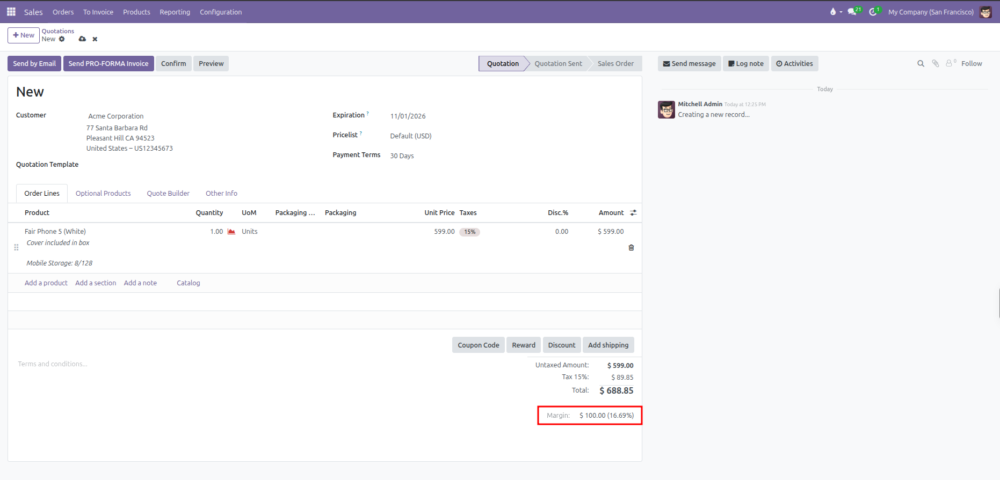
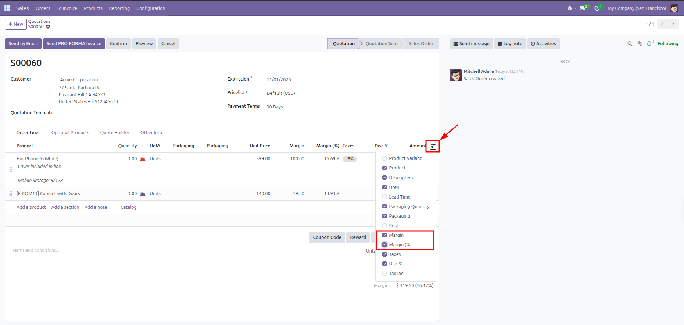
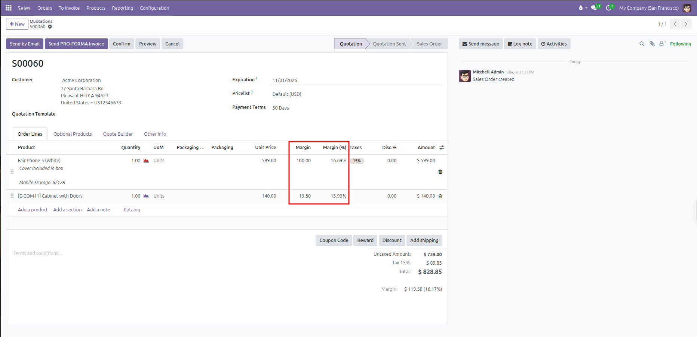

# Sales Margins Configuration and Profitability Tracking

Configure sales order margins, monitor real-time gross profit on quotations, and track product profitability in CURQ 18.

---

### 1. Overview of Sales Margins

Tracking profit margins directly within sales workflows ensures that sales staff and managers maintain commercial profitability before confirming quotations or negotiating discounts.

CURQ calculates gross profit margins automatically using a straightforward calculation:

* **Line Margin**: The line selling price minus the product cost, multiplied by quantity.
  * *Example*: Selling 1 phone at `$ 599.00` with a product cost of `$ 499.00` yields a line margin of `$ 100.00`.
* **Total Margin**: The combined profit added up across all order lines on the quotation.
* **Margin Percentage**: The total profit divided by the untaxed sales amount.
  * *Example*: `$ 100.00` profit divided by `$ 599.00` untaxed sales equals a `16.69%` margin.

*(Note: If a product cost is set to $ 0.00, CURQ treats the entire selling price as profit and calculates the margin at 100%)*

---

### 2. Enable Margins in Sales Settings

To activate margin calculations on quotations and orders:

1. Open the **Sales** app.
2. In the top navigation bar, click **Configuration** > **Settings**.
3. Scroll down to the **Pricing** section.
4. Check the box for **Margins** *(Show margins on orders)*.
5. Click **Save** in the top left corner.

Activating this setting installs the underlying sales margin engine, adds profit totals to quotation screens, and unlocks margin metrics in sales reporting.

---

### 3. Configure Baseline Product Costs

Accurate margins depend on setting realistic baseline costs. Where the cost field appears depends on whether the product has variants:

#### For Standard Products Without Variants

1. Navigate to **Sales** > **Products** > **Products**.
2. Open a standard product record.
3. In the **General Information** tab, locate the **Cost** field directly below the Sales Price and Sales Taxes.
4. Enter the baseline purchase or manufacturing cost *(such as `$ 40.00`)*.
5. Save the product record.

#### For Products With Multiple Variants

When a product template has multiple variants *(such as `Fair Phone 5` with 2 color combinations)*, CURQ automatically hides the **Cost** field on the parent template **General Information** tab because each variant can have different component or production costs.

To configure costs on a multi-variant product:

1. On the product template form *(such as `Fair Phone 5`)*, locate the **Variants** stat button in the top header:

2. Click the **Variants** stat button to view the list of generated combinations.
3. Review or edit the **Cost** column directly in the variants list view *(such as entering `$ 499.00` for `Color: White` and `Color: Black`)*:

4. Alternatively, click into any individual variant row to view or edit its detailed pricing.

---

### 4. Monitor Margins on Sales Quotations

Once enabled, CURQ displays live profit metrics at both the order level and the individual line level:

#### Order Level Margin Summary

Below the standard quotation totals *(Untaxed Amount, Taxes, and Total)*, CURQ displays the computed gross profit and margin percentage in real time:

| Display Field | Meaning | Practical Example |
| :--- | :--- | :--- |
| **Untaxed Amount** | Total net order value excluding sales taxes. | `$ 599.00` |
| **Margin (Amount)** | Gross dollar profit computed as Untaxed Amount minus total cost. | `$ 100.00` *(computed as `$ 599.00` sales price minus `$ 499.00` cost)* |
| **Margin (%)** | Percentage of the untaxed sales revenue represented by profit. | `16.69%` *(computed as `$ 100.00` / `$ 599.00`)* |

#### Line Level Margin Columns

Sales staff can view cost and margin calculations per line directly inside the **Order Lines** table:

1. On any draft quotation, open the **Order Lines** tab.
2. Click the optional columns toggle icon *(slider icon located at the far right edge of the table header, indicated by the red arrow)*.
3. In the dropdown list, check **Margin** and **Margin (%)** *(highlighted in red)*. You can also check **Cost** to display baseline purchase costs inline:

4. The **Order Lines** table immediately displays the gross profit and margin percentage for each individual item row:

| Product Line | Unit Price | Unit Cost | Line Margin | Margin (%) | Calculation |
| :--- | :--- | :--- | :--- | :--- | :--- |
| **Fair Phone 5 (White)** | `$ 599.00` | `$ 499.00` | `$ 100.00` | `16.69%` | `$ 599.00 minus $ 499.00` |
| **Cabinet with Doors** | `$ 140.00` | `$ 120.50` | `$ 19.50` | `13.93%` | `$ 140.00 minus $ 120.50` |
| **Combined Order Totals** | `$ 739.00` | `$ 619.50` | **`$ 119.50`** | **`16.17%`** | `$ 119.50 / $ 739.00` |

When sales staff adjust unit prices, apply discounts, or modify item quantities, CURQ recalculates both the line margins and the total order margin in real time.

---

### 5. Profitability Analysis in Sales Reporting

Margin data feeds directly into sales analytics to help commercial managers evaluate profitability across teams, salespersons, and product categories:

1. Navigate to **Sales** > **Reporting** > **Sales**.
2. Switch to the **Pivot** view using the grid icon in the top right.
3. Click the **Measures** dropdown menu and select:
   * **Margin** *(total gross profit dollars)*
   * **Margin (%)** *(weighted average profit percentage)*
4. Group rows by **Salesperson**, **Product Category**, or **Customer** to analyze which commercial accounts generate the highest net profit margins.
