# Online Signature and Online Payment Setup

Configure electronic signature policies, enable online payment collection and prepayment percentages, configure automatic invoice generation, manage customer portal approvals, and automate order validation in CURQ 18.

---

### 1. Overview of Customer Confirmation Methods

CURQ provides digital confirmation tools that allow customers to legally approve quotations and pay deposits directly from their web browser. Eliminating manual paperwork, printing, scanning, and external payment follow-ups accelerates sales turnaround and improves cash flow.

Businesses can configure three distinct confirmation workflows depending on commercial requirements:

* **Online Signature Only**: Customers sign the quotation digitally on the portal. The order automatically confirms into a sales order immediately upon signature submission.
* **Online Payment Only**: Customers pay the full order amount or a partial deposit online. The order automatically confirms into a sales order as soon as payment is authorized.
* **Combined Signature and Payment ("Sign & Pay")**: Customers first sign the agreement digitally, then complete the required prepayment. The order confirms only after both signature capture and payment authorization succeed.

---

### 2. Enable Confirmation and Automatic Invoicing in Global Settings

To activate signature capture, payment confirmation, and automated billing across the entire company:

1. Open the **Sales** app.
2. In the top navigation bar, click **Configuration** > **Settings**.
3. Locate the **Quotations & Orders** section.

#### Enable Online Signature

Check the box for **Online Signature** *(Request customers to sign quotations to validate orders)*:

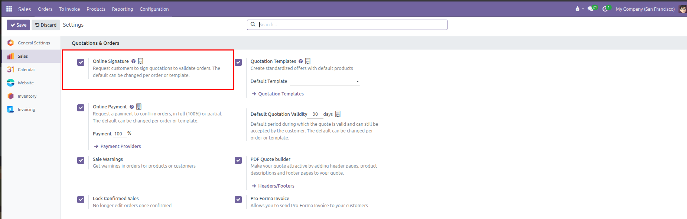

#### Enable Online Payment

Check the box for **Online Payment** *(Request a payment to confirm orders, in full (100%) or partial)*, and specify the company default **Payment** percentage *(such as `100 %` for full payment, or `30 %` for a standard deposit)*:

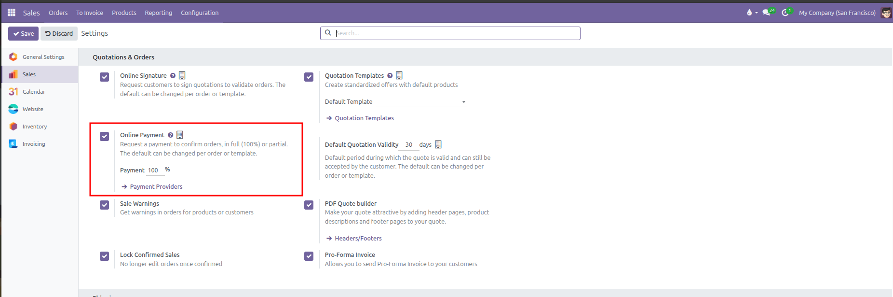

#### Enable Automatic Invoice Generation

In the same **Settings** screen, scroll down to the **Invoicing** section:

1. Check the box for **Automatic Invoice** *(Generate the invoice automatically when the online payment is confirmed)*:

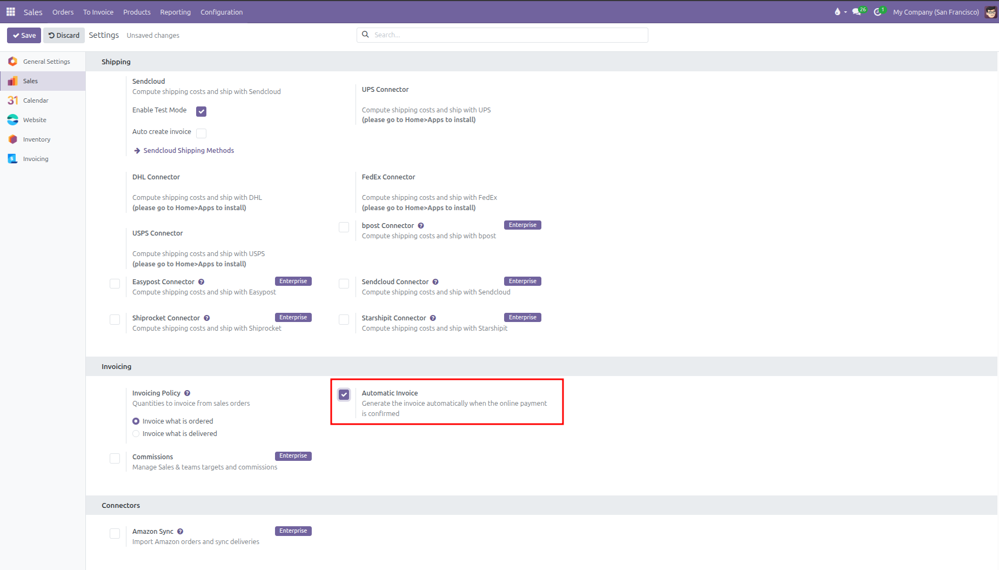

2. Review the company baseline **Invoicing Policy**:
   * **Invoice what is ordered**: When an online payment is confirmed, CURQ automatically creates and posts an invoice for the total ordered quantities.
   * **Invoice what is delivered**: Automatically creates down payment invoices matching the confirmed online transaction, while final product line invoicing waits until warehouse delivery.
3. Click **Save** in the top left corner.

Activating these global settings establishes the default confirmation and invoicing rules for all newly drafted quotations and templates across the company.

---

### 3. Configure and Activate Payment Providers

For customers to submit online payments, at least one payment provider must be active:

1. In **Sales** > **Configuration** > **Settings** under Online Payment, click the **Payment Providers** link.
2. Review the gallery of available payment gateways:

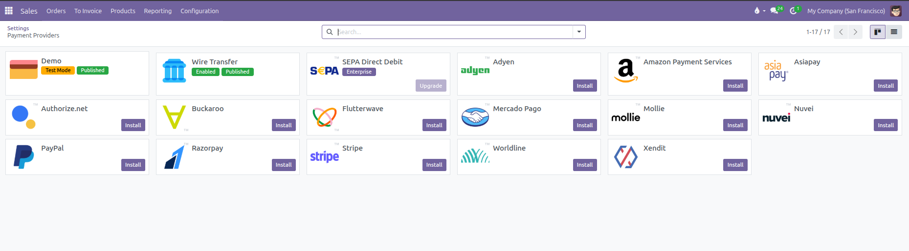

3. Click into a provider record *(such as `Demo` or `Wire Transfer`)* to open its configuration form.
4. Set the **State**:
   * **Disabled**: The payment method is hidden from customers.
   * **Test Mode**: Simulates transactions using test credentials without processing real funds.
   * **Enabled**: Active live mode processing real customer payments.
5. In the **Configuration** tab, review payment form options, saving payment methods, and availability limits:

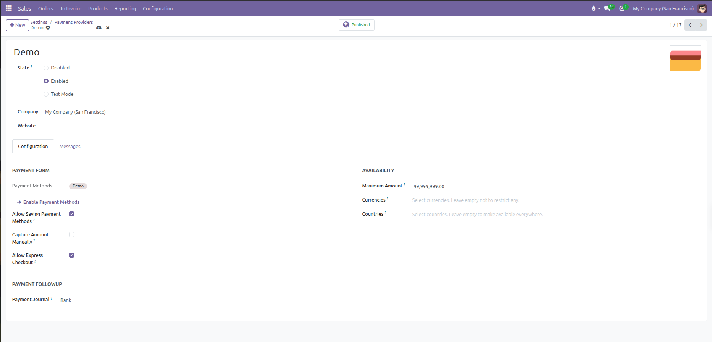

6. In the **Messages** tab, customize customer-facing messages for **Pending**, **Authorize**, **Done**, and **Cancelled** payment statuses:

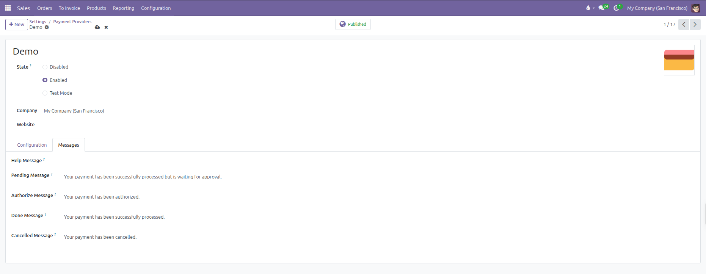

7. Ensure the **Published** indicator in the top header is active so customers can use the provider during checkout.

---

### 4. Apply Confirmation Rules on Quotation Templates

Standardized quotation templates allow businesses to enforce specific confirmation requirements based on product type, deal size, or contract terms:

1. Navigate to **Sales** > **Configuration** > **Quotation Templates**.
2. Select an existing template *(such as `Standard Equipment Package`)* or click **New**.
3. Under the template header on the right side, configure the confirmation rules:
   * **Online Signature**: Check to require an electronic signature whenever this template is applied.
   * **Online Payment**: Check to require an upfront payment before order confirmation.
   * **Prepayment Percentage**: Specify the exact percentage required for this template *(such as `of 100 %`)*.

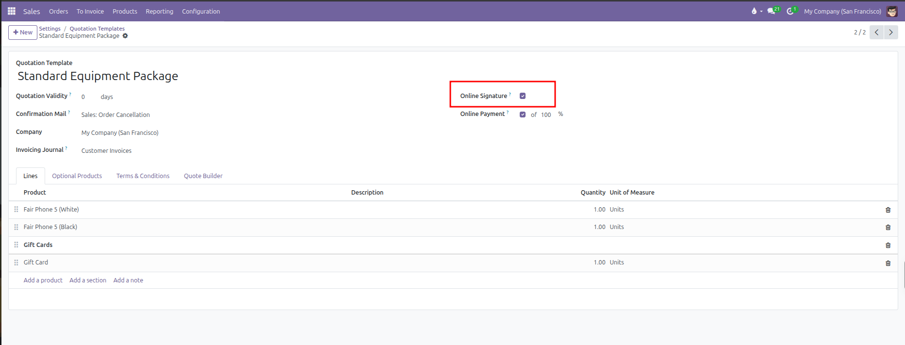

4. Save the quotation template. When a salesperson applies a template to a draft quotation, CURQ automatically sets the order confirmation requirements and deposit percentage to match the template policy.

---

### 5. Configure Confirmation Settings on Individual Quotations

Sales staff can customize or override signature and payment requirements for specific customer negotiations prior to sending the quote:

1. Navigate to **Sales** > **Orders** > **Quotations**.
2. Open a draft quotation *(such as `S00060`)*.
3. In the lower notebook, click the **Other Info** tab *(highlighted in red)*.
4. Under the **Sales** column on the left side, locate the confirmation controls:
   * **Online signature**: Toggle whether this specific customer must sign online *(highlighted in red)*.
   * **Online payment**: Toggle whether this customer must submit payment online, and adjust the prepayment percentage if a custom deposit was negotiated.

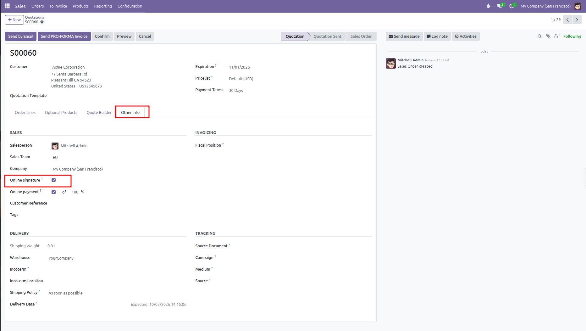

5. Send the quotation to the customer via **Send by Email** or click **Preview** to inspect the customer portal view.

*(Note: Once a quotation is confirmed into a Sales Order or cancelled, both the Online signature and Online payment fields lock as read-only to preserve legal and financial audit integrity)*

---

### 6. The Customer Portal Approval and Payment Workflow

When a customer opens the quotation link received by email, CURQ displays an interactive portal view tailored to the required confirmation mode:

#### Step 1: Digital Signature Capture

1. The customer reviews the order lines, unit prices, and financial totals *(such as `$ 828.85` for quote `S00060`)*.
2. Clicking **Sign & Pay** *(or **Accept & Sign**)* opens the **Validate Order** modal.
3. The customer chooses their signing method *(highlighted in red)*:
   * **Auto**: Types the customer full name in formal script calligraphy.
   * **Draw**: Provides a digital signature pad to sign with a finger, stylus, or mouse.
   * **Load**: Uploads a saved signature image file.
4. The customer confirms their **Full Name** and clicks **Accept & Sign** *(highlighted in red)*:

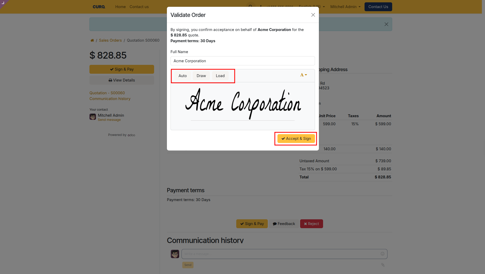

#### Step 2: Post-Signing Notification and Payment Prompt

1. Upon submitting their signature, CURQ displays a green status banner:
   *"Thank You! Your order has been signed but still needs to be paid to be confirmed."*
2. A yellow **Pay Now** button appears on the left navigation pane *(indicated by the red arrow)*.
3. The captured digital signature is displayed at the bottom right of the quotation document *(highlighted in red)*:

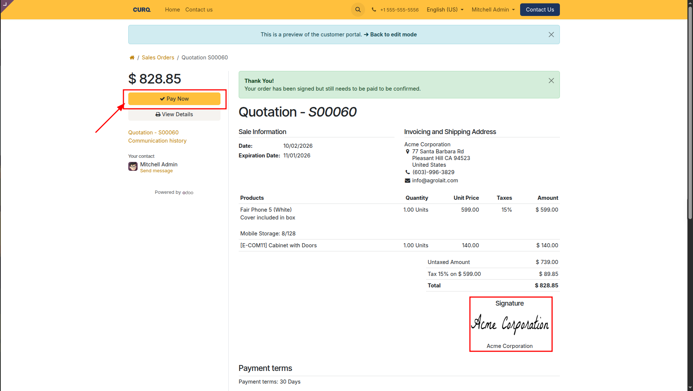

#### Step 3: Payment Method Selection and Checkout

1. Clicking **Pay Now** opens the payment modal.
2. The modal states: *"By paying, you confirm acceptance on behalf of Acme Corporation for the $ 828.85 quote."*
3. Under **CHOOSE A PAYMENT METHOD**, the customer selects their preferred provider *(such as `Wire Transfer` or `Demo`)*.
4. The customer clicks **Pay** *(highlighted in red)*:

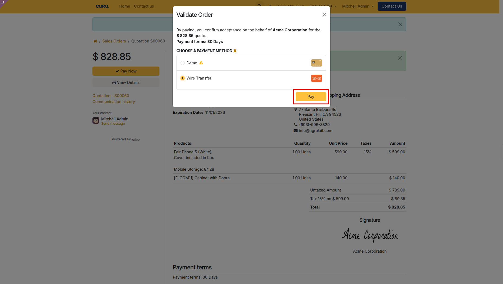

#### Step 4: Instant Confirmation and Order Progression

1. Once payment is processed, the portal displays a green success confirmation:
   *"Thank you! Your payment has been successfully processed."* *(highlighted in red)*.
2. The document title immediately updates from quotation to **Sales Order S00060**.
3. Downstream operations trigger automatically, including warehouse delivery orders *(such as `WH/OUT/00030` In Preparation)*:

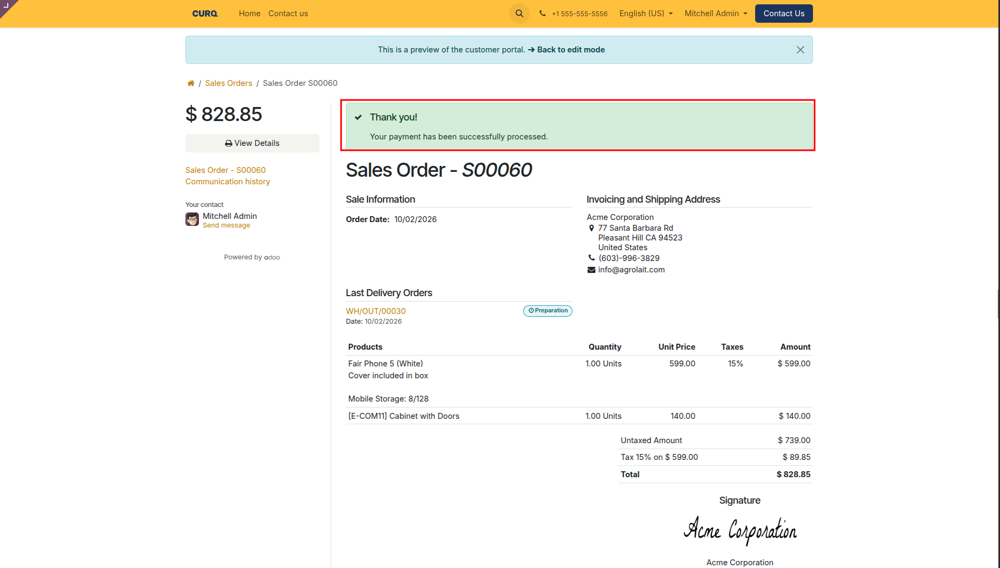

---

### 7. Backend Order Confirmation and Financial Audit Trail

When sales staff open the confirmed order in CURQ *(such as `S00060`)*:

1. **Sales Order Status**: Document status advances from Quotation Sent to **Sales Order**, with the order automatically locked *(highlighted in red)*.
2. **Create Invoice**: The top action bar displays the **Create Invoice** button *(highlighted in red)*.
3. **Chatter Audit Log**:
   * Status transition logged: `Quotation Sent -> Sales Order (Status)`, `No -> Yes (Locked)`.
   * Transaction confirmation logged: `The transaction with reference S00060-2 for $ 828.85 has been confirmed (Demo)` *(highlighted in red)*.
   * Signed contract attached: `Order_S00060.pdf` containing the customer signature, timestamp, and IP address.

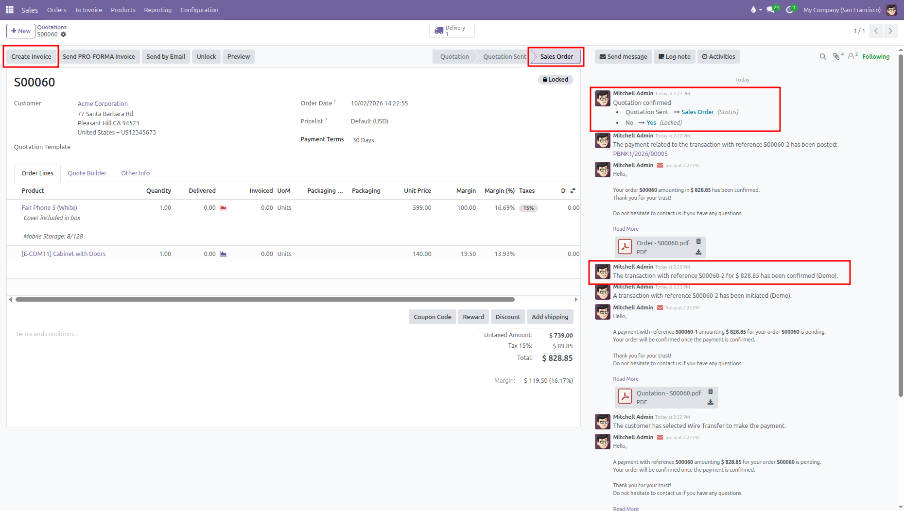

#### Invoicing Automation Comparison

* **With Automatic Invoice Disabled**: Once payment completes online, CURQ confirms the sales order and requires staff or accounting to click **Create Invoice** manually.
* **With Automatic Invoice Enabled**: The moment the payment gateway authorizes the online transaction, CURQ immediately creates, validates, and posts the customer invoice automatically without requiring manual action from staff.

#### Manual Staff Override

If a customer prefers offline confirmation *(such as returning a signed paper contract by courier or submitting an offline bank wire)*:
* Sales staff can click **Confirm** directly on the quotation header.
* Clicking Confirm bypasses the online portal requirement and converts the document into a confirmed Sales Order immediately.

---

### 8. Confirmation Options Summary Matrix

| Configuration Mode | Customer Portal Button | Signing Step | Payment Step | When Order Converts to Sales Order |
| :--- | :--- | :--- | :--- | :--- |
| **Signature Only** | `Accept & Sign` | Required *(Auto, Draw, or Load)* | None | Immediately after digital signature is submitted |
| **Payment Only** | `Pay & Confirm` | None | Required *(Selected Provider)* | Immediately after payment transaction is authorized |
| **Signature + Payment** | `Sign & Pay` | Required *(Auto, Draw, or Load)* | Required *(Deposit or 100%)* | Only after payment transaction succeeds |
| **Neither Enabled** | `Review & Download` | None | None | When sales staff manually click Confirm in the backend |
